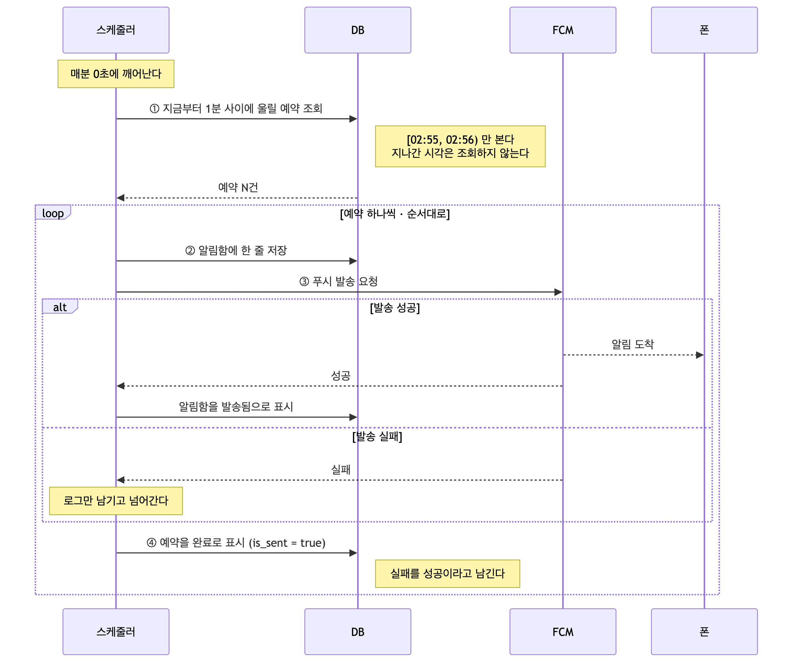
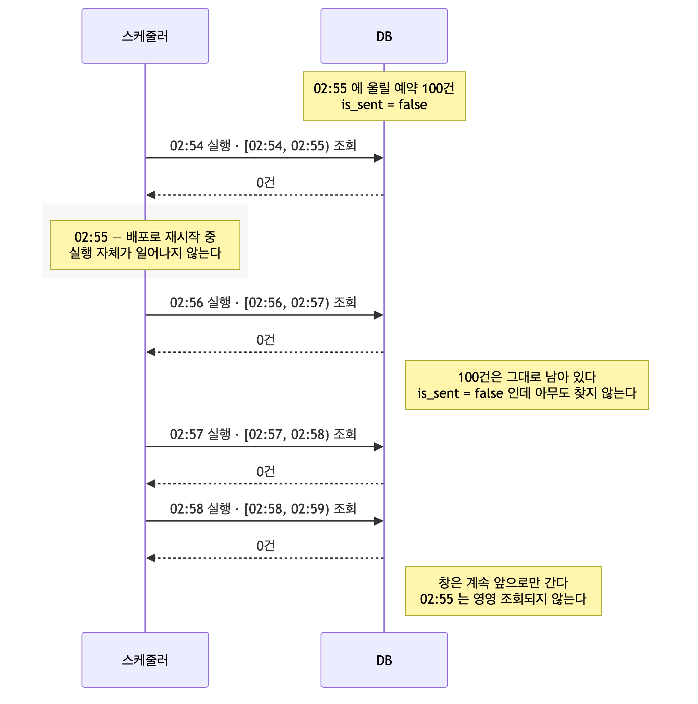
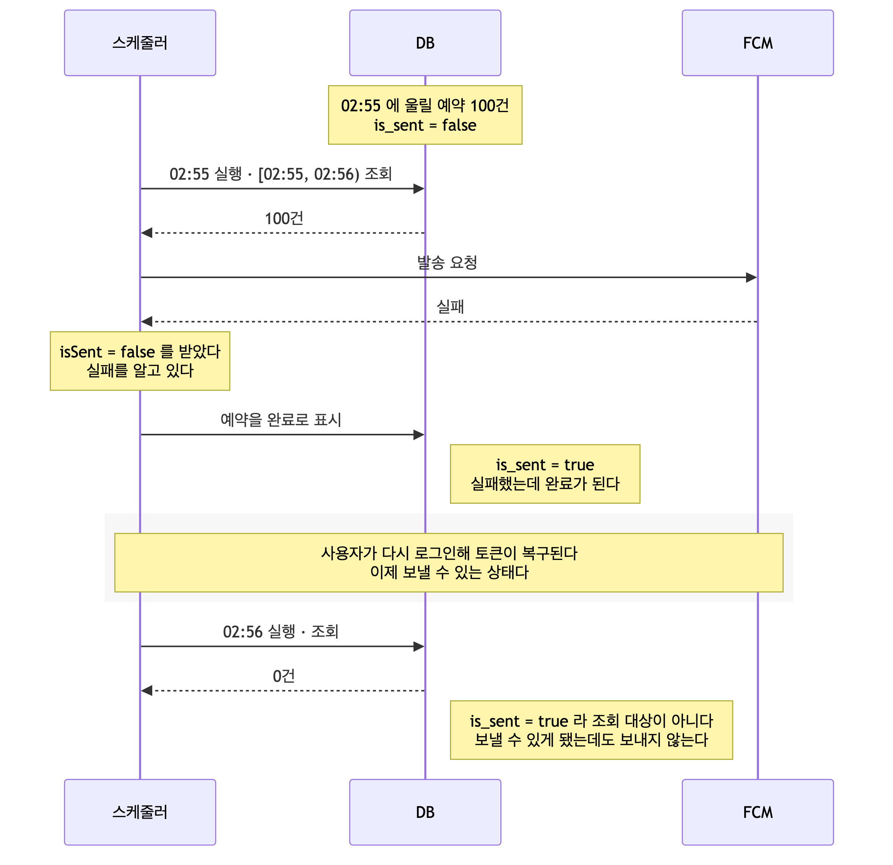
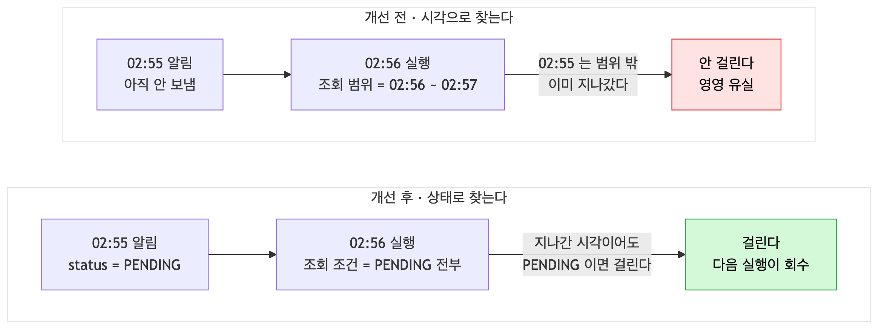
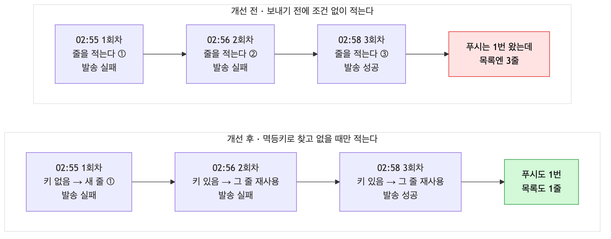
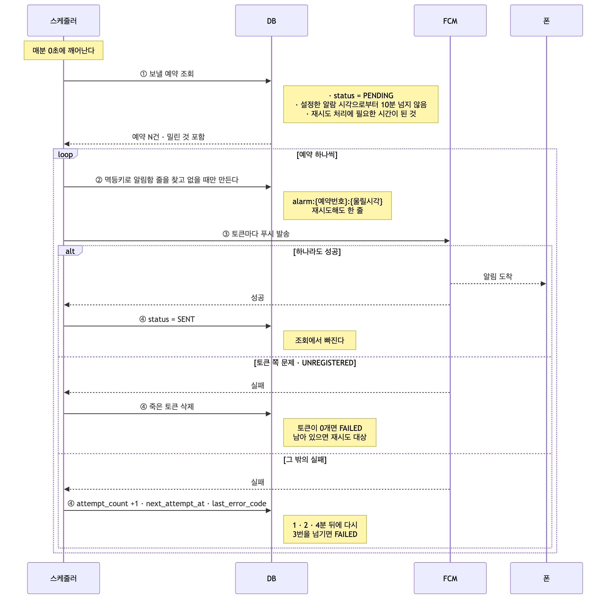

# 알림 유실 해결기 : 실패한 걸 아는데 왜 다시 안 보낼까?

> **상태** 개선 전 측정 완료 (실험 A·B 모두 도달 0 / 100) → 재처리 구조 적용 → 재측정 예정
> **측정 자료** [measurements.md](measurements.md)
> **관련 글** [밀린 알림이 쌓일 때의 처리량](../throughput/) · [스케줄러 개요](../README.md)

# 1. 개요

이번 글에서는 일정 알림이 조용히 사라지던 문제를 해결한 과정을 공유하고자 합니다.

사용자가 일정에 알림을 켜두면 서버가 정해진 시각에 푸시를 보냅니다. 그런데
**폰에 알림이 안 와도 어디서 끊겼는지 알 수가 없었습니다.** 알림을 안 켠 건지,
서버가 예약을 안 만든 건지, 스케줄러가 못 찾은 건지, FCM 이 거부한 건지
확인할 방법이 없었습니다.

전 구간에 로그를 붙이고 나서야 **알림이 조용히 사라지고 있다**는 것을 봤습니다.
서버가 재시작되는 사이에 시각이 지나간 것도, 발송에 실패한 것도 마찬가지였습니다.

두 경우는 **DB 에 남는 흔적이 달랐습니다.** 하나는 "아직 안 보냄" 으로 정확히
남아 있었고, 다른 하나는 실패했는데 **"보냄" 으로 적혀 있었습니다.** 그런데
결과는 같았습니다. **둘 다 다시 시도되지 않았습니다.**

스케줄러가 찾는 것은 "아직 안 보낸 것" 이 아니라 **"지금 울릴 시각인 것"**
이었고, 그 조건은 1분만 참이었기 때문입니다.

이 글에는 기록과 조회가 어떻게 어긋나 있었는지, 무엇을 기준으로 전달 보장
수준을 골랐는지, 그리고 되살릴 범위를 어디까지로 정했는지를 담았습니다.

# 2. toIT 알림 기능 소개

toIT 는 링크, 메모, 이미지, 파일을 보관함에 모아 두고 캘린더 일정과 연결하는
서비스로, **일정마다 알림을 켤 수 있습니다.**

```
시간을 설정한 일정    시작 시각에서 고른 분만큼 앞당겨 알림   (5분 전, 10분 전, 일정 시작)
종일 일정            시작 날짜 오전 9시에 알림
```

알림을 켜면 `schedules_alarm` 테이블에 **예약 한 줄**이 만들어집니다.

| 컬럼 | 뜻 |
|---|---|
| `alarm_date_time` | 울릴 시각 |
| `alarm_state` | 알림을 켰는지 |
| `alarm_offset_minutes` | 몇 분 전인지 |
| `is_sent` | 보냈는지 |
| `is_read` | 읽었는지 |

그리고 스케줄러가 **1분마다** 깨어나 지금 울릴 예약이 있는지 확인하고, 있으면 FCM 으로 푸시를 보냅니다.

# 3. 기존 구조의 문제점

스케줄러는 매분 0초에 깨어나 이렇게 동작합니다.




이 구조에서 두 가지 문제를 생각했습니다.

- **시간이 지난 알림은 영영 유실됩니다.** 1번 조회가 "지금부터 1분" 으로 잘려 있어 지나온 시각은 쳐다보지 않습니다.
- **실패한 기록이 남지 않아 재시도가 없습니다.** 4번 완료 표시가 발송에 실패해도 `is_sent = true` 로 찍힙니다.

이 둘이 실제로 어떻게 나타나는지 두 가지 시나리오로 따라가 봤습니다.

- 서버가 꺼진 사이 : 스케줄러가 그 분에 아예 돌지 못한 경우
- 발송이 실패했을 때 : 스케줄러는 돌았지만 FCM 이 거부한 경우

## 3.1 서버가 잠깐 꺼진 사이

배포하면 서버가 재시작됩니다. 그 사이에 알림 시각이 지나가면 다음과 같습니다.



- **창은 계속 앞으로만 갑니다.** 02:56 의 실행은 02:55 를 쳐다보지 않습니다. 
- 그 알림은 완료 표시도 안 됐는데 아무도 찾으러 오지 않습니다.

배포할 때마다, 장애로 멈출 때마다, 앞 실행이 1분을 넘겨 밀릴 때마다 같은 일이
일어납니다.

## 3.2 발송이 실패했을 때

이번에는 스케줄러가 정상으로 돌았습니다. 다만 FCM 이 거부했습니다.



발송에 실패했는데도 **`is_sent = true` 로 찍힙니다.** 이제 이 줄은 "안 보낸 것"
이 아니라 "보낸 것" 입니다.

토큰이 되살아나 **보낼 수 있는 상태가 되어도 달라지지 않습니다.** 조회 대상에서
이미 빠졌기 때문입니다.

**로그에는 실패라고 적혀 있는데 DB 에는 완료라고 적혀 있습니다.**

## 3.3 테스트

정확하게 알기 위해 두 시나리오를 테스트해보았습니다.

| | 시나리오 | 실제로 언제 일어나는가 |
|---|---|---|
| A | 서버가 꺼진 사이에 알림 시각이 지나감 | 배포할 때마다, 장애로 멈출 때마다 |
| B | FCM 발송이 실패함 | 토큰 만료, FCM 장애, 인증 문제 |

측정 조건은 다음과 같이 맞추었습니다.

```
알림 100건을 같은 시각으로 모은다
환경: 2 vCPU / 2 GB, 단일 인스턴스
정상이라면 100건 모두 폰에 도착해야 한다
```

결과는 **두 경우 모두 한 건도 도착하지 않음**이었습니다.

| | 폰에 도착한 건수 | 보내려고 시도했나 | DB 컬럼 상태          | 재시도 |
|---|---|---|-------------------|-----|
| **A** 서버 재시작 | **0 / 100** | **시도조차 안 함** | 아직 안 보냄 (`false`) | 안 함 |
| **B** 발송 실패 후 복구 | **0 / 100** | **100번 시도, 100번 실패** | **보냄 (`true`)**   | 안 함 |

# 4. 원인 분석

**A 는 스케줄러가 그 알림을 아예 집지 않았습니다.** 보내려는 시도조차 없었으니
DB 에는 "아직 안 보냄" 이 그대로 남아 있습니다. 기록은 정확한데 아무도 찾아가지
않은 것입니다.

**B 는 100번 다 시도했고 100번 다 실패했습니다.** 그런데 DB 에는 "보냄" 이라고
적혔습니다. 한 건도 안 나갔는데 전부 보낸 것으로 기록된 것입니다.

그리고 **둘 다 그다음부터는 아무 일도 일어나지 않았습니다.** 원인은 두 곳에
있었습니다.

## 4.1 조회 쿼리가 시각으로만 찾는다

```sql
WHERE a.alarm_date_time >= :now AND a.alarm_date_time < :nextMinute   -- 이 조건이
  AND a.is_sent = false                                              -- 이 조건을 무력화한다
```

```
alarm_date_time   알림이 울릴 시각.  일정 시작 시각에서 오프셋을 뺀 값을 켤 때 미리 저장한다
is_sent           보냈는지.  아직 안 보낸 것이 false
now               스케줄러가 깨어난 분.  02:56 에 깨어나면 초를 잘라 02:56:00
nextMinute        그다음 분.  now 에 1분을 더한 02:57:00
```

`is_sent = false` 조건은 **이미 들어 있습니다.** 다만 시각 조건과 `AND` 로 묶여
있어서, **그 1분이 지나면 아직 안 보낸 알림이라도 걸리지 않습니다.**

## 4.2 실패해도 재시도하지 않는다

```java
if (isSent) { ... } else { log.warn("발송실패"); }

alarm.markAsSent();      // ← if 밖. 실패해도 실행된다
```

실패를 몰라서가 아닙니다. 로그에는 `발송실패` 라고 남깁니다. 다만 **다음 실행이
읽는 것은 로그가 아니라 `is_sent` 컬럼**이고, 거기에는 "보냄" 이라고 적힙니다.

# 5. 문제 해결 방법

기존 구조에서는 유실도나고 중복도 일어납니다. 실행을 건너뛰면 유실이고, 발송 후
저장 사이에서 죽으면 중복입니다. 어느 쪽도 보장하지 않는 상태입니다.

그래서 **무엇을 보장할 것인지**부터 정하기로 했습니다.

| | 뜻 | 대가 |
|---|---|---|
| at-most-once | 중복 없음 | 유실 가능 |
| at-least-once | 유실 없음 | 중복 가능 → 멱등으로 흡수 |
| exactly-once | 둘 다 없음 | 분산 환경에서 사실상 불가능 |

셋 중 하나를 골라야 하는 이유는 **보냈는지 알 수 없는 순간이 반드시 생기기**
때문입니다. FCM 에 요청했는데 응답이 안 오면 도착했는지 알 방법이 없고,
**포기하면 유실 및 다시 보내면 중복**입니다.

**유실을 없애는 쪽인 at-least-once 를 골랐습니다.** 사용자는 알림을 믿고 일정을
기억하지 않으므로 유실은 곧 약속을 놓치는 것이라고 생각했습니다.

방법은 세 가지를 검토했습니다.

## 5.1 상태 기반 재처리

조회 기준을 **시각에서 상태로** 옮깁니다. "지금 이 1분에 울릴 게 뭐지" 를 "아직
안 보낸 게 뭐지" 로 바꾸는 것입니다.

- 장점은 컬럼을 새로 만들거나 인프라를 추가하지 않고 조건만 바꾸면 된다
- 단점은 복구할 때 밀린 알림이 한꺼번에 몰린다

서버가 3일 멈췄다 살아나면 3일치가 한 번에 나갑니다. **어디까지 되살릴지
정하는 일이 따라옵니다.**

## 5.2 상태 전이 및 멱등키

상태를 여러 개로 나누고 발송 단위마다 멱등키를 둡니다.

- 장점은 5.1 때문에 생기는 중복을 흡수한다
- 단점은 중간 상태에서 멈춘 것을 회수하는 로직이 또 필요하다

**유실을 막으려다 새로운 유실 경로를 만들지 않도록** 상태를 어디까지 나눌지가
따라옵니다.

## 5.3 메시지 큐 위임

선점, 분배, 재시도, DLQ 를 전부 큐에 맡깁니다.

- 장점은 재시도와 실패 격리를 직접 만들지 않아도 된다
- 단점은 운영할 컴포넌트가 하나 늘어난다

큐를 두면 **큐 자체의 장애와 중복 소비를 또 다뤄야 합니다.** 그리고 toIT 의
발송량은 분당 수십 건이고 인프라는 2 vCPU / 2 GB 단일 인스턴스입니다.

**이 규모에서는 DB 컬럼 하나로 되는 일**이라 채택하지 않았습니다. 앞의 두 가지를
합쳐 6장에서 만들었습니다.


# 6. 문제 해결 과정

문제 해결을 진행하기 전 다음과 같은 생각들을 먼저 해보았습니다.
- 발송 실패를 어떤 종류로 나누고, 각각을 무엇으로 기록할 것인가
- 지나간 알림을 어떻게 다시 집을 것인가
- 다시 보낸다면 몇 번, 얼마 간격으로 할 것인가
- 그 재시도가 앱 안 알림 목록에 무슨 영향을 주는가
- 얼마나 지난 알림까지 되살릴 것인가

문제 해결 과정에서는 위 경우를 생각하며 하나씩 풀어나가보았습니다.

## 6.1 알림 상태를 무엇으로 나눌 것인가

기존에는 `is_sent` 불리언 하나였습니다. 이 값으로는 성공과 실패 둘로만 나눌 수
있어 **실패의 여러 갈래를 담지 못했습니다.**
- 서버가 알림을 아직 보내지 않은 상태를 나타낼 값이 없어, DB 에 `status` 컬럼을 두고 다음과 같이 구성하였습니다.

```
PENDING   아직 안 보냄.  조회 대상
SENT      성공
FAILED    보내봐야 소용없음.  더 안 보지만 성공은 아님
```

그런데 `FAILED` 상태를 다시 보니 **FCM 서버 내부 오류, 서버 오류, 토큰 관련
오류**로 나뉠 수 있었습니다. 그래서 다음과 같이 정의해보았습니다.
- **FCM 서버 쪽 문제** (`UNAVAILABLE`, `INTERNAL`, `QUOTA_EXCEEDED`) - 응답을 못
  하거나 내부 오류이거나 한도를 넘긴 것입니다. 토큰도 요청도 멀쩡하니 **기다렸다
  다시 보내면 됩니다.**
- **토큰 쪽 문제** (`UNREGISTERED`) - 앱을 지웠거나 FCM 이 토큰을 폐기한 것입니다.
  **몇 번을 보내도 똑같이 실패**하므로 붙들 이유가 없습니다.
- **요청·설정 쪽 문제** (`INVALID_ARGUMENT`, `SENDER_ID_MISMATCH`,
  `THIRD_PARTY_AUTH_ERROR`) - 메시지 필드가 잘못됐거나, 토큰이 다른 Firebase
  프로젝트 것이거나, APNs 인증 키가 없는 것입니다. **재시도해도 안 되지만 토큰은
  멀쩡**하므로 지우면 안 됩니다.
- **그 외** - 네트워크가 끊겨 오류 코드조차 못 받거나, 앞으로 새로 생길 코드입니다.
  **모르는 실패는 버리기보다 몇 번 더 시도하는 편이 낫다**고 보았습니다.

그래서 실패한 이유를 남길 `last_error_code` 도 같이 두었습니다. 로직에는 쓰지
않지만, **나중에 어떤 오류로 실패했는지 세려면 로그가 아니라 상태로 남아 있어야
한다고 생각했습니다.**

- **비즈니스 로직** - 발송 결과를 다음과 같은 상태를 정합니다.

```
성공                     →  SENT
FCM 서버 쪽 문제          →  PENDING 유지.  다음 실행이 다시 집는다
토큰 쪽 문제              →  토큰 삭제 후 FAILED.  last_error_code 에 UNREGISTERED 를 남긴다
요청·설정 쪽 문제 · 그 외   →  PENDING 유지.  토큰은 건드리지 않는다
```

## 6.2 스케줄러 조회 기준을 시각에서 상태로



- **문제** : 스케줄러는 매분 깨어나 **딱 그 1분 안에 울릴 알림만** 찾았습니다.
  02:56 에 깨어나면 `02:56 ~ 02:57` 만 보고, **02:55 알림은 아직 안 보냈는데도
  범위 밖이라 지나칩니다.** 이 창은 앞으로만 가므로 한 번 놓친 시각은 다시
  오지 않습니다.
- **DB** : 6.1 에서 만든 `status` 를 그대로 사용하여 값이 `PENDING` 인 것만 알림을 보내도록 합니다.
```sql
-- 전
WHERE alarm_date_time >= :now AND alarm_date_time < :nextMinute
  AND is_sent = false

-- 후
WHERE status = 'PENDING'
  AND alarm_date_time <= :now
```

`alarm_date_time <= :now` 를 사용하여 **울릴 시각이 되었거나 이미 지난** 알림을
전부 가져옵니다. 제시간이면 그 분에 바로 나가고, 놓친 것은 다음 실행이
집어갑니다.

## 6.3 알림 재시도 방법

알림이 실패했을 때 재시도 할 수 있는 방법이 필요했습니다. 또한, 실패한 알림의 횟수와 간격을 위해 DB의 컬럼을 추가했습니다.
```sql
ALTER TABLE schedules_alarm
    ADD COLUMN attempt_count   INT NOT NULL DEFAULT 0,
    ADD COLUMN next_attempt_at DATETIME NULL;
```

### 6.3.1 어떤 경우에 재시도 할 것인가

6.1 에서 나눈 네 갈래를 **재시도해야 하는 것과 아닌 것**으로 다시 묶었습니다.

- **FCM 서버 쪽 문제**는 재시도가 꼭 필요했습니다. 기다리면 풀리는 실패라
  안 하면 그대로 유실입니다.
- **토큰 쪽 문제**는 재시도하지 않아야 했습니다. 앱을 지운 사용자에게 몇 번을
  보내도 결과가 같습니다.
- **요청·설정 쪽 문제**는 재시도해도 안 됩니다. 다만 **토큰은 멀쩡하므로 지울 수
  없어**, 토큰 쪽처럼 바로 접지 않고 횟수를 다 쓴 뒤에 접습니다.
- **그 외**는 무엇인지 모르니 일단 재시도합니다.

그러면 last_error_code에 오는 것들 중 재시도를 해야하는 값들은 다음과 같습니다.

```
UNAVAILABLE              FCM 서버가 응답을 못 함
INTERNAL                 FCM 내부 오류
QUOTA_EXCEEDED           한도를 넘김
INVALID_ARGUMENT         메시지 필드가 잘못됨
SENDER_ID_MISMATCH       토큰이 다른 Firebase 프로젝트 것
THIRD_PARTY_AUTH_ERROR   APNs 인증 키가 없거나 틀림
(코드 없음)               네트워크가 끊겨 응답 자체를 못 받음
```

재시도하지 않는 것은 **하나뿐입니다.**

```
UNREGISTERED             앱을 지웠거나 FCM 이 토큰을 폐기함
```

### 6.3.2 재시도 횟수

**3번까지 시도하고 접습니다.** 넘으면 더 이상 조회되지 않게 표시합니다.
횟수를 3으로 둔 것은 **너무 늦게 도착한 알림은 의미가 없다고 생각했기 때문**입니다. 사용자는
설정한 시각에 받기를 기대하므로, 되살리더라도 몇 분 안이어야한다고 생각했습니다.

재시도 횟수는 **알림을 발송한 뒤에** 올리는 형태로 진행했습니다.

```java
private static final int MAX_ATTEMPT = 3;

alarm.increaseAttempt();
if (alarm.getAttemptCount() >= MAX_ATTEMPT) {
    alarm.markAsFailed();
}
```

### 6.3.3 재시도 간격

**실패한 발송은 성공보다 느렸습니다.** 측정해보았을 때 1.5초에서 최대 3초까지 걸립니다. 매 분
다시 시도하면 밀린 것이 스케줄러를 붙들어 **새 알림까지 늦어집니다.** 그래서 간격을 두 배씩 벌렸습니다. **3번으로 7분을 덮습니다.**

```
1회차   1분 뒤
2회차   2분 뒤
3회차   4분 뒤
```

```java
alarm.setNextAttemptAt(now.plusMinutes(1L << (n - 1)));   // 1, 2, 4분
```

조회 쿼리에도 조건이 하나 붙습니다. `NULL` 은 한 번도 시도하지 않은 것이라 바로
보냅니다.

```sql
WHERE status = 'PENDING'
  AND alarm_date_time <= :now
  AND (next_attempt_at IS NULL OR next_attempt_at <= :now)   -- 재시도 간격 때문에 추가
```

요구사항대로면 사용자가 설정한 시각에 정확히 가야 하지만, **늦더라도 보내는 것이
맞다고 봤습니다.**

## 6.4 멱등키로 재시도 중복 막기

재시도를 넣고 나니 앱 안 알림 목록에 **같은 알림이 여러 개** 쌓였습니다.



원인은 목록에 적는 자리에 있었습니다.

```java
for (SchedulesAlarm alarm : alarms) {
    UserNotification notification = userNotificationService.create(...);   // ← 조건 없이 매번
    boolean isSent = fcmNotificationService.sendToUser(...);
```

**보내기 전에 조건 없이 한 줄을 적습니다.** 재시도를 진행하게 되면 그 줄도 같이 늘어납니다.
6.3 에서 정한 대로 **한 알림이 최대 3번 시도**되므로, FCM 장애로 100건이 다
재시도되면 목록에 300줄이 생깁니다.

DB에서는 알림함 테이블에 멱등키 컬럼을 더하고 유니크 제약을 걸었습니다.
키는 다음과 같이 구성하였습니다.
- `alarm:{예약번호}:{울릴시각}` 

```sql
ALTER TABLE user_notification
    ADD COLUMN idempotency_key VARCHAR(100) NULL,
    ADD UNIQUE KEY uk_user_notification_idem (idempotency_key);
```

비즈니스 로직에서는 다음과 같이 처리했습니다.
- 재시도할 때는 **조회에서 걸립니다.** 유니크 제약은 스케줄러가 둘 이상일 때를 위한
안전망이라 지금은 걸리지 않습니다.

```java
public UserNotification findOrCreate(String key, ...) {
    return repository.findByIdempotencyKey(key)
            .orElseGet(() -> repository.save(new UserNotification(key, ...)));
}
```

다만 이 키가 막는 것은 **알림함 줄까지**입니다. **푸시는 못 막습니다.**

```
FCM 이 폰에 전달함        성공
FCM 이 서버에 준 응답      오다가 끊김
```

서버는 **실패로 판단합니다.** 응답이 없으면 보냈는지 알 방법이 없기 때문입니다.
다음 실행이 다시 집어가 **이미 도착한 알림이 한 번 더 울립니다.** 알림함은 키로
걸러지지만 FCM 에는 **"이거 아까 보냈어?" 라고 물어볼 방법이 없습니다.**

**5장에서 유실을 없애는 쪽을 고른 대가**입니다. 응답이 유실돼야 생기고 3번으로
제한돼 있으므로 중복을 안고 가기로 했습니다.


## 6.5 스케줄러가 되살릴 범위 제한

6.2 를 넣은 뒤로 스케줄러는 **아직 안 보낸 것을 전부** 집어 갑니다. 서버가 잠시
내려갔거나 장애로 멈춰 있었다면 그동안 밀린 것이 한꺼번에 딸려옵니다. 이때 어떻게
행동할지를 다음과 같이 생각해보았습니다.
- 전부 보낸다 : 사용자에게 지난 알림이 쏟아집니다.
- N분 지난 건 버린다 : 늦은 알림은 가치가 없다고 보는 것입니다.
- 버리되 알림함에는 남긴다 : 푸시는 안 가지만 앱을 열면 보입니다.

**두 번째를 골랐고 N 은 10분으로 두었습니다.** 2장에서 본 대로 알림 오프셋은 최대
10분 전이라, **10분을 넘기면 어떤 설정이든 일정이 이미 시작한 뒤**입니다. 회의 중에
오는 "5분 전입니다" 는 알림이 아니라 방해입니다.

- **DB**는 바뀌는 것이 없습니다.
- **비즈니스 로직**은 조회에 하한을 하나 더 둡니다.

```sql
WHERE status = 'PENDING'
  AND alarm_date_time <= :now
  AND alarm_date_time >= :now - 10분     -- 6.5 에서 추가
```

조회에서 빠지므로 **알림함 줄도 생기지 않습니다.** 일부러 만들지 않았습니다. 3일을
멈췄다 살아나면 지난 알림 수백 줄이 목록에 쌓이는데, **그 일정들은 캘린더에 이미
있어** 사용자가 얻는 것이 없기 때문입니다. 서버는 `FAILED` 로 기록하므로 개발자
쪽에서는 그대로 셀 수 있습니다.

다만 **종일 일정은 억울하게 잘립니다.** 오전 9시 알림이라 10분 늦어도 하루 종일
유효한데 같은 규칙으로 버려집니다. 분기를 늘릴 만큼은 아니라고 보고 한 규칙으로
두었습니다.

## 6.6 최종 구조



한 번의 실행을 **네 구간**으로 나누었습니다.

1. **조회** : 보낼 것을 고른다. `status` · 유효 시간 · 다음 시도 시각
2. **알림함** : 키로 찾고 없을 때만 만든다. 재시도해도 한 줄
3. **발송** : 토큰마다 FCM 호출
4. **기록** : 결과에 따라 상태를 정한다

나눈 기준은 **"여기서 죽으면 어떻게 되는가"** 였습니다. 3 뒤에서 죽으면 푸시는
갔는데 `PENDING` 이 그대로라 한 번 더 울릴 수 있고, **나머지 자리는 다음 실행이
그대로 회수**합니다.

그래서 구간마다 따로 저장합니다. 100건을 돌다 50건째에 죽어도 **앞의 49건은
`SENT` 로 남습니다.** 하나의 트랜잭션으로 묶었다면 전부 롤백되어 다시 나갔을
것입니다.

3장의 그림과 견주면 **4의 갈래가 하나에서 셋으로 늘었습니다.** 전에는 성공이든
실패든 완료로 찍고 넘어갔습니다.

늘어난 컬럼은 넷입니다.

```
status             PENDING · SENT · FAILED       6.1
last_error_code    마지막 오류 코드                6.1
attempt_count      몇 번 시도했는지                6.3
next_attempt_at    언제 다시 볼지                  6.3
idempotency_key    알림함 중복 방지 (알림함 테이블)   6.4
```

**인프라는 하나도 안 늘었습니다.** 5.3 에서 메시지 큐를 두지 않기로 한 그대로,
DB 컬럼과 조회 조건만으로 끝냈습니다.


# 7. 개선 후 테스트

`(측정 예정)`

같은 실험을 같은 순서로 다시 돌립니다. 준비부터 다시 실행해 조건을 맞춥니다.

| | 개선 전 | 개선 후 |
|---|---|---|
| 실험 A 도달 | **0 / 100** | `(측정 예정)` / 100 |
| 실험 B 도달 | **0 / 100** | `(측정 예정)` / 100 |
| 재처리 지연 | — | `(측정 예정)` |

**마지막 줄이 중요합니다.** at-least-once 는 유실을 없애는 대신 **늦어지는 것을
받아들이는** 선택입니다. 얻은 것만 적고 잃은 것을 빼면 절반만 말하는 셈입니다.

# 8. 결론

`(작성 예정)`

# 9. 남은 것

**인스턴스를 늘리면 전량 중복 발송됩니다.** `@Scheduled` 는 인스턴스마다 독립
실행되므로 2대로 늘리는 순간 모든 알림이 2번 나갑니다. 현재는 단일 인스턴스라
드러나지 않지만 **구조적으로 수평 확장이 불가능한 상태**입니다.

락을 잡은 인스턴스가 죽었을 때의 처리는 결국 **상호배제와 점유대기**의 문제고,
Ecole 42 에서 뮤텍스로 다룬 것을 분산 환경으로 확장한 형태입니다. ShedLock 이나
종료 권한 선점 방식을 검토했으나 **증설 계획이 없는 지금 도입할 이유가
없다**고 보고 남겨두었습니다.

**로그아웃해도 기기 토큰이 서버에 남습니다.** 로그아웃은 앱 안의 값만 지우고
서버에는 알리지 않습니다. 토큰 삭제 API 자체가 주석 처리돼 있습니다. 그래서 그
기기에서 다른 사람이 로그인해 주인이 바뀌거나 FCM 이 `UNREGISTERED` 를 돌려줄
때까지 **이전 사용자의 알림이 계속 그 기기로 갑니다.** 남의 일정 제목이 잠금
화면에 뜨는 것이라 알림 유실보다 성격이 나쁩니다.

**밀린 알림이 쌓일 때의 지연**은 [별도 글](../throughput/)에서 다룹니다.

---

## 이력서 문구

`(측정 후 확정)`

```
[문제 상황]
- 알림이 실제로 갔는지 확인할 수단이 없어 실패가 조용히 묻히고 있었음
- 발송 실패는 완료로 표시되고, 실행을 건너뛴 구간은 조회 대상에서 빠져 재시도 불가

[해결 과정]
- 실패를 실패로 남기고 조회 기준을 시각에서 미발송 상태로 전환
- 복구 시 지난 알림이 몰리는 문제를 두고 유효 시간을 정해 오래된 건 푸시 없이 알림함에만 적재
- 인턴에서 쓴 메시지 큐는 분당 수십 건 규모에 과해 채택하지 않음

[결과] 재시작·발송 실패 구간의 알림 N건 유실 → 0, 재처리 지연 최대 1분
```
