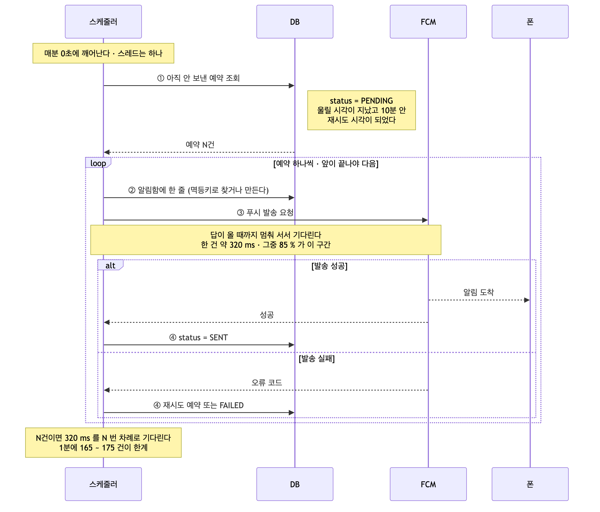
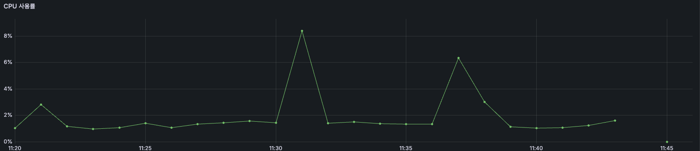
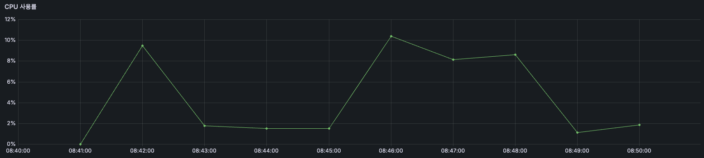
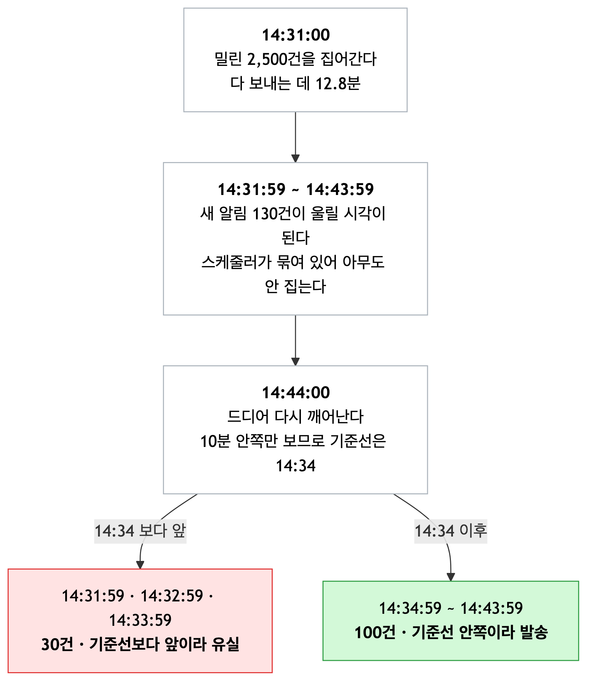

# 알림 처리량 개선기 : 다시 보내게 했더니 이번엔 못 따라간다

> **상태** 작성 중 — 개선 전 측정은 [재처리 글](../retry/measurements.md)의 값을 이어받는다
> **측정 자료** [measurements.md](measurements.md)
> **관련 글** [알림 유실 해결기](../retry/) · [스케줄러 개요](../README.md)

---

# 1. 개요

위 글에서 알림에 대한 유실을 보강했습니다. 그런데 서버가 멈췄다 살아나면 그동안의 알림이 한 번의 실행에 몰립니다.

이때 비우는 속도가 **분당 150~175건** 입니다. 또한, 알림에는 10분이라는 유효시간이 있기 때문에 1,500건이 한 번에 들어오게 된다면 초과분은 유실이 되는 문제가 있었습니다.

이 글에는 한계를 무엇으로 쟀는지, 동시에 보내기로 하면서 상한을 무엇을 보고
정했는지, 빨라진 대신 무엇을 감수했는지를 담았습니다.

# 2. 지금 알림이 나가는 방식

## 2.1 기존 구조



앞 글 구조에서 스케줄러의 조회 부분을 강조하였습니다. 
- 스케줄러는 매분 0초에 깨어나 **아직 안 보낸
예약**을 찾고, 찾은 것을 **하나씩 순서대로** 보냅니다. 
- 여기서 중요한 것은 **3번인 푸시 발송 요청의 이후입니다.** 푸시를 요청한 뒤 답이 올 때까지 스케줄러는
멈춰 서 있습니다. 각 한 건이 끝나야 다음 예약으로 넘어갑니다.
- `@Scheduled` 는 **기본이 스레드 하나**입니다. 그래서 예약이 N건이면 330 ms 를 N 번
  차례로 기다리게 됩니다.
```java
for (SchedulesAlarm alarm : alarms) {
    FcmSendResult result = fcmNotificationService.send(...);   // 답이 올 때까지 대기
}
```

## 2.2 기존 성능과 한계

| 건수 | 처리 시간 | 1건 중앙값 | RPS | QPS | TPS |
|---|---|---|---|---|---|
| 100 | 36.3 초 | 332 ms | 2.8 | 68 | 56 |
| 200 | 71.9 초 | 341 ms | 2.8 | 67 | 56 |
| 300 | 103.6 초 | 330 ms | 2.9 | 70 | 58 |
| 500 | 199.3 초 | 295 ms | 2.5 | 61 | 50 |

위는 알림에 대한 부하 테스트를 진행한 값입니다. **재처리 구조를 넣은 뒤에 잰
값**입니다.

- 스케줄러는 분당 150 ~ 175 건을 처리할 수 있습니다. 다음은 이 값이 나온 근거입니다.

```
100건 / 36.3초  = 2.75 건/초  × 60 = 165건
200건 / 71.9초  = 2.78 건/초  × 60 = 167건
300건 / 103.6초 = 2.90 건/초  × 60 = 174건
500건 / 199.3초 = 2.51 건/초  × 60 = 151건
```

**건수를 다섯 배로 늘려도 초당 2.5 ~ 2.9건 그대로입니다.** 100건에서부터 이미 그
값이라 **처음부터 천장에 붙어 있었습니다.**

CPU 경우 자원은 남아 있었습니다 다음은 100 ~ 300 CPU 사용률, 500 CPU 사용률 입니다.





| 라운드 | 걸린 시간 | CPU 최고 |
|---|---|---|
| 평소 | — | 1 ~ 2 % |
| 100건 | 36.3 초 | 1.4 % (평소와 구분 안 됨) |
| 200건 | 71.9 초 | 8.4 % |
| 300건 | 103.6 초 | 6.4 % |
| 500건 | 199.3 초 | 10.4 % (3분 유지) |

`2 vCPU` 인데 **10% 를 못 넘겼습니다.** 자원이 모자라서 느린 것이 아닙니다.  200건이든 500건이든 6~10%
이고, 500건은 **높이가 아니라 폭이 늘어납니다.** 건수가 늘어도 더 세게 일하는 게
아니라 시간만 더 걸리는 거였습니다.

그러면 CPU가 놀고 있는 원인은 외부 FCM이라고 생각했습니다. 왜냐하면 각 1건에서 FCM을 탈때와 안 탈때를 비교 해본다면 다음과 같았습니다.
- 발송시도 → FCM 직전 : 29 ms, 조회/알림함 저장 
- FCM 왕복  : 289 ms 
- 전송성공 → 완료표시 : 21 ms, 상태 기록 
- 합계 : 339 ms

**한 건의 85%(289 / 339) 가 FCM 왕복을 기다리는 시간입니다.** 나머지 15% 안에 조회
및 알림함 저장 및 상태 기록이 전부 들어 있습니다.  기다리는 동안은 계산을 하지 않으므로 CPU 에 잡히지 않습니다. **CPU 가 낮은 것과
처리량이 낮은 것이 같은 원인**입니다.

# 3. 기존 구조의 문제점

2.2 에서 본 것은 **분당 150 ~ 175건**입니다. 그리고 알림에는 앞 글에서 정한
**10분**이라는 시한이 있습니다. 울릴 시각에서 10분이 지나면 보내지 않습니다.

둘을 곱하면 **한 번에 밀려도 끝내 다 보낼 수 있는 최대**가 나옵니다.
```
분당 150 ~ 175건   ×   10분   =   1,500 ~ 1,750건
```

여기까지는 늦더라도 결국 나갑니다. **넘긴 만큼은 시한이 지나 사라집니다.**

그런데 이만큼 몰릴 일이 있느냐 하면, **구조적으로 몰립니다.**

```
종일 일정   전부 오전 9시에 알림
정각 일정   10시 일정이 많으면 9시 50분에 몰린다
```

사람들은 정각에 일정을 잡습니다. **부하를 하루 총량으로 재면 이게 안 보입니다.**
하루 10만 건도 고르게 퍼지면 분당 70건이라 여유롭습니다. **재야 하는 것은 총량이
아니라 한 분에 몰리는 최대치**입니다.

이 처리량의 한계로 인해 다음과 같은 문제들이 발생합니다.

## 3.1 151건을 넘으면 다음 실행이 밀린다

`@Scheduled` 는 **앞 실행이 끝나야 다음이 뜹니다.** 스레드가 하나라서입니다. 또한, 이 스레드는 분당 150 ~ 175건을 처리할 수 있습니다.

만약 1분에 이 값을 넘어가는 값이 온다면 다음과 같은 상황이 발생합니다.
```
14:31:00   200건 조회 → 하나씩 발송 시작
14:32:00   여기서 다시 떠야 하는데, 앞이 아직 도는 중
14:32:12   앞 실행이 끝남 (72초)
14:33:00   드디어 다시 뜬다
```

**14:32 에 울렸어야 할 알림이 14:33 에 나갑니다.** 그리고 그 실행은 밀린 것까지 같이
집으므로 **더 무거워집니다.** 유실은 아닙니다. 상태로 찾으니 늦어도 결국 갑니다. 다만 요구사항을 지키지 못합니다.

## 3.2 밀린 채 10분을 넘기면 조회에서 빠지고 기록도 안 남는다

3.1 처럼 밀리는 동안, **일부 예약은 차례가 오기 전에 시한을 넘깁니다.** `14:00` 에 1,800건이 한꺼번에 울릴 시각이 되었다고 하겠습니다.

```
14:00   스케줄러가 집어가기 시작.  분당 150건씩 나간다
14:10   1,500건까지 나감.  300건이 아직 PENDING
        이 300건의 alarm_date_time 은 14:00 이라 이미 10분이 지났다
14:11   조회 조건에서 빠진다
```

조회는 **10분 안쪽만** 봅니다.

```java
AND a.alarmDateTime >= :oldest      // oldest = 14:11 − 10분 = 14:01
```


**한 번 넘기면 영영 안 잡힙니다.** 그런데 **빠질 뿐입니다.** `FAILED` 로 바뀌지도, 로그가 남지도 않습니다. `PENDING` 인
채로 남아 있는데 아무도 집으러 오지 않습니다.

## 3.3 FCM 이 답을 안 하면 한 건이 5초가 된다

지금까지의 숫자는 **FCM 이 제때 답할 때**의 것입니다. 답이 안 오면 앞 글에서 넣은
타임아웃까지 기다립니다.

```java
// FcmConfig
.setConnectTimeout(3_000)
.setReadTimeout(5_000)
```

**한 건이 330 ms 에서 5,000 ms 가 됩니다. 15배입니다.**

| | 1건 | 밀리기 시작하는 건수 | 10분 안에 비울 수 있는 양 |
|---|---|---|---|
| 평소 | 330 ms | 151건 | 1,500건 |
| 응답 없음 | 5,000 ms | **12건** | **120건** |

**151건이 12건이 됩니다.** 그래서 몇 건이 타임아웃 나야 유실이 시작되는가를 보았습니다.
전부 답이 없는 경우는 드뭅니다. **일부만 타임아웃 나는 쪽**으로 생각했습니다. 섞였을
때 한 건에 걸리는 평균은 이렇게 됩니다.

```
한 건 평균 = (1 − 타임아웃 비율) × 0.4초  +  타임아웃 비율 × 5초
10분 ÷ 한 건 평균 = 10분 안에 비울 수 있는 양
```

| 타임아웃 비율 | 한 건 평균 | 10분 안에 비울 양 |
|---|---|---|
| 0 % | 0.40 초 | 1,500건 |
| 1 % | 0.45 초 | 1,340건 |
| 5 % | 0.63 초 | 950건 |
| 10 % | 0.86 초 | 700건 |
| 50 % | 2.70 초 | 220건 |
| 100 % | 5.00 초 | 120건 |

**100건 중 10건만 답이 없어도, 10분 안에 보낼 수 있는 건수가 1,500건에서 700건으로
줄어듭니다.** 

<details>
<summary>추가 사항 — 왜 10%가 이렇게 세게 먹히는가</summary>

100건으로 세어 보면 이유가 보입니다.

```
성공  90건 × 0.4초 = 36초
실패  10건 × 5.0초 = 50초      ← 10건이 90건보다 오래 쓴다
```

한 건이 **12.5배** 무거우니, 열 건이면 **125건 몫**을 씁니다. **타임아웃 난 건이 자기
몫만 축내는 게 아니라 뒤에 줄 선 것들의 시간을 먹습니다.**

여기에 앞 글에서 넣은 **재시도 3회**가 얹힙니다. 실패한 건은 1분·2분·4분 뒤에 다시
와서 **또 5초씩 씁니다.** 위 표는 첫 시도만 센 값이라 **실제로는 더 나쁩니다.**

**가장 필요한 순간에 가장 느립니다.**

> `5초` 는 잰 값이 아니라 **우리가 설정한 값**이고, 위 표는 그 값으로 계산한
> 것입니다. 실제로 FCM 이 얼마나 느려지는지는 저쪽이 아파야 알 수 있어 관측으로는
> 확인하지 못했습니다.

</details>

## 3.4 재시도 건이 새 알림보다 뒤로 밀린다

```sql
ORDER BY a.alarm_date_time DESC
```

**울릴 시각이 최신인 것부터 가져옵니다.** 그래서 **재시도 건은 언제나 과거 시각이라 맨 뒤로 갑니다.**

```
14:01 실행
  새 알림 100건    alarm_date_time = 14:01   수명 10분 남음   ← 먼저
  재시도    1건    alarm_date_time = 14:00   수명  9분 남음   ← 101번째
```

**수명이 짧은 쪽이 뒤로 갑니다.** 재시도를 거듭할수록 시각은 더 옛것이 되니 **더
뒤로 밀립니다.**


# 4. 유실 테스트

실제로 일어나는 일은 **밀린 것이 쌓인 상태에서 새 알림이 계속 들어오는 것**입니다.
그래서 둘을 같이 넣었습니다.

```
밀린 알림   14:30:59 에 2,500건을 한꺼번에            장애 뒤 몰린 몫
새 알림    14:31:59 부터 1분마다 10건씩 20분 동안    평소처럼 들어오는 몫
          14:31:59 · 14:32:59 · … · 14:50:59
```

테스트 결과는 다음과 같습니다.
```
14:31:00        스케줄러가 2,500건을 집어감  →  다 보내는 데 770.7초 (12.8분)
14:32 ~ 14:43   스케줄러가 못 깨어난다.  앞 작업이 아직 도는 중
14:44:00        드디어 다시 깨어남.  그런데 100건만 집힌다
```

- **2,500건을 12.8분에 비웠습니다. 분당 195건**이고, 밀린 것은 한 건도 빠짐없이 `SENT`
로 갔습니다. 
- 문제는 그 12.8분 동안 **스케줄러가 한 번도 못 깨어났다**는 것입니다. 그사이 시각이 된 새 알림은
아무도 집지 않았습니다.

그런데 **왜 100건만** 잡힌 이유는 다음 다이어그램에서 볼 수 있습니다.



울릴 시각은 지났는데 **스케줄러가 못 깨어나는 사이 10분을 넘겨버린 30건**입니다.
미리 계산한 값과도 맞습니다.

```
12.8분 밀림 - 10분 창 = 2.8분치가 창 밖
2.8분 × 분당 10건 = 28건  ≈  30건
```

또한, 이 유실 된 것에 대해 기록이 없습니다. 밀린 2,500건은 전부 `SENT` 로 남았는데, 이 30건만 아무 흔적이
없습니다. 앞 글에서 **실패를 성공으로 기록하던 것**을 고쳤습니다. 그런데 여기는 **기록 자체가
없습니다.** 몇 건이 이렇게 사라졌는지 셀 방법이 없습니다.

정리하면 다음과 같습니다.

- **밀린 것을 비우는 데 10분이 넘으면, 넘긴 시간 동안 들어온 새 알림이 통째로 유실됩니다.** 이번에는 2,500건에 12.8분이 걸려 **2.8분치인 30건**이 사라졌습니다.
- **유실에 아무 기록이 없습니다.** `PENDING` 그대로고 `FAILED` 도, 로그도, 알림함 줄도 없습니다.

# 5. 원인 분석

## 5.1 왕복을 하나씩 줄 서서 기다린다

`(작성 예정)` — 자원 포화가 아니라는 근거 (건수를 늘려도 초당 처리량이 그대로)

## 5.2 조회 순서가 만료 순서와 반대다

`(작성 예정)`

---

# 6. 문제 해결 방법

## 6.1 동시에 보낸다

`(작성 예정)`

## 6.2 조회 순서를 바꾼다

`(작성 예정)`

## 6.3 메시지 큐로 넘긴다

`(작성 예정)` — 검토만 하고 채택하지 않은 이유

---

# 7. 문제 해결 과정

## 7.1 병목이 어디인가

`(작성 예정)` — FCM 왕복 85% 를 어떻게 갈랐는지

## 7.2 동시성 상한을 무엇으로 정할 것인가

`(작성 예정)` — DB 커넥션 풀 · 트랜잭션 경계 · FCM 쪽 제한

## 7.3 결과를 알림별로 다시 접기

`(작성 예정)` — 동시 발송과 상태 전이를 어떻게 이었는지

## 7.4 조회 순서와 만료 처리

`(작성 예정)`

## 7.5 최종 구조

`(작성 예정)` — 다이어그램

---

# 8. 개선 후 테스트

`(작성 예정)`

## 잃은 것

`(작성 예정)`

---

# 9. 결론

`(작성 예정)`

---

# 10. 남은 것

`(작성 예정)`

## 이력서 문구

`(작성 예정)`

## 포트폴리오 문구

`(작성 예정)`

## 면접에서 꺼낼 것

`(작성 예정)`
