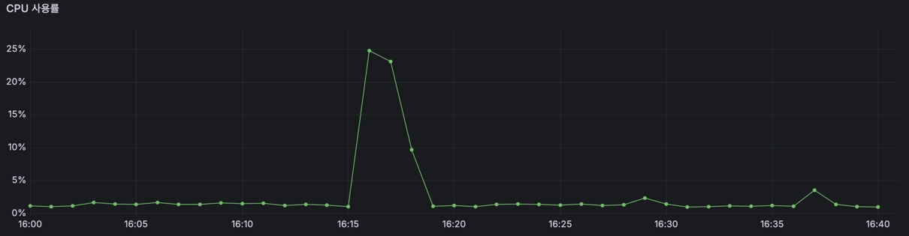

# 알림 처리량 개선기 : 다시 보내게 했더니 이번엔 못 따라간다

> **상태** 작성 중 — 개선 전 측정은 [재처리 글](../retry/measurements.md)의 값을 이어받는다
> **측정 자료** [measurements.md](measurements.md)
> **관련 글** [알림 유실 해결기](../retry/) · [스케줄러 개요](../README.md)

---

# 1. 개요

위 글에서 알림에 대한 유실을 보강했습니다. 그런데 서버가 멈췄다 살아나면 그동안의 알림이 한 번의 실행에 몰립니다.

이때 비우는 속도가 **분당 150~175건** 입니다. 또한, 알림에는 10분이라는 유효시간이 있어 **비우는 데 10분이 넘어가면 그동안 울릴 시각이 된 알림이 사라지는** 문제가 있었습니다.

이 글에는 한계를 무엇으로 쟀는지, 동시에 보내기로 하면서 상한을 무엇을 보고
정했는지, 빨라진 대신 무엇을 감수했는지를 담았습니다.

# 2. 지금 알림이 나가는 방식

## 2.1 기존 구조


앞 글 구조에서 스케줄러의 조회 부분을 강조하였습니다. 
- 스케줄러는 매분 0초에 깨어나 **아직 안 보낸
예약**을 찾고, 찾은 것을 **하나씩 순서대로** 보냅니다. 
- 여기서 중요한 것은 **3번인 푸시 발송 요청의 이후입니다.** 푸시를 요청한 뒤 답이 올 때까지 스케줄러는
멈춰 서 있습니다. 각 한 건이 끝나야 다음 예약으로 넘어갑니다.
- `@Scheduled` 는 **기본이 스레드 하나**입니다. 그래서 예약이 N건이면 330 ms 를 N 번
  차례로 기다리게 됩니다.
```java
for (SchedulesAlarm alarm : alarms) {
    FcmSendResult result = fcmNotificationService.send(...);   // 답이 올 때까지 대기
}
```

## 2.2 기존 성능과 한계

| 건수 | 처리 시간 | 1건 중앙값 | RPS | QPS | TPS |
|---|---|---|---|---|---|
| 100 | 36.3 초 | 332 ms | 2.8 | 68 | 56 |
| 200 | 71.9 초 | 341 ms | 2.8 | 67 | 56 |
| 300 | 103.6 초 | 330 ms | 2.9 | 70 | 58 |
| 500 | 199.3 초 | 295 ms | 2.5 | 61 | 50 |

위는 알림에 대한 부하 테스트를 진행한 값입니다. **재처리 구조를 넣은 뒤에 잰
값**입니다.

- 스케줄러는 분당 150 ~ 175 건을 처리할 수 있습니다. **최고 약 175건, 최저 약 150건 정도 처리할 수 있었습니다.**
```
300건 / 103.6초 = 2.90 건/초  × 60 = 174건
500건 / 199.3초 = 2.51 건/초  × 60 = 151건
```


CPU 경우 자원은 남아 있었습니다 다음은 100 ~ 300 CPU 사용률, 500 CPU 사용률 입니다.


| 라운드 | 걸린 시간 | CPU 최고 |
|---|---|---|
| 평소 | — | 1 ~ 2 % |
| 100건 | 36.3 초 | 1.4 % (평소와 구분 안 됨) |
| 200건 | 71.9 초 | 8.4 % |
| 300건 | 103.6 초 | 6.4 % |
| 500건 | 199.3 초 | 10.4 % (3분 유지) |

`2 vCPU` 인데 **10% 를 넘기지 않았습니다** CPU가 놀고 있는 원인은 외부 FCM이라고 생각했습니다. 왜냐하면 각 1건에서 FCM을 탈때와 안 탈때를 비교 해본다면 다음과 같았습니다.
- 발송시도 → FCM 직전 : 29 ms, 조회/알림함 저장 
- FCM 왕복  : 289 ms 
- 전송성공 → 완료표시 : 21 ms, 상태 기록 
- 합계 : 339 ms

한 건의 85%(289ms)가 FCM 왕복을 기다리는 시간입니다. 나머지 15% 안에 조회 및 알림함 저장 및 상태 기록이 전부 들어 있습니다.  기다리는 동안은 계산을 하지 않으므로 CPU 에 잡히지 않습니다. **CPU 가 낮은 것과
처리량이 낮은 것이 같은 원인**입니다.

# 3. 기존 구조의 문제점

2.2에서 최저 분당 약 150건을 처리할 수 있었습니다. 그리고 알림에는 앞 글에서 정한
**10분**이라는 시한이 있습니다. 울릴 시각에서 10분이 지나면 보내지 않습니다.

지켜야 할 선은 [SLO](../../../slo.md) 로 이렇게 잡아 두었습니다.
- p95 1분 : 알림 100개 중 95개는 1분 안에 나간다 
- 10분 : 넘기면 보내지 않고 버린다     
분당 150건이라는 한계가 이 선과 부딪혀 다음 문제들이 생깁니다.

## 3.1 한 분에 150건이 넘게 들어오면 알림이 1분 넘게 늦게 간다

분당 약 150건을 처리할 수 있다는 것은 **한 건에 약 0.4초**가 걸린다는 뜻입니다.

```
150건 × 0.4초 = 60초
```

150건이 한꺼번에 들어오면 마지막 한 건이 나가기까지 딱 1분입니다.
**여기서 더 들어오면 1분을 넘기고, 약속한 `p95 1분` 을 지키지 못합니다.**

> 그렇다면 150건이 넘게 몰릴 일이 있는가 즉, **알림이 한 분에 얼마나 몰리는지 예측할 기준**이 필요했습니다. 

## 3.2 밀린 알림은 차례가 오기 전에 사라진다

하나의 알림은 설정된 시각에서 10분이 지나면 알림을 보내지 않도록 설계되었습니다.

그런데 스케줄러는 스레드가 하나라 **앞 실행이 끝나야 다음이 뜹니다.** 분당 150건보다
많이 들어오면 처리하지 못한 것은 다음 실행으로 넘어가고, 그 실행은 밀린 것까지 같이
집으므로 더 오래 걸립니다. **밀림은 이렇게 계속 뒤로 쌓입니다.**

그러다 **한 번도 집히지 못한 채 10분을 넘긴 알림**이 생깁니다. 조회가 10분 안쪽만
보기 때문입니다. 

> 현재 분당 처리량에서 **문제는 10분이 지난 알림은 그대로 유실이됩니다.**

## 3.3 FCM 의 느린 응답 하나가 뒤의 알림을 모두 막는다

FCM 이 답을 안 할 때 영원히 기다리지 않도록 타임아웃을 걸어 두었습니다.

```java
// FcmConfig
.setConnectTimeout(3_000)   // 연결이 맺어질 때까지 3초
.setReadTimeout(5_000)      // 연결 뒤 답이 올 때까지 5초
```

FCM 공식 문서는 **10초 이상**을 권합니다. 그보다 짧게 잡은 이유는 재시도가 있어서
한 건을 오래 붙잡고 있느니 빨리 포기하고 나중에 다시 보내는 편이 낫다고 봐서입니다.

> 문제는 그 **5초 동안 스레드 하나가 통째로 묶인다**는 것입니다. 스케줄러는 스레드가 하나라, 한 건이 멈추면 **뒤에 줄 선 알림이 전부 같이 멈춥니다.**

그래서 처리가 다음과 같이 진행됩니다.

| | 1건 | 분당 |
|---|---|---|
| 평소 | 330 ms | 151건 |
| 답이 없을 때 | 5,000 ms | **12건** |

**3.1 · 3.2 에서 말한 `150건` 은 FCM 이 건강할 때의 값입니다.** 고정된 선이 아니라
FCM 사정에 따라 언제든 내려갑니다.


## 3.4 재시도 건이 새 알림보다 뒤로 밀린다

```sql
ORDER BY a.alarm_date_time DESC
```

**울릴 시각이 최신인 것부터 가져옵니다.** 그래서 **재시도 건은 언제나 과거 시각이라 맨 뒤로 갑니다.**

```
14:01 실행
  새 알림 100건    alarm_date_time = 14:01   수명 10분 남음   ← 먼저
  재시도    1건    alarm_date_time = 14:00   수명  9분 남음   ← 101번째
```

> 문제는** 수명이 짧은 쪽이 뒤로 갑니다.** 재시도를 거듭할수록 시각은 더 옛것이 되니 **더
뒤로 밀립니다.**


# 4. 유실 테스트

유실이 실제로 나는지, **어떤 상태가 되어야 나는지** 보려고
돌렸습니다. 테스트를 진행할 때 **밀린 것과 새로 들어오는 것을 같이** 넣어서 진행했습니다.

```
밀린 알림   2,500건을 한꺼번에          장애 뒤 몰린 몫
새 알림     1분마다 10건씩 20분 동안    평소처럼 들어오는 몫
```

결과는 다음과 같았습니다.

```
밀린 2,500건   12.8분 걸려 전부 SENT      분당 195건
그동안         스케줄러가 한 번도 못 깨어남
새 알림 200건   170건 발송, 30건 유실
```

- 밀린 것은 **한 건도 안 사라졌습니다.** 조회에 한 번 집히면 늦더라도 끝까지 나갑니다.
- 사라진 건 **그 12.8분 동안 울릴 시각이 된 새 알림**입니다. 스케줄러가 앞 작업에
  묶여 있어 아무도 집지 않았습니다.

**왜 30건인지**는 다음 다이어그램에서 볼 수 있습니다.


> 울릴 시각은 지났는데 **스케줄러가 못 깨어나는 사이 10분을 넘겨버린 30건**입니다. 
> 또한, 이 유실 된 것에 대해 기록이 없습니다. 밀린 2,500건은 전부 `SENT` 로 남았는데, 이 30건만 아무 흔적이
없습니다. 앞 글에서 **실패를 성공으로 기록하던 것**을 고쳤습니다. 그런데 여기는 **기록 자체가
없습니다.** 몇 건이 이렇게 사라졌는지 셀 방법이 없습니다.

한편 처리 속도가 2.2 에서 잰 것보다 빨랐습니다. 최저가 분당 151건이었는데 여기서는
195건이 나왔습니다.

```
2026-08-29   1건 중앙값 295 ms   p95 869 ms   분당 151건
2026-08-30   1건 중앙값 284 ms   p95 382 ms   분당 195건
```

정리하면 다음과 같습니다.

- **유실이 실제로 일어납니다.** 밀린 것을 비우는 데 10분이 넘으면, 넘긴 시간 동안 들어온
  새 알림이 통째로 사라집니다. 2,500건에 12.8분이 걸려 **2.8분치인 30건**이 없어졌습니다.
- **분당 195건으로 잘 돌던 날에도 났습니다.** FCM 이 나쁜 날은 150건까지 떨어지므로,
  개선은 **분당 150건을 기준**으로 잡습니다.
- **유실에 아무 기록이 없습니다.** `PENDING` 그대로고 `FAILED` 도, 로그도, 알림함 줄도 없습니다.

# 5. 문제 해결 과정

문제를 정리하면 다음과 같습니다,
1. 한 분에 150건이 넘게 들어오면 알림이 1분 넘게 늦게 간다
2. 밀린 알림이 차례를 못 받고 10분을 넘기면 사라진다.  기록도 없다
3. 느린 한 건이 스레드를 붙잡아 뒤의 알림을 전부 세운다
4. 재시도 건이 새 알림보다 뒤로 밀린다.  수명이 짧은 쪽이 뒤로 간다

이 4가지 문제를 3가지 관점으로 보았습니다.
- 1번과 3번은 스케줄러 속도 
- 4번은 스케줄러가 정하는 우선순위
- 2번은 유실된 것들의 처리


그런데 처리량의 한계는 완전히 없앨 수 없습니다. 스레드를 늘려도 선이 올라갈 뿐 어딘가에는 있습니다. 그래서 어디까지 버티게 만들 것인가 라는 기준이 필요했습니다.

서비스 규모는 [통합검색 글](../../search/)과 같이 **DAU 1,000명**으로 가정했습니다.

```
DAU 1,000명, 한 사람이 하루 2건   →  하루 2,000건
고르게 퍼지면                    →  분당 3건 이하
그런데 정각 및 30분에 몰린다        →  하루 24개 분에 집중
                                →  분당 약 80건(2000/ 24)
피크를 그 4배로 보면               →  분당 320건
```
- **하루 2,000건** - 한 사람이 일정 두 개에 알림을 걸어둔다고 봤습니다.
- **분당 3건 이하** - 사용자가 활동하는 12시간(720분)에 고르게 퍼진다고 치면 나오는 값입니다.
- **하루 24개 분** - 사람들은 2시 17분이 아니라 2시에 일정을 잡습니다. 하루 시간에서 30분과 정각은 2개입니다. 그래서, 12시간 × (정각·30분) = 24개 분에 뭉칩니다.
- **분당 약 80건** - 2,000건을 그 24개 분에 나눈 값입니다.
- **분당 320건** - 24개 분에도 고르게 안 퍼집니다. 출근 직후나 점심 무렵이 더 몰리므로 평균의 4배로 봤습니다.

사용자당 건수와 몰림 정도는 지금 데이터로 셀 수 없어 **가정한 값입니다.** 피크 배수는
통합검색 글에서 평균의 4~5배로 본 것과 맞췄습니다.

목표는 다음과 같습니다.
> **분당 320건이 몰려도 10분 안에 다 나간다 그보다 더 몰려 못 보내는 것이 생기면, 몇 건인지 남는다**

지금이 분당 150건이니 **두 배가 조금 넘습니다.** 이 숫자를 놓고 세 가지를 고쳐 나갔습니다.


## 5.1 스케줄러 속도

2.2에서 테스트 중 건수를 다섯 배 늘려도 CPU의 작업량은 10%를 넘기지 못했습니다. 즉, FCM 왕복이 85% 잡아먹고 있는 상황이었습니다.

**기다리는 동안은 계산을 하지 않으니 CPU 에 안 잡힙니다.** 그런데 스레드는 묶여 있어
다음 알림을 못 집습니다. CPU 가 낮은 것과 처리량이 낮은 것이 **같은 원인**이었습니다.

그래서 다음과 같이 개선하는 방법을 생각했습니다.
- DB 를 고친다 : 전체의 15% 안에서만 움직인다.  절반으로 줄여도 7% 빨라진다
- 기다림을 겹친다 : 85% 를 여러 건이 나눠 쓴다

즉, 기다리는 일을 겹칠 수 있는 방법인 여러 개의 스레드를 처리할 수 있는 방법을 생각했습니다.

다음은 직접 생각한 트레이드 오프입니다.
1. ExecutorService - 동시 실행 개수를 명확히 제한하고 완료까지 기다릴 수 있지만, 풀 크기와 종료를 직접 관리해야 한다.
2. CompletableFuture - 비동기 작업의 조합과 예외 처리가 편하지만, 단순히 독립적인 알림들을 병렬 실행하는 용도에는 구조가 불필요하게 복잡해질 수 있다.
3. Spring @Async - Spring이 스레드 실행을 관리해 사용은 간단하지만, 여러 알림 작업의 전체 완료 시점을 한 번에 제어하기에는 추가 처리가 필요하다.
4. Virtual Thread - Blocking I/O가 매우 많은 대규모 동시 작업에는 유리하지만, 동시 작업 수가 적다면 기존 고정 스레드 풀 대비 이점이 크지 않다.

- 필요한 것은 둘이었습니다. **스레드 개수를 직접 정할 수 있을 것**, 그리고 **다 끝날
  때까지 기다릴 수 있을 것.** 안 기다리면 다음 실행이 아직 보내는 중인 알림을 또
  집어가기 때문입니다.

- 그래서 **`ExecutorService`** 를 선택했습니다. 동시 실행 개수를 명확하게 제한하면서
  전체 작업 완료도 기다릴 수 있는 것 중 가장 직접적으로 되는 것이 이것이었습니다.

다음은 스레드 몇 개를 둘 지에 대한 테스트를 진행했습니다. **N 은 스레드 개수**입니다. 같은 조건에서 N 만 바꿔 세 번 돌렸습니다.
- 알림 : 1,000건 
- 기기 : 3대 - 실제 사용자 기기 (IOS 2, ANDROID 1)
- N   : 1개, 2개, 4개


기기를 셋으로 나눈 이유는 **FCM 이 한 기기에 분당 240건까지만 받기 때문**입니다.
한 사람에게 몰면 N=2 부터 우리 코드가 아니라 FCM 의 제한을 재게 됩니다.

다음은 결과 표입니다.

| | N = 1 | N = 2 | N = 4 |
|---|---|---|---|
| 처리 시간 | 286.5 초 | 148.1 초 | **75.2 초** |
| 분당 | 209건 | 405건 | **798건** |
| N=1 대비 | 1.00 | 1.94 | **3.82** |
| 1건 중앙값 | 316 ms | 326 ms | 321 ms |
| 1건 p95 | 383 ms | 380 ms | 381 ms |
| CPU 최고 | 12.8 % | 24.7 % | 34 % |
| 커넥션 평균 사용 | 0.154 | 0.255 | 0.529 |
| 커넥션 대기 | 0 | 0 | 0 |

위 표는 잰 날의 값입니다. 4장에서 정한 대로 **한 건 처리 0.4초**로 환산해 목표와 견주면 이렇게 됩니다.
- N=2는 2 ÷ 0.4초 × 60 = 분당 300건
- N=4는 4 ÷ 0.4초 × 60 = 분당 600건
- 즉, 목표 분당 320건을 처리할 수 있는 4개로 진행하였습니다. 

또한, FCM의 응답 속도 5초를 얹으면 차이가 더 벌어집니다. **느린 한 건은 스레드 하나를 5초 동안 붙잡습니다.** 그동안은 남은 스레드로만 돌아갑니다.
```
N=2   하나가 묶이면 남는 스레드 1개  →  분당 150건
N=4   하나가 묶이면 남는 스레드 3개  →  분당 450건
```

- **N=2 는 느린 건 하나에 목표의 절반이 됩니다.** N=4 는 하나가 묶여도 목표를 지킵니다.
  그래서 N=4 로 정했습니다.
- 올리는 비용도 없었습니다. 커넥션은 풀 10 개 중 0.529 개에 대기가 0 이고, 1건 시간도 316 → 321 ms 로 그대로라서, 커넥션 풀은 건드리지 않았습니다.


### 원자성 대신 멱등성

스레드끼리 부딪히지 않는지 봤습니다.
- **락은 안 씁니다.** 한 알림을 한 스레드가 통째로 맡고 `alarmId` 로 나눠 가집니다.
서로 넘기는 것이 없으니 **알림끼리는 겹칠 일이 없습니다.**
- **트랜잭션으로도 안 묶었습니다.** 한 건은 `알림함 INSERT → FCM 발송 → 결과 UPDATE`
순인데, 이 셋을 묶으면 두 가지가 걸립니다.

```
FCM 은 되돌릴 수 없다      DB 만 롤백되고 푸시는 이미 나가서, 다음 실행이 또 보낸다
커넥션을 오래 쥔다         40 ms → 321 ms.  N=4 면 풀 10개 중 4.3개를 물고 있게 된다
```

그래서 **원자성 대신 멱등성으로 막았습니다.** 중간에 죽어도 알림은 `PENDING` 으로
남아 다음 실행이 회수하고, 알림함은 멱등키(`알림번호 + 울릴시각`)로 몇 번을 다시
처리해도 한 줄만 생깁니다. 사용자가 두 번 받을 수는 있습니다(`at-least-once`).

### 결과

```
분당              150  →  600건        (한 건 0.4초 기준)
10분 안에 비울 양   1,500  →  6,000건
1건 시간           316  →  321 ms      그대로
```

- **목표 분당 320건을 넘깁니다.**
- **1건 시간이 안 변했습니다.** 한 건이 빨라진 것이 아니라 여러 건이 겹쳐 나간 것이고,
  안 늘어났다는 것은 스레드끼리 다투지 않았다는 뜻입니다.
- **3.3 도 같이 풀립니다.** 느린 한 건이 5초를 붙잡아도 나머지 스레드는 계속 나갑니다.
  다만 FCM 이 통째로 멎으면 어떤 값으로도 못 지키고, 그 경우는 앞 글의 재시도가 맡습니다.

## 5.2 스케줄러가 정하는 우선순위

알림 스케줄러에서 알림의 조회가 **최신 것부터** 가져옵니다.

```sql
ORDER BY a.alarm_date_time DESC
```

각 알림의 **마감은 `울릴 시각 + 10분`** 입니다. 울릴 시각이 오래된 것일수록 마감이
가깝습니다. 그런데 `DESC` 는 **마감이 먼 것부터** 보내고 있었습니다.

```sql
ORDER BY a.alarm_date_time ASC
```

`ASC` 로 바꾸면 **마감이 가까운 것부터** 나갑니다. 마감이 있는 작업을 최대한 많이
맞추는 순서로 알려진 **EDF(Earliest Deadline First)** 입니다.


## 5.3 유실된 것들의 처리

각 알림들은 10분이 지나면 유실됩니다. 상태값으로 `PENDING` 인 채로 남아 있습니다. 현재 유실이되면 몇 건이 사라졌는지 셀 수 없었습니다.

그래서 표시할 주체를 만들었습니다. 스케줄러가 발송 대상을 집기 **전에** 시한을 넘긴
것부터 먼저 걷어냅니다.

```java
// 1. 만료 표시
int expired = schedulesAlarmRepository.markExpired(oldest);
if (expired > 0) {
    meterRegistry.counter("alarm.expired").increment(expired);
    log.warn("[ALARM] 만료 count={} oldest={}", expired, oldest);
}

// 2. 발송 대상 조회
List<Long> alarmIds = schedulesAlarmRepository.findTargetAlarmIds(now, oldest);
```

```sql
UPDATE schedules_alarm
   SET status = 'EXPIRED'
 WHERE status = 'PENDING'
   AND alarm_date_time < :oldest
   AND ...   -- 발송 조회와 같은 조건
```
그리고 이 쿼리가 **바뀐 행 수를 돌려주므로 그게 곧 유실 건수**입니다. 따로 세는
쿼리를 두지 않아도 됩니다.

```java
@Transactional
@Modifying(clearAutomatically = true, flushAutomatically = true)
@Query("UPDATE SchedulesAlarm a SET a.status = ...EXPIRED WHERE ...")
int markExpired(@Param("oldest") LocalDateTime oldest);
```

벌크 UPDATE로 진행했습니다 이 연산은 **JPA 를 건너뛰고 DB 로 바로 나갑니다.** 영속성 컨텍스트가 그 사실을
모르므로 `clearAutomatically` 로 실행 뒤 캐시를 비웁니다. 지금은 스케줄러가 이걸 맨
앞에서 부르고 뒤에서 꺼내 쓰는 엔티티가 없어 실질적인 차이는 없지만, 나중에 앞뒤로
코드가 붙을 때를 대비해 붙여 두었습니다.


또한, 지표도 추가하였습니다.
```
유실률 = alarm_expired_total / (alarm_sent_total + alarm_expired_total)
```

# 6. 개선 후 테스트


4장과 **같은 시나리오**를 다시 돌렸습니다.
```
밀린 알림   2,500건을 한꺼번에          세 사람에게 나눔
새 알림     1분마다 10건씩 20분 동안
```

**4장에서 유실된 것이 30건입니다.** 그때는 드레인이 12.8분이라 다시 깨어났을
때 이미 창 밖이었습니다. 이번에는 2.7분이라 전부 창 안에 들어옵니다.

| | 개선 전 (4장)          | 개선 후 |
|---|--------------------|---|
| 홀딩 2,500 | 770.7초 (12.8분)     | **161.6초 (2.7분)** |
| 분당 | 195건               | **943건** |
| 유입 200 | 170 발송 + **30 유실** | **200 발송 · 유실 0** |
| 만료 · 실패 | 30                 | **0** |

| | 개선 전 | 개선 후 |
|---|---|---|
| 2,500건 비우기 | 12.8분 | **2.7분** |
| 분당 처리 | 195건 | **943건** |
| 새 알림 200건 | 170 발송 + **30 유실** | **200 발송 · 유실 0** |
| 1건 처리 시간 | 316 ms | 321 ms |
| CPU 최고 | 10.4 % | 24.8 % |
| 커넥션 평균 사용 | — | 0.529 / 10 |
| 커넥션 대기 | — | 0 |

CPU 는 이렇게 나왔습니다.



```
평소     1 % 안팎
16:16   24.8 %      ← 2,500건을 비우는 중
16:17   23.1 %
16:18    9.7 %      ← 남은 30건까지 끝
```

**분당 943건을 보내면서도 2 vCPU 의 4분의 1을 안 넘겼습니다.**

## 잃은 것

**사용자가 알림을 두 번 받을 수 있습니다.** 트랜잭션을 안 걸었으니 FCM 발송과 결과
저장 사이에 죽으면 다음 실행이 다시 보냅니다. 앞 글에서 정한 `at-least-once` 를
그대로 이어받았습니다.

**N=8 위쪽은 재보지 못했습니다.** 실기기 셋으로는 FCM 기기 제한에 걸립니다. 다만
6장에서 기기당 314건을 보냈는데도 거절이 없었으니, **그 제한을 근거로 삼은 것이
생각보다 느슨했을 수 있습니다.**

**처리율은 여전히 날마다 흔들립니다.** 같은 N=4 인데 9월 3일 798건, 9월 7일 943건으로
18% 차이가 났습니다. 한 건의 85%가 FCM 왕복이라 그쪽이 흔들리면 전체가 흔들립니다.


# 7. 결론

한 건씩 순서대로 보내던 것을 **넷이 동시에** 보내게 바꿨습니다.

```
분당              150  →  943건
10분 안에 비울 양   1,500  →  9,430건
2,500건 비우기      12.8분  →  2.7분
유실                30건  →  0건
```

목표는 분당 320건이었고, FCM 이 나빴던 날 기준(한 건 0.4초)으로 계산해도 600건이라
넘깁니다.

### 세 가지를 고쳤습니다

```
속도    ExecutorService N=4      1건 시간은 316 → 321 ms 로 그대로
순서    ORDER BY ASC             마감이 가까운 것부터
기록    EXPIRED 상태             유실을 처음으로 셀 수 있게 됨
```

**1건 시간이 안 변한 것이 이 개선의 핵심 근거**입니다. 한 건이 빨라진 게 아니라 여러
건이 겹쳐 나간 것이고, 안 늘어났다는 것은 스레드끼리 아무것도 다투지 않았다는 뜻입니다.

### 배운 것

**자원이 남는데 느리면 계산이 아니라 기다림을 의심해야 합니다.** 2 vCPU 에서 CPU 가
10% 를 못 넘기는데 처리량도 안 오르는 상황이었습니다. 두 가지가 따로 있는 문제가
아니라 **같은 원인**이었습니다 — 한 건의 85%가 FCM 응답을 기다리는 시간이라, 기다리는
동안 CPU 에도 안 잡히고 다음 알림도 못 집었습니다.

**못 세는 것은 못 고칩니다.** 유실은 처음부터 있었는데 `PENDING` 인 채로 조회에서
빠지기만 해서 아무도 몰랐습니다. 상태 하나를 추가해 세기 시작한 뒤에야 SLO 에 적어둔
유실률이 계산 가능한 값이 됐습니다.

**한계는 하나의 숫자가 아닙니다.** 같은 코드로 잰 값이 날마다 150 ~ 209건, 798 ~ 943건
으로 벌어집니다. 한 건의 85%가 외부 호출이라 그쪽이 흔들리면 전체가 흔들립니다.
그래서 좋았던 날이 아니라 **가장 나빴던 날을 기준**으로 목표를 잡았습니다.

# 8. 남은 것

**`@Version` 이 없습니다.** 알림을 읽고 저장하기까지 330 ms 사이에 사용자가 일정을
수정하면 그 수정을 덮어씁니다. 스레드가 넷이면 열린 창도 넷입니다. **배포 전에 하는
것이 순서입니다.** → [lost-update.md](lost-update.md)

**조회에 상한이 없습니다.** `LIMIT` 도 `Pageable` 도 없어서 밀린 것을 전부 메모리에
올립니다. 2,500건까지는 재봤지만 10만 건을 한 번에 들 수 있는지는 안 재봤습니다.

**보내기 직전에 만료를 다시 안 봅니다.** 조회할 때만 확인하므로, 심하게 밀리면 차례가
왔을 때 이미 지난 알림을 그대로 보냅니다. 상한과 같이 봐야 할 문제입니다.

**FCM 실패율을 안 셉니다.** 3.3 의 타임아웃 비율은 계산으로만 다뤘고, 실제로 몇 %가
실패하는지 재는 지표가 없습니다. 지금까지 8,000건 넘게 보내면서 실패가 0건이라 급하지는
않습니다.

**타임아웃이 공식 권고보다 짧습니다.** FCM 은 10초 이상을 권하는데 5초로 두었습니다.
동시성을 넣은 지금은 한 건이 오래 붙잡혀도 나머지 스레드가 도니 **10초로 늘릴 여유가
생겼습니다.** 다만 실패율을 세기 시작한 뒤에 정하는 게 맞습니다.

