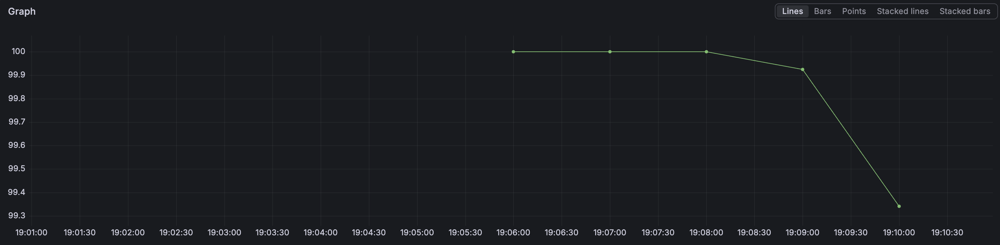
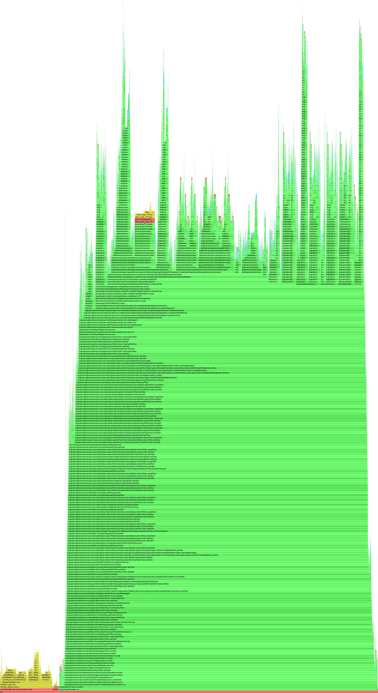
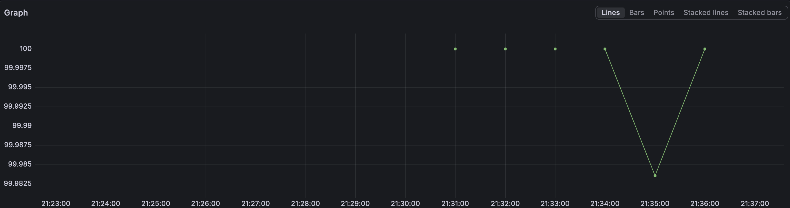
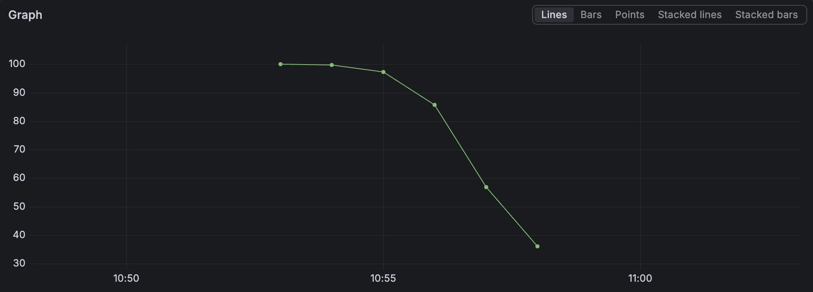

# 통합검색 성능 개선기 (PostgreSQL 기준)

> **주의** 이 글의 모든 수치는 **PostgreSQL 에서 측정한 값**입니다.
> 이후 DB 를 MySQL 8.0 으로 전환했으므로 **현재 운영 환경의 값이 아닙니다.**
> MySQL 재측정 결과는 [README.md](README.md) 를 참고하세요.
>
> **원문** https://wo-dbs.tistory.com/419

## 1. 배경, 목표, 그리고 개선 방향

### 1.1 배경 및 목표

저희 서비스에는 **통합검색** 기능이 있습니다. 검색어 하나를 넣으면 **보관함, 일정, 링크,
텍스트, 파일** 5종을 한 번에 찾아줍니다. 그런데 이 API 는 한 번 호출될 때마다 **5개 테이블을
전부 검색하게 되었습니다.**

사용자가 자료를 수천 개씩 쌓고 여러 명이 동시에 검색하면 과연 버틸 수 있을까? 이 막연한
불안에서 이 개선을 시작하게 되었습니다.

**1. SLO**

> SLI = 700ms 이내에 성공한 검색 요청 수 / 전체 검색 요청 수
> SLO = SLI ≥ 95%

검색의 기준선이 필요했습니다. 사용자 응답성 연구와 SRE 의 latency SLO 설계 방식을 참고해
700ms 를 초기 기준으로 잡았습니다. (레퍼런스에 첨부하였습니다.)

**2. 동시 접속자의 한계**

부하가 걸렸을 때도 700ms 를 지키는가에 대한 한계를 숫자로 정확하게 알아야 했습니다.
DAU 1,000명을 가정하더라도 1,000명이 동시에 들어오는 것이 아니라 하루에 흩어져 들어와 잠깐씩
쓴다는 가정이 필요했습니다. 그래서 DAU 를 동시 접속자로 환산해야 했고 Little's Law 로
접근했습니다.

> 평균 동시 인원(L) = 도착률(λ) × 체류시간(W)
> ≈ (하루 사용자 수 ÷ 하루 이용 시간대) × 1인 세션 시간 = (1,000명 ÷ 12시간) × 8분 ≈ 11명

가정은 이렇게 넣었습니다.

- **1인 세션 = 8분** 활동
- **하루 이용 시간대 = 12시간** — 한 사람의 이용 시간이 아니라 사용자들이 하루 중 들어오는
  시간 폭. 새벽엔 거의 안 쓰니 깨어 있는 12시간 동안 흩어져 들어온다고 봤습니다.

평균 동시 사용자는 약 **11명**. 다만 트래픽은 몰리는 시간대가 있으니 피크를 그 **4~5배** 로
보고 **동시 약 50명** 을 목표로 잡았습니다.

**3. 목표**

> DAU 1,000 규모(피크 동시 약 50명)에서, 통합검색을 p95 700ms 이내로 SLI 95% 이상 유지

## 2. 기존 구조와 문제점

### 2.1 기존 구조

통합검색은 5개 테이블을 다음과 같이 조회합니다.

```sql
WHERE users_id = ? AND status = 'ACTIVE'
  AND lower(컬럼) LIKE lower('%검색어%')
```

### 2.2 부하 테스트 설계

서버가 동시 몇 명까지 버티나(용량)부터 재기로 했고 그러려면 두 가지의 준비가 필요했습니다.

**1. 더미 데이터**

| 데이터 | 일반 유저 1명 | 헤비 유저 1명 | 상한 |
| --- | --- | --- | --- |
| 보관함 | 100 | 100 | 유저당 100개 (앱 제한) |
| 일정 | 1,000 | 10,000 | 없음 |
| 링크 | 1,000 | 10,000 | 없음 |
| 텍스트 | 1,000 | 10,000 | 없음 |
| 파일 | 1,000 | 5,000 | 총 5GB (평균 1MB → 5,000개) |
| **합계** | **약 4,100행** | **약 35,100행** | |

일반 유저 29명 + 데이터를 많이 쌓아둔 헤비 유저 1명으로 구성했습니다.

**2. 동시 사용자를 흉내 낼 방법**

k6 로 동시 사용자(VU)를 천천히 올리며, SLI(700ms 이내 비율) 패널로 관찰했습니다.

### 2.3 부하 테스트로 드러난 문제

우선, 극단을 봤습니다. 똑같은 단어로 검색하면 유저의 모든 데이터가 한 응답에 담기게 했습니다.
동시 사용자를 10 → 50 → 100 → 150 → 200명으로 올렸습니다.

| 지표 | 값 |
| --- | --- |
| SLI(700ms) | **0%** |
| p95 | **35초** |
| 실패율 | 66% (500 에러) |
| 전송량 | 910MB |

가장 빠른 요청조차 2.9초였습니다. 500 은 Broken pipe 이었습니다. 거대한 JSON 을 직렬화하는
도중 클라이언트가 60초 타임아웃으로 먼저 끊어버려 서버가 닫힌 소켓에 쓰다 실패한 것이었습니다.

그런데 이 결과로는 "동시 몇 명까지 버티나"를 알 수 없었습니다. 여기서 무너진 건 검색 처리
능력이 아니라 응답 크기였기 때문입니다. 그래서 변수를 하나로 좁혔습니다. 데이터 일부에만
단어를 심어 검색 결과가 유저당 50건만 나오게 맞추고 동시 접속자를 10~30명으로 줄였습니다.

| 동시 사용자 | SLI(700ms 이내) |
| --- | --- |
| 10명 | 100% |
| 15명 | 100% |
| **20명** | **~99%** |
| 25명 | ~85% |
| 30명 | ~60% |

단일 요청은 44ms 로 빠른데도 동시 20명까지는 SLO 를 지키다 25명부터 무너지기 시작해 30명에서
60% 로 떨어졌습니다. (전체 p95 984ms, 처리량 36 req/s) 즉 개선 전 용량은 동시 약 20명.
목표(동시 50명)의 절반에도 못 미쳤습니다.

SLO 를 지키지 못하는 원인을 파악하기 위해 쿼리 실행 계획과 CPU 상태를 보았습니다.

```
Seq Scan on schedules
  Rows Removed by Filter: 39,005   <- 읽고 버린 행
  Buffers: shared hit=534          <- 전부 메모리(캐시)에서 읽음 (디스크 0)
  (actual ... rows=10)             <- 실제로 찾은 행
```

테이블엔 30명 전원의 39,015행이 섞여 있는데 전부를 한 줄씩 읽어 10건만 건지고 39,005행을
버립니다. 그리고 `Buffers: shared hit` 이 말해주듯 이 읽기는 디스크가 아니라 메모리(캐시)에서
일어납니다. 디스크 대기가 아니라 순수 CPU 로 3.9만 행을 훑고 문자열 비교(LIKE)하는 작업이고
이게 5개 테이블에서 매 요청마다 반복됩니다.

CPU 는 `mpstat` 명령어로 확인했습니다.

- usr 97% / idle 0% / iowait 0%
  - idle 0% → CPU **완전 포화**
  - iowait 0% → 디스크 대기 **아님**

즉 병목은 디스크도 메모리도 아닌 CPU 였습니다. 인덱스 없는 풀스캔이 매 요청마다 5개 테이블에서
수만 행을 CPU 로 훑고 있었고, 동시 사용자가 늘자 CPU 가 가장 먼저 포화됐습니다.

## 3. 개선 1 — 인덱스 추가

**풀스캔을 없애는 것**이 첫 목표였습니다. 하지만 함정이 하나 있었습니다.

- **`LIKE '%검색어%'` 는 인덱스를 못 탄다**

가장 먼저 든 생각은 "검색하는 컬럼에 인덱스를 걸면 되지 않나?" 였습니다. 하지만
**PostgreSQL 에서 `LIKE '%검색어%'`(앞 와일드카드)는 일반 btree 인덱스를 타지 못합니다.**
인덱스는 앞에서부터 정렬된 자료구조라 `'검색어%'` 처럼 **앞이 고정**돼야 쓸 수 있는데,
`'%검색어%'` 는 앞이 열려 있어 결국 **전 행을 훑을 수밖에** 없습니다. 검색어 컬럼에 인덱스를
걸어도 **LIKE 자체는 빨라지지 않습니다.** 방향을 바꿔야 했습니다.

검색은 항상 사용자 PK 로 먼저 거르게 되었습니다. 테이블엔 30명 전원의 3.9만 행이 섞여 있지만
한 요청이 실제로 봐야 할 건 그 유저의 행뿐이라 LIKE 가 훑는 대상이 전체 3.9만 행에서 그 유저의
약 1,000행으로 줄어듭니다.

```sql
CREATE INDEX idx_schedules_users_status ON schedules (users_id, status);
-- 보관함, 링크, 텍스트, 파일 4개 테이블도 동일하게
ANALYZE ...;
```

같은 쿼리의 실행 계획을 인덱스 전후로 떠봤습니다.

| | 인덱스 전 | 인덱스 후 |
| --- | --- | --- |
| 실행 방식 | Seq Scan (풀스캔) | **Bitmap Index Scan** |
| 읽고 버린 행 | **39,005** | **990** |
| 읽은 페이지 | 534 | **22** |
| 쿼리 시간 | 5.1ms | **0.68ms** |

읽고 버린 행이 **39,005에서 990** 으로 줄었습니다. 읽은 페이지도 534 → 22 로 떨어지며 단일
쿼리가 약 **7.5배** 빨라졌습니다.

개선 전과 **똑같은 부하 테스트(동시 10 → 30명)** 를 다시 돌렸습니다.



| 지표 | 개선 전 | 개선 후 |
| --- | --- | --- |
| p95 응답시간 | 984ms | **464ms** |
| 처리량 | 36 req/s | **85 req/s** |
| SLI (동시 25명) | 85% | **~99.9%** |
| SLI (동시 30명) | 60% | **~99.3%** |

전엔 25명부터 무너져 30명에서 SLI 60% 였던 것이 인덱스 후엔 30명까지 99% 이상으로 버텼습니다.

처리량은 약 2.4배(36 → 85 rps), p95 는 절반 이하가 됐습니다. 용량으로 보면 동시 ~20명 →
~30명 으로 올라간 셈입니다.

하지만 30명 구간에서 SLI 가 딱 100% 가 아니라 99.3% 까지 미세하게 내려왔습니다. 부하 중 서버
CPU 를 보니 여전히 ~92% 로 높았습니다. 저는 CPU 가 뭐 때문에 병목인지 궁금해졌습니다.

SQL 은 EXPLAIN 상 0.68ms 로 빠른데 CPU 가 높다는 건 비용이 SQL 이 아니라 그 바깥 어딘가에
있다는 뜻이라고 생각했습니다. 그래서 부하 중 async-profiler 로 CPU 플레임그래프를 떠서 직접
확인했습니다.



각 프레임이 자기 코드에서 직접 쓴 시간(self-time)을 패키지별로 묶어봤습니다.

| 패키지(self-time) | 비중 |
| --- | --- |
| native / syscall / JIT | 27.9% |
| JDK util (String, HashMap …) | 24.6% |
| GC | 13.8% |
| AWS/S3 | 12.4% |
| Hibernate/JPA | 6.5% |
| Spring/AOP proxy | 4.3% |
| 기타 | 나머지 |

상위 개별 프레임을 봐도 HashMap, String 같은 것들뿐이라 원인은 보이지 않았습니다. native 와
JDK util 만 잔뜩 크고 정작 순수 Hibernate 는 6.5% 인데, 그렇다고 ORM 이 싸다고 결론 내리기엔
동시에 String 및 HashMap 이 비정상적으로 컸습니다.

알고 보니 self-time 을 패키지별로 묶는 것은 **그 순간 CPU 가 물리적으로 어느 코드 줄에
있었나**를 셉니다. 그런데 하나의 작업이 여러 패키지로 흩어지면 원인이 분해돼 버리는 것을 알게
되었습니다. 메서드 단위인 inclusive 로 다시 집계했습니다. 흩어졌던 비용이 원인 하나로 모이자
그림이 완전히 바뀌었습니다.

| CPU 소비처 | 비중 |
| --- | --- |
| S3 presigned URL 생성 (첨부 검색, 행마다) | 42.6% |
| GC | 15.6% |
| 엔티티 하이드레이션 + DTO (4개 검색) | ~18% |
| 보관함 이름 조회 | 7.8% |

```
통합검색 search() — 71.0%
├── searchFiles(첨부) — 50.0%
│   └── S3 presigned URL 생성 — 42.6%
├── searchLinks / Texts / Schedules / Folders — ~18%
└── FoldersService.findById — 7.8%
GC — 15.6%
```

병목은 검색 결과인 파일의 S3 presigned URL 을 동기로 서명 및 생성하는 것이었습니다.

## 4. 개선 2 — 검색 결과의 S3 서명 제거

현재 통합검색 결과 화면은 이 URL 을 즉시 쓰지 않으므로(상세 진입 시 발급해도 충분) 목록
응답에서는 서명을 생성하지 않도록 제거한 후, 부하 테스트(동시 10 → 30명)를 다시 돌렸습니다.
결과는 다음과 같습니다.

| 지표 | 인덱스 후 | 서명 제거 후 |
| --- | --- | --- |
| p95 응답시간 | 464.16ms | **291.84ms** (−37%) |
| p90 | 377.51ms | **237.65ms** |
| 평균 | 224.23ms | **157.13ms** |
| 최댓값 | 1.06s | **759.65ms** |
| 처리량 | 84.6 req/s | **120.5 req/s** (+42%) |
| 실패율 | 0.00% | **0.00%** |
| 총 처리 요청 | 27,082 | **38,555** |
| SLI(동시 30명) | ~99.3% | **~100%** |

요청을 1.1만 건 더 처리했고 p95 는 절반 가까이, 처리량은 약 1.4배가 됐습니다.



부하 구간 내내 **100% 라인에 붙어** 있었지만, 정확히는 **딱 100% 가 아니었습니다.**
21:35 한 지점에서 **99.983% 까지 미세하게 내려왔습니다.**

- **약 0.017% 의 요청만 700ms 를 넘겼다**는 뜻입니다.
- 38,555건 기준 **대략 6~7건** 수준이고, k6 의 max=759.65ms 가 바로 그 꼬리(tail)입니다.

**드물게 700ms 를 넘기는 꼬리가 아직 남아 있었습니다.** 이 원인을 파악하기 위해 똑같이
플레임그래프를 측정해보았습니다.

| CPU 소비처 | 제거 전 | 제거 후 | 계층 |
| --- | --- | --- | --- |
| 통합검색 search | 71.0% | **58.0%** | 최상위 |
| GC | 15.6% | **5.1%** | 최상위 |
| 기타 | 나머지 | 나머지 | 최상위 |
| JPA 쿼리 실행 및 매핑 | - | ~34% | 통합검색 search |
| findById | - | 13.8% | 통합검색 search |
| 기타 (AOP 프록시, DTO 생성 등) | - | ~10% | 통합검색 search |
| 쿼리 해석, 플랜, SQL 변환 | - | 22.2% | JPA 쿼리 실행 및 매핑 |
| JDBC 드라이버 | - | 7.7% | JPA 쿼리 실행 및 매핑 |
| JPQL 파싱 | - | 2.6% | JPA 쿼리 실행 및 매핑 |
| 하이드레이션(엔티티 생성) | - | 1.2% | JPA 쿼리 실행 및 매핑 |

플레임그래프에서 `FoldersService.findById` 가 **13.8%** 를 차지한다는 점이었습니다. 이 프레임은
그래프에 **세 번**(링크, 텍스트, 파일 안) 따로 잡혀 있었고 코드를 열어보니 원인을 알게
되었습니다.

```java
for (AttachMents a : files) {                                  // 결과 행 N개
    String foldersName = foldersService.findById(a.getStorageId()).getName(); // 행마다 +1 쿼리
}
```

이 코드에서 검색 쿼리가 조건에 맞는 파일들을 **한 번에** 가져온 후, 결과가 N개 행이라고 하면
그다음 루프가 그 행들을 돌면서 **행마다** `foldersService.findById(...)` 로 보관함 이름을 다시
조회합니다. 실제로 DB 에 나가는 SQL 을 세어보면

```sql
SELECT ... FROM attachments WHERE ... ;      -- 검색: 1번
SELECT ... FROM folders WHERE folders_id=?;  -- 1번째 행
SELECT ... FROM folders WHERE folders_id=?;  -- 2번째 행
...                                          -- N번째 행
```

즉 검색 1번 + 보관함 조회 N번 = 총 1 + N번의 쿼리가 나가고 있었습니다. 검색 결과가 100건이면
화면 하나에 쿼리가 101번 날아가는 셈입니다. 이것이 바로 N+1 문제라는 것을 알게 되었습니다.

`findById` 가 13.8%(links 7.2% + texts 3.3% + files 3.3%)까지 올라온 것도 이 세 곳의 반복
조회가 합쳐진 결과였습니다.

## 5. 개선 3 — N+1 제거: DTO 프로젝션 + JOIN

N+1 해법은 보통 세 가지인데, 이 코드의 구조가 선택지를 좁혔습니다.

- fetch join 은 적용이 불가능했습니다. 보관함이 `@ManyToOne` 이 아니라 경로식을 못 사용했습니다.
- EntityGraph 같은 경우도 fetch join 과 같은 방향이었습니다.
- DTO 프로젝션은 연관관계 없이 조인이 가능하였습니다.

파일, 링크, 텍스트는 보관함을 연관관계가 아니라 FK 로 들고 있어서 fetch join 및 entity graph 는
쓸 수가 없었습니다. 게다가 이 둘은 N+1 만 없앨 뿐 엔티티를 그대로 부풀려 로딩합니다. 반면
DTO 프로젝션은 N+1 과 하이드레이션을 동시에 없앱니다. 그래서 DTO 프로젝션을 선택했습니다.

**레포지토리 — DTO 를 직접 select 및 Folders 를 ON 절로 JOIN**

```java
@Query("""
    select new com.toit.items.attachments.dto.response.AttachMentsFilesGetInFoldersResponse(
        a.attachmentsId, a.storageId, a.attachmentsType, a.objectKey,
        a.attachmentsExtension, a.attachmentsSize, a.fileName, a.createdAt,
        f.name, a.textContent)
    from AttachMents a
    join Folders f on f.foldersId = a.storageId
    where a.users.usersId = :usersId
      and a.status = :status
      and a.attachmentsType = :type
      and lower(coalesce(a.fileName, '')) like lower(concat('%', :keyword, '%'))
    order by a.createdAt desc
""")
List<AttachMentsFilesGetInFoldersResponse> searchFilesWithFolder(...);
```

→ 엔티티 하이드레이션도 생략. 링크 및 텍스트도 동일 패턴으로 적용했습니다.

| CPU 소비처 및 지표 | 서명 제거 후 | N+1 제거 후 |
| --- | --- | --- |
| findById | 13.8% | **0%** |
| **통합검색 search() 전체** | 58.0% | **35.0%** |
| p95 | 291.84ms | 296.41ms |
| 처리량 | 120.5 rps | 112.5 rps |
| 실패율 | 0% | 0% |

검색 전체 CPU 가 58% 에서 35% 로 내려갔습니다.

## 6. 마무리

애플리케이션 병목을 걷어낸 뒤, 이 서버가 동시 몇 명까지 버티는지 한계를 다시 재보았습니다.
k6 로 VU(동시 사용자)를 1분 간격으로 30 → 50 → 70 → 90 → 110명까지 단계적으로 올렸고 동시에
서버의 CPU 및 메모리를 함께 기록했습니다.

**부하 단계별 SLI (700ms 내 응답 비율)**



| 동시 VU | SLI | 상태 |
| --- | --- | --- |
| 30 | ~100% | 여유 |
| 50 | ~99.5% | 양호 |
| 70 | ~97% | 저하 시작 |
| 90 | ~86% | 저하 |
| 110 | ~57% | 붕괴 |

p95 **1.02s**, 처리량 **127 rps**, 실패율 **0%**. **동시 ~50명까지는 SLI 99% 로 버티지만
70명부터 무너지기 시작**하고 110명에선 절반 이상의 요청이 700ms 를 넘겼습니다.

**서버 CPU 를 뜯어보니** 부하 최고 구간의 시스템 전체와 자바 프로세스를 같이 봤습니다.

- 시스템 전체 (2 vCPU): usr ~93%, iowait 0%, idle 0%
- 자바 프로세스: %CPU ~50~63% (200% 중) → 약 0.5 코어만 사용

여기서 두 가지를 읽을 수 있었습니다.

1. **usr 가 93%** — CPU 가 커널 처리나 대기가 아니라 순수 유저 공간의 계산으로 포화됐다.
2. **자바는 0.5 코어뿐** — 나머지 ~1.4 코어는 앱이 아닌 다른 프로세스, 즉 DB(PostgreSQL)가
   쓰고 있었다.

LIKE 스캔은 `Buffers: shared hit`(디스크 읽기 0, 전부 메모리 캐시)로 돌고 있었습니다. 즉 DB 는
디스크를 기다리는 게 아니라 캐시에 올라온 행을 CPU 로 훑으며 문자열을 비교(LIKE)하고 있었던
것입니다. 인덱스를 못 타는 `LIKE '%keyword%'` 가 DB 의 CPU 를 태우고 있었습니다.

### 6.1 한 줄 요약

통합검색을 EXPLAIN, async-profiler, k6 로 측정하며 병목을 하나씩 걷어냈습니다. 인덱스로
풀스캔을, 프로파일링으로 S3 서명(CPU 42.6%)을, JOIN 으로 N+1 을 제거해 p95 984ms → 292ms,
처리량 36 → 120 rps, 용량 동시 20명 → 50명으로 끌어올렸습니다. 그리고 마지막 한계 테스트에서
다음 병목(DB CPU)의 위치까지 확인했습니다.

## 레퍼런스

- Jakob Nielsen, Response Time Limits (Nielsen Norman Group)
- Google Search Central / web.dev, Core Web Vitals — INP (200ms good, 500ms poor)
- Google, SRE Workbook — Implementing SLOs (percentile 기반 latency SLI)
