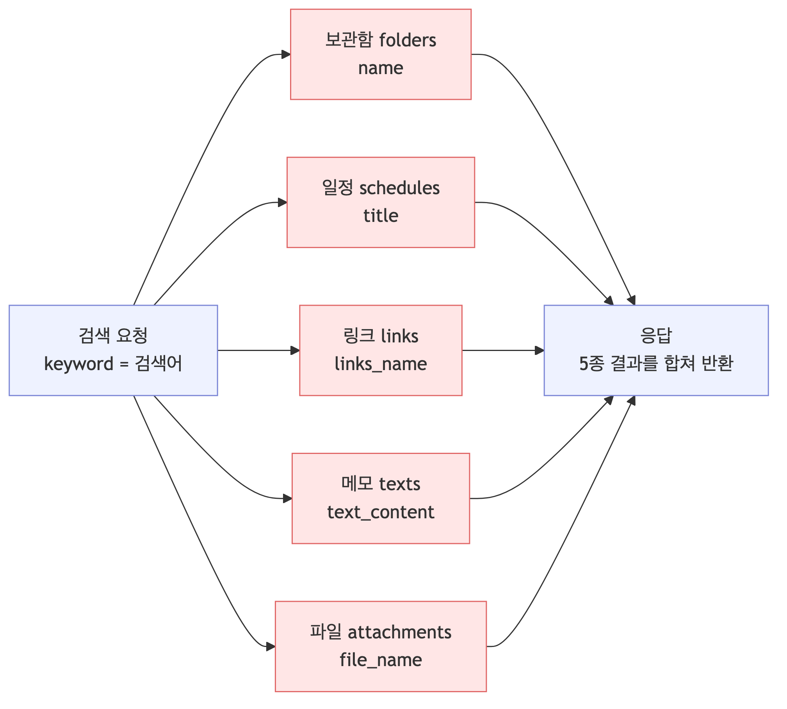
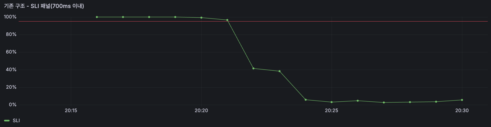
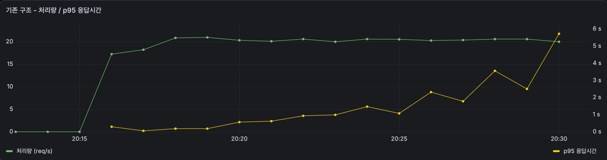
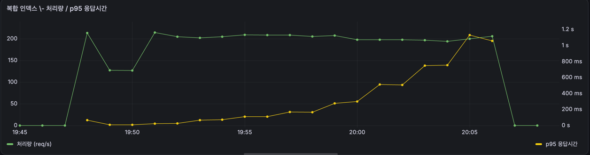

# 통합검색은 동시 몇 명까지 버틸까

> **상태** 인덱스 없는 상태 측정 완료 (동시 10명 · 목표 50명) → 복합 인덱스 측정 예정
> **측정 자료** [measurements.md](measurements.md)

# 1. 개요

toIT 에는 검색어 하나로 **보관함, 일정, 링크, 메모, 파일 5종을 한 번에** 찾는 통합검색이 있습니다. 그런데 이 API 는 한 번 호출될 때마다 **5개 테이블을 전부 검색합니다.**

사용자가 자료를 쌓고 여러 명이 동시에 검색하면 버틸 수 있을까. 이 막연한 불안에서 시작했습니다.

이번 글에서는 **한계를 숫자로 재고 → 병목을 찾아 → 인덱스를 설계한** 과정을 공유하고자 합니다. 인덱스를 넣어 빨라진 것뿐 아니라 **어디까지 유효하고 무엇을 잃는지**까지 확인했습니다.

# 2. 무엇을 잴 것인가

## 2.1 SLO 설정

검색에 대한 성능이 얼마나 느린지 및 빠른지를 알아보기 위한 기준값이 필요했습니다. 즉, 검색을 하였을 떄 몇 ms 인지는 사용자가 어떻게 느끼는지 찾아보게 되었습니다.

- Nielsen 의 응답 시간 연구는 **1초를 넘으면 흐름이 끊긴다**고 보고, Google 의 Core Web Vitals 는 상호작용 응답을 **200ms 이하 good / 500ms 초과 poor** 로 잡습니다. 
- 검색은 버튼 하나 누르는 상호작용이라 그 사이에 두되, 2 vCPU 한 대라는 조건을 감안해 **700ms** 로 정했습니다.

몇 % 인지는 SRE Workbook 의 SLO 설계 방식을 따랐습니다. **평균이 아니라 백분위로 보고, 100% 를 목표로 두지 않는 것**이 핵심입니다. 평균은 느린 요청을 가려버리고, 100% 는
달성할 수도 없거니와 비용만 커집니다.

> SLI = 700ms 이내에 응답한 요청 수 / 전체 요청 수

> SLO = SLI ≥ 95%

**95% 를 넘기면 개선을 멈추고, 못 넘기면 원인을 찾는다**라는 이 기준 하나로 이후 판단을 진행했습니다.


## 2.2 동시 몇 명을 버텨야 하나

서버에서 몇 명이 동시 검색할 때 그 기준도 필요하다고 생각했습니다. 그래서 서비스 규모는 DAU 1000명으로 가정했습니다.

동시 접속자 수로 옮기는 데는 Little's Law 를 썼습니다.

> 평균 동시 인원(L) = 도착률(λ) × 체류시간(W)

- 한 사람이 앱을 한 번 열어 **8분**쯤 쓴다고 봤습니다.
- 하루 중 사용자가 들어오는 시간대는 **12시간**으로 잡았습니다. 새벽엔 거의 안 쓰니
  깨어 있는 동안 흩어져 들어온다고 본 것입니다.

```
λ = 1,000명 ÷ 720분(12시간) = 분당 1.39명이 들어온다
W = 8분              각자 8분 머문다

L = 1.39 × 8 ≈ 11명   지금 이 순간 앱 안에 있는 사람
```

**들어오는 속도 × 머무는 시간 = 안에 있는 인원**입니다. 그래서 DAU 만으로는 부하를 알 수 없고
세션 길이가 함께 필요합니다.

평균은 약 11명입니다. 다만 트래픽은 특정 시간대에 몰리므로 **피크를 평균의 4~5배**로 보고
**동시 50명**을 목표로 잡았습니다.

## 2.3 목표

> DAU 1,000 규모(피크 동시 약 50명)에서 통합검색을 **p95 700ms 이내로 SLI 95% 이상 유지**

# 3. 부하 테스트

## 3.1 기존 구조

검색어 하나가 들어오면 **5개 테이블을 각각 조회한 뒤 결과를 합쳐** 돌려줍니다.



각 테이블에 나가는 쿼리는 컬럼만 다르고 모양이 같습니다. 인덱스는 없었습니다.

```sql
WHERE users_id = ? AND status = 'ACTIVE'
  AND lower(컬럼) LIKE lower('%검색어%')
```

## 3.2 테스트 데이터

현실에 가까운 데이터가 필요했습니다. 개인 보관함 앱의 사용 패턴으로 잡았습니다.

| | 평균 유저 195명 | 헤비 유저 5명 |
| --- | --- | --- |
| 보관함 | 10 | 30 |
| 일정 | 50 | 800 |
| 링크 | 80 | 1,200 |
| 메모 | 30 | 500 |
| 파일 | 30 | 500 |
| **합계** | **200** | **3,030** |

```
전체        54,161행
메모 길이    평균 132자
검색 결과    유저당 20건
```

세 가지를 의도적으로 넣었습니다.
- **가입자 200명 중 195명은 평균, 5명은 헤비로 구축했습니다.** 실제 서비스의 데이터는 균일하지 않습니다. 남들보다 훨씬 많이 쌓아둔 사용자가 섞여있다고 가정했습니다. 그 편차를 그대로 두려고 200명 중 5명을 헤비 유저로 만들었습니다. 이 5명이 전체 54,161행 중 15,150행을 차지합니다.
- **부하는 200명 전원을 섞어서 진행했습니다.** 헤비 유저도 검색을 하니 요청에서 빼지 않았습니다. k6 가
200개 계정을 번갈아 쓰므로 **요청의 약 2.5% 가 헤비 유저**에게서 나옵니다. 실제 트래픽의
비율과 같습니다.
- **메모는 실제 길이인 132자로 채웠습니다.** DB 는 행을 하나씩 읽는 게 아니라 **16KB 페이지 단위**로 읽습니다. 행이 작으면 한 페이지에 많이 들어가서, 같은 행 수를 훑어도 읽을 페이지가 줄어듭니다.

```
8,351행을 전부 훑을 때
  메모가 14자면    행 ≈ 50B   → 페이지당 320행 →  26장
  메모가 132자면   행 ≈ 170B  → 페이지당  96행 →  87장   ← 3배 더 읽는다
```

짧은 문자열로 채웠다면 읽을 페이지도, `LIKE` 로 비교할 글자 수도 실제보다 적어집니다.
**스캔이 실제보다 싸게 나오는 것**이라 실제 메모에 가까운 길이로 맞췄습니다.

## 3.3 측정 방법

k6 로 동시 요청 수를 1부터 100까지 단계별로 올리며 각 단계를 **2분씩** 유지했습니다.

```
워밍업   동시 10 × 30초 (집계에서 제외)
단계     1 · 3 · 10 · 15 · 20 · 30 · 50 · 70 · 100, 각 2분
경로     NGINX Rate Limiter 를 우회해 앱 포트로 직접
```

- JIT 워밍업 전에는 값이 2~3배로 나오므로 앞의 30초는 버렸습니다.
- Rate Limiter 를 거치면 요청이 잘려나가 애플리케이션 레벨 측정이 안 됩니다.
- 단계를 2분으로 잡은 건 모니터링 스크래이프 간격(60초) 때문입니다. 30초로 두면 그래프에
  단계당 점이 하나도 안 찍힙니다.

## 3.4 결과

| 동시 요청 | SLI(700ms) | p95 | p99 | 최장 응답 | 처리량 |
| --- | --- | --- | --- | --- | --- |
| 1 | 100.00% | 78.8ms | 101.8ms | 251.0ms | 17.2/s |
| 3 | 100.00% | 185.9ms | 243.0ms | 544.3ms | 20.6/s |
| **10** | **98.82%** | **555.4ms** | 715.3ms | 972.0ms | 20.5/s |
| 15 | 39.63% | 921.0ms | 1,131.9ms | 1,679.3ms | 20.5/s |
| 20 | 2.96% | 1,152.8ms | 1,485.8ms | 2,008.3ms | 20.6/s |
| 30 | 4.24% | 1,941.1ms | 2,490.7ms | 3,641.7ms | 20.6/s |
| 50 | 3.57% | 2,787.0ms | 4,415.7ms | 7,062.5ms | 20.8/s |
| 70 | 3.36% | 3,953.7ms | 6,564.6ms | 9,824.0ms | 20.6/s |
| 100 | 3.33% | 6,170.9ms | 9,276.2ms | 13,624.3ms | 20.8/s |



실패율은 전 구간 0% 입니다. 죽은 요청은 없고 **느려지기만** 했습니다. 동시 100명에서 최장
응답이 13.6초까지 갔지만 타임아웃에는 닿지 않았습니다.

## 3.5 혼자 쓰면 빠르다

**단일 요청은 97.9ms** 입니다. 이 상태만 보면 아무 문제가 없습니다. 개발하면서 눈치채기
어려운 이유이기도 합니다.

무너지는 건 **경합이 생기는 순간**입니다.

## 3.6 처리량이 못 박혀 있다

표에서 제일 눈에 띄는 건 처리량입니다.



```
동시   3 → 20.6/s
동시 100 → 20.8/s     ← 요청을 33배 밀어넣었는데 그대로
```

**동시 3명부터 이미 천장입니다.** 그 이상 들어온 요청은 처리되지 못하고 줄만 섭니다.
초록 선이 평평한데 노랑 선만 계속 올라가는 게 그 모습입니다.

Little's Law 를 이번엔 반대로 써서 맞춰봤습니다. 서버 안에 N개가 머물고 초당 20.6건이
빠져나가면, 하나가 머무는 시간은 이렇게 나옵니다.

```
동시  15   W =  15 ÷ 20.5 =   732ms      실측 p95   921ms
동시 100   W = 100 ÷ 20.8 = 4,808ms      실측 p95 6,171ms
```

**응답이 느린 게 아니라 처리 능력이 바닥난 것**입니다. 아무리 기다려줘도 초당 20.6건
이상은 못 받습니다.

## 3.7 목표의 5분의 1

```
목표    동시 50명에서 SLI 95%
측정    동시 10명에서 SLI 98.82%
        동시 15명에서 39.63%
        동시 50명에서  3.57%
```

**목표 지점에서 3.57% 입니다.** 이제 왜 초당 20.6건이 한계인지 봐야 합니다.

# 4. 왜 초당 20.6건이 한계인가

## 4.1 실행 계획

`EXPLAIN ANALYZE` 로 쿼리 하나가 무엇을 하는지 봤습니다.

```
EXPLAIN  type=ALL  key=NULL
```

```
-> Filter: ((schedules.status = 'ACTIVE') and (schedules.users_id = 100)
            and (lower(schedules.title) like '%zzsearch%'))
     (cost=1343 rows=659) (actual time=5.61..13 rows=4 loops=1)
   -> Table scan on schedules
     (cost=1343 rows=13188) (actual time=0.0699..10.6 rows=13750 loops=1)
```

**13,750행을 통째로 읽어 4건을 건집니다.** 나머지 13,746행은 읽고 버립니다. 그리고 이게
**5개 테이블에서 매 요청마다** 반복됩니다.

```
folders 2,102 + schedules 13,750 + links 21,603 + texts 8,351 + attachments 8,355
= 요청 하나가 54,161행을 훑는다
```

초당 20.6건이면 **초당 112만 행**을 훑고 있는 셈입니다. 2 vCPU 한 대에서 그게 천장이었습니다.

디스크 문제가 아닙니다. 테이블이 다 합쳐 수십 MB 라 전부 메모리에 올라와 있고, **캐시에
있는 행을 CPU 로 하나씩 비교**하는 데서 막힙니다.

## 4.2 검색 컬럼에 인덱스를 걸면 되지 않나

가장 먼저 든 생각이었습니다. 확인해보니 **되는 경우와 안 되는 경우가 갈렸습니다.**

`(users_id, status, title)` 인덱스를 임시로 만들고 `LIKE` 모양만 바꿔 재봤습니다.

| | type | key_len | rows | 실측 |
| --- | --- | --- | --- | --- |
| `LIKE 'zzsearch%'` | **range** | **1,030** | **1** | 0.047ms |
| `LIKE '%zzsearch%'` | ref | 9 | 50 | 0.107ms |

**`key_len` 이 갈립니다.**

```
앞 고정   1,030   users_id(8) + status(1) + title(1,021)   ← title 까지 인덱스로 좁힌다
앞 열림       9   users_id(8) + status(1)                 ← title 은 못 쓴다
```

실행 계획에도 그대로 나옵니다.

```
앞 고정   Index range scan over ('zzsearch' <= title <= 'zzsearch￿￿…')
앞 열림   Index lookup (users_id=100, status='ACTIVE')
```

**앞이 고정되면 범위를 만들 수 있습니다.** 인덱스는 앞에서부터 정렬돼 있으니 `'zzsearch'`
로 시작하는 구간을 딱 집어냅니다. 앞이 열려 있으면 어디서 시작할지 정할 수 없어 **그 사용자의
50행을 전부** 봐야 합니다.

사전에서 찾는 것과 같습니다. `"회의"` 로 **시작하는** 단어는 그 페이지를 펴면 모여 있지만,
`"회의"` 가 **들어간** 단어는 전부 뒤져야 합니다.

> 두 경우 다 `Extra` 에 `Using index condition` 이 붙습니다. 앞이 열려 있어도 `title` 이
> 인덱스에 있으면 **인덱스를 훑으면서 `LIKE` 를 평가**할 수는 있습니다. 다만 50개 항목을
> 순서대로 다 보는 건 그대로입니다. 범위를 좁히는 것과 훑으면서 거르는 것은 다릅니다.

### 그럼 접두 검색으로 바꿀까

인덱스가 완전히 동작하게 하려면 검색을 `'회의%'` 로 바꾸면 됩니다. 대신

```
"회의" 로 검색   →   "월간 회의" 를 못 찾는다
```

**사용자가 기대하는 검색이 아닙니다.** 성능을 위해 기능을 바꾸는 선택지라 접었습니다.

### `LIKE` 를 그대로 두고 인덱스를 태울 수는 없나

MySQL 에는 방법이 없습니다. 앞 와일드카드를 인덱스로 처리하려면 **B+트리가 아닌 다른
자료구조**가 필요한데, MySQL 이 제공하는 건 `MATCH ... AGAINST` 를 쓰는 FULLTEXT 뿐입니다.
쿼리를 바꿔야 하고 매칭 규칙도 달라집니다.

> PostgreSQL 에는 `pg_trgm` 확장이 있어 `LIKE '%…%'` 를 그대로 둔 채 인덱스를 붙일 수
> 있습니다. **같은 문제라도 DB 마다 낼 수 있는 카드가 다릅니다.**

### 그래서

```
검색어를 찾아주는 인덱스   →  만들 수 없다
훑을 대상을 줄이는 인덱스   →  만들 수 있다
```

찾는 방향이 아니라 **줄이는 방향**으로 가야 했습니다.

# 5. 복합 인덱스

## 5.1 어떤 인덱스를 걸 것인가

검색은 **항상 사용자 단위**로 이뤄집니다. 테이블에 200명의 5만 행이 섞여 있어도 한 요청이
실제로 봐야 할 건 그 사용자의 행뿐입니다.

```
전체 54,161행을 훑는다   →   그 사용자의 200행만 훑는다
```

그래서 인덱스를 검색 컬럼이 아니라 **`(users_id, status)`** 에 걸었습니다.

```java
@Table(
    name = "schedules",
    indexes = {
        // 통합검색: 사용자별 활성 항목만 훑도록 스캔 대상 축소
        @Index(name = "idx_schedules_users_status", columnList = "users_id, status")
    }
)
```

**컬럼 순서가 `users_id` 먼저**인 이유는 선택도입니다. 복합 인덱스는 앞 컬럼부터 정렬되므로,
값이 다양한 컬럼이 앞에 와야 범위가 확 좁혀집니다.

```
users_id   서로 다른 값 200개    → 전체의 1/200 로 좁힌다
status     서로 다른 값 2~3개    → 전체의 1/3 밖에 못 좁힌다
```

`status` 를 뒤에 붙인 건 검색이 항상 `ACTIVE` 만 보기 때문입니다. 인덱스 안에서 걸러지므로
테이블까지 안 가고 제외됩니다.

첨부는 검색 시 타입까지 거르므로 **`(users_id, status, attachments_type)`** 3컬럼입니다.

## 5.2 실행 계획이 바뀌었다

```
-> Filter: (lower(schedules.title) like '%zzsearch%')
     (cost=17.5 rows=50) (actual time=0.0448..0.174 rows=4 loops=1)
   -> Index lookup on schedules using idx_schedules_users_status
        (users_id=100, status='ACTIVE'), with index condition: (status = 'ACTIVE')
     (cost=17.5 rows=50) (actual time=0.0408..0.148 rows=50 loops=1)
```

`Table scan` 이 `Index lookup` 으로 바뀌었습니다. 5개 테이블 전부 그렇습니다.

| 테이블 | 인덱스 없음 | 복합 인덱스 |
| --- | --- | --- |
| folders | 2,102 | 10 |
| schedules | 13,750 | 50 |
| links | 21,603 | 80 |
| texts | 8,351 | 30 |
| attachments | 8,355 | 30 |
| **합계** | **54,161** | **200** |

**요청 하나가 읽는 행이 271배 줄었습니다.**

`Extra` 에 `Using index condition` 이 붙는데, `status` 조건을 인덱스 안에서 평가한다는
뜻입니다. 조건에 안 맞는 행은 테이블까지 가지 않습니다.

## 5.3 부하 테스트

같은 조건으로 다시 돌렸습니다.

| 동시 요청 | SLI(700ms) | p95 | p99 | 처리량 |
| --- | --- | --- | --- | --- |
| 1 | 100.00% | 15.1ms | 21.0ms | 118.1/s |
| 3 | 100.00% | 25.2ms | 41.6ms | 210.4/s |
| 10 | 100.00% | 72.0ms | 123.1ms | 204.2/s |
| 15 | 100.00% | 113.4ms | 166.3ms | 206.1/s |
| 20 | 100.00% | 170.4ms | 219.3ms | 205.6/s |
| 30 | 100.00% | 294.3ms | 361.6ms | 200.8/s |
| **50** | **99.00%** | **559.6ms** | 699.7ms | 191.5/s |
| 70 | 90.89% | 745.7ms | 1,000.1ms | 194.7/s |
| 100 | 68.11% | 1,082.8ms | 1,476.6ms | 196.6/s |


**목표를 달성했습니다.**

```
목표    동시 50명에서 SLI 95% 이상
결과    동시 50명에서 99.00%
```

기존 구조와 나란히 놓으면 이렇습니다.

| 동시 요청 | 기존 구조 SLI | 복합 인덱스 SLI | 기존 구조 p95 | 복합 인덱스 p95 |
| --- | --- | --- | --- | --- |
| 10 | 98.82% | 100.00% | 555.4ms | 72.0ms |
| 15 | 39.63% | 100.00% | 921.0ms | 113.4ms |
| 30 | 4.24% | 100.00% | 1,941.1ms | 294.3ms |
| **50** | **3.57%** | **99.00%** | **2,787.0ms** | **559.6ms** |
| 70 | 3.36% | 90.89% | 3,953.7ms | 745.7ms |
| 100 | 3.33% | 68.11% | 6,170.9ms | 1,082.8ms |

## 5.4 천장의 높이만 바뀌었다

처리량은 여전히 한 값에서 평평합니다.



```
기존 구조     20.6/s 에서 평평
복합 인덱스    196.6/s 에서 평평
```

동시 3명부터 천장에 닿고, 그 이상은 줄만 길어지는 구조가 똑같습니다. **천장의 높이가
9.5배 올라갔을 뿐**입니다.

한 요청이 훑는 행이 271배 줄었는데 처리량은 9.5배만 늘었습니다. 스캔이 전부가 아니라
인증·직렬화·네트워크 같은 나머지 비용이 남아 있기 때문입니다. **병목이 옮겨간 것**이지
사라진 게 아닙니다.

## 5.5 얻은 것과 낸 것

| 테이블 | data | 기존 구조 | 복합 인덱스 | 증가 |
| --- | --- | --- | --- | --- |
| attachments | 1.52MB | 0.00 | 0.22 | +0.22 |
| folders | 0.28MB | 0.00 | 0.08 | +0.08 |
| links | 4.52MB | 0.00 | 0.52 | +0.52 |
| schedules | 1.52MB | 0.22 | 0.55 | +0.33 |
| texts | 2.52MB | 0.00 | 0.22 | +0.22 |
| **합계** | **10.36MB** | **0.22** | **1.59** | **+1.37MB** |

```
얻은 것   처리량 9.5배 · 수용 인원 5배
낸 것     저장 공간 13% · 쓰기마다 인덱스 5개 유지 비용
```

읽기가 압도적으로 많은 검색 기능이라 **낼 만한 값**이라고 봤습니다.

# 6. 정리

```
수용 한계     동시 10명 → 50명        5배 · 목표 달성
처리량 천장   20.6/s → 196.6/s        9.5배
읽는 행       54,161 → 200            271배
저장 공간     10.36MB 대비 13% 증가
```

**막힌 자리마다 배운 것**

| 막힌 지점 | 배운 것 |
| --- | --- |
| 검색 컬럼에 인덱스를 걸어도 안 빨라짐 | `LIKE '%키워드%'` 는 앞이 열려 있어 인덱스를 못 탄다. 찾는 대신 **훑을 대상을 줄이는** 방향으로 가야 한다 |
| 인덱스를 지우려는데 안 지워짐 | InnoDB 는 FK 컬럼에 인덱스를 강제한다. 인덱스 없는 상태를 만들려면 FK 부터 떼야 했다 |
| 404 응답이 SLI 100% 로 잡힘 | SLI 는 "700ms 이내에 응답했는가" 만 본다. 에러 응답은 빠르니 만점이 된다. **응답 시간은 성공 여부와 함께 봐야 한다** |
| 인덱스가 풀스캔보다 느리게 나옴 | 시드가 검색어를 모든 행에 심어 `LIKE` 가 아무것도 못 걸렀다. **측정 조건부터 확인해야 한다** |
| 그래프에 점이 안 찍힘 | 모니터링 스크래이프 간격이 60초인데 단계를 30초로 잡았다. 표는 맞는데 추세를 볼 수 없었다 |

가운데 두 개는 **그럴듯한 숫자가 나와서 잘못된 걸 몰랐던** 경우입니다. 표에 실패율을
같이 두지 않았다면 404 를 개선 결과로 착각했을 겁니다.

## 남은 것

- **검색 컬럼까지 넣는 커버링 인덱스**는 검토만 했습니다. 지금 인덱스 조회가 0.113ms 이고
  북마크 조회가 30회뿐이라 줄일 여지가 0.1ms 안쪽인데, 인덱스는 검색 컬럼 길이만큼 커집니다.
  사용자당 행 수가 수천을 넘어가면 다시 볼 만합니다.
- **사용자별 편차는 재보지 않았습니다.** 헤비 유저는 데이터로만 넣었고 요청의 2.5% 라
  p95 에 안 잡힙니다. 인덱스를 걸어도 그 사용자는 3,030행을 훑으므로 평균 유저(200행)보다
  느릴 텐데, 얼마나인지는 확인하지 않았습니다.
- **병목이 DB 에서 앱으로 옮겨갔습니다.** 부하 중 CPU 를 보면 인덱스 전에는 JVM 이 5% 만 쓰고
  나머지를 DB 가 태웠는데, 인덱스 후에는 JVM 이 50% 를 씁니다. 프로파일링해보니 5개 검색이
  43% 를 고르게 나눠 쓰고 그 안에서도 Hibernate 의 쿼리 해석 비중이 컸습니다. **5번 반복하는
  구조 자체**가 다음 과제입니다. 기록은 [measurements.md](measurements.md) 에 있습니다.
- **검색 결과에 개수 제한(LIMIT)이 없습니다.** 한 사용자의 결과가 많으면 응답 크기 자체가
  병목이 됩니다.

## 이력서 문구

한 줄

```
통합검색 수용 한계를 SLO 기준으로 측정·개선 — 동시 10명 → 50명(5배), 처리량 20 → 197 req/s
```

세 줄

```
- p95 700ms · SLI 95% 로 SLO 를 정의하고 Little's Law 로 목표 동시 사용자 50명을 도출,
  k6 단계별 부하 테스트로 한계 측정 — 동시 10명이 한계, 목표의 5분의 1
- LIKE 앞 와일드카드가 인덱스를 못 타는 것을 EXPLAIN key_len(1,030 → 9)으로 확인하고
  접두 검색 · FULLTEXT ngram 등 대안 4종을 비교해 (users_id, status) 복합 인덱스 채택
- 조회 행 54,161 → 200(271배), 수용 한계 5배, 처리량 9.5배. 인덱스 저장 공간 +13% 를
  트레이드오프로 기록
```
