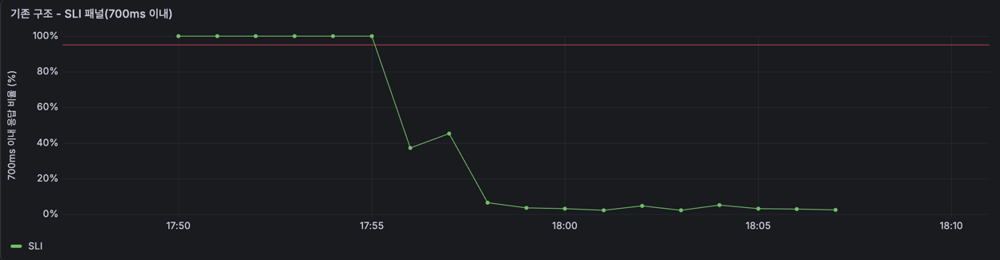
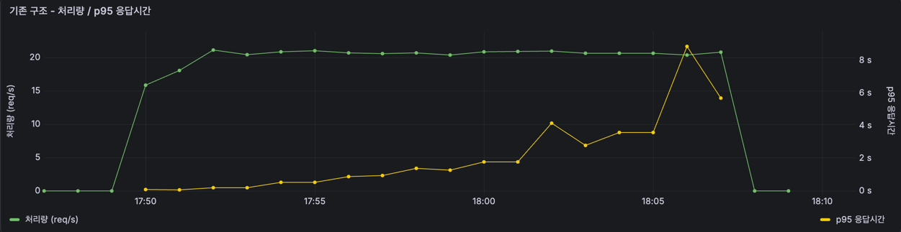
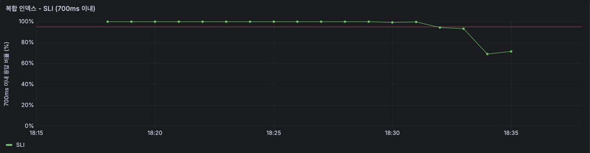
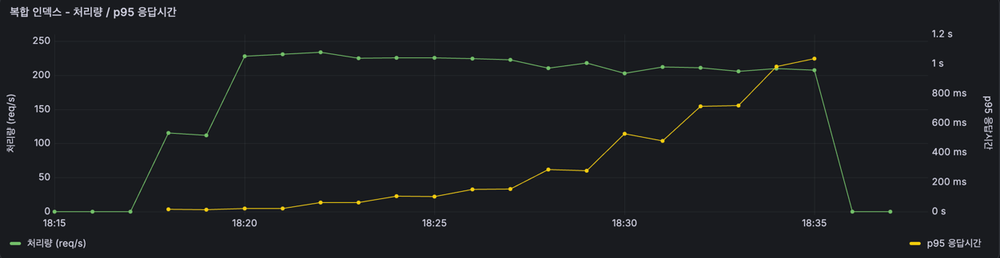

# 통합검색은 동시 몇 명까지 버틸까

> **상태** 측정 완료 — 수용 한계 동시 10명 → 50명 (목표 50명 달성)
> **측정 자료** [measurements.md](measurements.md)

# 1. 개요

toIT 에는 검색어 하나로 **보관함, 일정, 링크, 메모, 파일 5종을 한 번에** 찾는 통합검색이 있습니다. 그런데 이 API 는 한 번 호출될 때마다 **5개 테이블을 전부 검색합니다.**

사용자가 자료를 쌓고 여러 명이 동시에 검색하면 버틸 수 있을까. 이 막연한 불안에서 시작했습니다.

이번 글에서는 **한계를 숫자로 재고 → 병목을 찾아 → 인덱스를 설계한** 과정을 공유하고자 합니다. 인덱스를 넣어 빨라진 것뿐 아니라 **어디까지 유효하고 무엇을 잃는지**까지 확인했습니다.

# 2. 무엇을 잴 것인가

## 2.1 SLO 설정

검색에 대한 성능이 얼마나 느린지 및 빠른지를 알아보기 위한 기준값이 필요했습니다. 즉, 검색을 하였을 떄 몇 ms 인지는 사용자가 어떻게 느끼는지 찾아보게 되었습니다.

- Nielsen 의 응답 시간 연구는 **1초를 넘으면 흐름이 끊긴다**고 보고, Google 의 Core Web Vitals 는 상호작용 응답을 **200ms 이하 good / 500ms 초과 poor** 로 잡습니다. 
- 검색은 버튼 하나 누르는 상호작용이라 그 사이에 두되, 2 vCPU 한 대라는 조건을 감안해 **700ms** 로 정했습니다.

몇 % 인지는 SRE Workbook 의 SLO 설계 방식을 따랐습니다. **평균이 아니라 백분위로 보고, 100% 를 목표로 두지 않는 것**이 핵심입니다. 평균은 느린 요청을 가려버리고, 100% 는
달성할 수도 없거니와 비용만 커집니다.

> SLI = 700ms 이내에 응답한 요청 수 / 전체 요청 수

> SLO = SLI ≥ 95%

**95% 를 넘기면 개선을 멈추고, 못 넘기면 원인을 찾는다**라는 이 기준 하나로 이후 판단을 진행했습니다.


## 2.2 동시 몇 명을 버텨야 하나

서버에서 몇 명이 동시 검색할 때 그 기준도 필요하다고 생각했습니다. 그래서 서비스 규모는 DAU 1000명으로 가정했습니다.

동시 접속자 수로 옮기는 데는 Little's Law 를 썼습니다.

> 평균 동시 인원(L) = 도착률(λ) × 체류시간(W)

- 한 사람이 앱을 한 번 열어 **8분**쯤 쓴다고 봤습니다.
- 하루 중 사용자가 들어오는 시간대는 **12시간**으로 잡았습니다. 새벽엔 거의 안 쓰니
  깨어 있는 동안 흩어져 들어온다고 본 것입니다.

```
λ = 1,000명 ÷ 720분(12시간) = 분당 1.39명이 들어온다
W = 8분              각자 8분 머문다

L = 1.39 × 8 ≈ 11명   지금 이 순간 앱 안에 있는 사람
```

**들어오는 속도 × 머무는 시간 = 안에 있는 인원**입니다. 그래서 DAU 만으로는 부하를 알 수 없고
세션 길이가 함께 필요합니다.

평균은 약 11명입니다. 다만 트래픽은 특정 시간대에 몰리므로 **피크를 평균의 4~5배**로 보고
**동시 50명**을 목표로 잡았습니다.

## 2.3 목표

> DAU 1,000 규모(피크 동시 약 50명)에서 통합검색을 **p95 700ms 이내로 SLI 95% 이상 유지**

# 3. 부하 테스트

## 3.1 기존 구조

검색어 하나가 들어오면 **5개 테이블을 각각 조회한 뒤 결과를 합쳐** 돌려줍니다.


각 테이블에 나가는 쿼리는 컬럼만 다르고 모양이 같습니다. 인덱스는 없었습니다.

```sql
WHERE users_id = ? AND status = 'ACTIVE'
  AND 컬럼 LIKE '%검색어%'
```

## 3.2 테스트 데이터

현실에 가까운 데이터가 필요했습니다. 개인 보관함 앱의 사용 패턴으로 잡았습니다.

| | 평균 유저 195명 | 헤비 유저 5명 |
| --- | --- | --- |
| 보관함 | 10 | 30 |
| 일정 | 50 | 800 |
| 링크 | 80 | 1,200 |
| 메모 | 30 | 500 |
| 파일 | 30 | 500 |
| **합계** | **200** | **3,030** |

```
전체        54,176행
메모 길이    평균 132자
검색 결과    유저당 20건
```

세 가지를 의도적으로 넣었습니다.
- **가입자 200명 중 195명은 평균, 5명은 헤비로 구축했습니다.** 실제 서비스의 데이터는 균일하지 않습니다. 남들보다 훨씬 많이 쌓아둔 사용자가 섞여있다고 가정했습니다. 그 편차를 그대로 두려고 200명 중 5명을 헤비 유저로 만들었습니다. 이 5명이 전체 54,176행 중 15,150행을 차지합니다.
- **부하는 200명 전원을 섞어서 진행했습니다.** 헤비 유저도 검색을 하니 요청에서 빼지 않았습니다. k6 가
200개 계정을 번갈아 쓰므로 **요청의 약 2.5% 가 헤비 유저**에게서 나옵니다. 실제 트래픽의
비율과 같습니다.
- **메모는 실제 길이인 132자로 채웠습니다.** DB 는 행을 하나씩 읽는 게 아니라 **16KB 페이지 단위**로 읽습니다. 행이 작으면 한 페이지에 많이 들어가서, 같은 행 수를 훑어도 읽을 페이지가 줄어듭니다.

```
8,351행을 전부 훑을 때
  메모가 14자면    행 ≈ 50B   → 페이지당 320행 →  26장
  메모가 132자면   행 ≈ 170B  → 페이지당  96행 →  87장   ← 3배 더 읽는다
```

짧은 문자열로 채웠다면 읽을 페이지도, `LIKE` 로 비교할 글자 수도 실제보다 적어집니다.
**스캔이 실제보다 싸게 나오는 것**이라 실제 메모에 가까운 길이로 맞췄습니다.

## 3.3 측정 방법

k6 로 동시 요청 수를 1부터 100까지 단계별로 올리며 각 단계를 **2분씩** 유지했습니다.

```
워밍업   동시 10 × 30초 (집계에서 제외)
단계     1 · 3 · 10 · 15 · 20 · 30 · 50 · 70 · 100, 각 2분
```

- JIT 워밍업 전에는 값이 2~3배로 나오므로 앞의 30초는 버렸습니다.
- Rate Limiter 를 거치면 요청이 잘려나가 애플리케이션 레벨 측정이 안 됩니다.
- 단계를 2분으로 잡은 건 모니터링 스크래이프 간격(60초) 때문입니다. 30초로 두면 그래프에
  단계당 점이 하나도 안 찍힙니다.

## 3.4 결과

| 동시 요청 | SLI(700ms) | p95 | p99 | 최장 응답 | 처리량 |
| --- | --- | --- | --- | --- | --- |
| 1 | 100.00% | 87.0ms | 104.1ms | 276.2ms | 16.9/s |
| 3 | 100.00% | 183.2ms | 204.1ms | 468.2ms | 21.0/s |
| **10** | **99.48%** | **540.3ms** | 655.9ms | 919.6ms | 20.8/s |
| 15 | 41.68% | 898.0ms | 1,014.6ms | 1,270.5ms | 20.8/s |
| 20 | 3.75% | 1,202.9ms | 1,480.2ms | 2,998.6ms | 20.9/s |
| 30 | 4.23% | 1,771.4ms | 2,467.9ms | 4,017.1ms | 20.9/s |
| 50 | 3.62% | 2,790.2ms | 4,376.6ms | 7,216.2ms | 20.9/s |
| 70 | 2.71% | 3,646.9ms | 6,315.9ms | 10,743.7ms | 20.9/s |
| 100 | 3.09% | 5,309.8ms | 9,176.1ms | 15,902.4ms | 21.0/s |



> 17:49 부터 단계당 2분 · 동시 1 → 3 → 10 → 15 → 20 → 30 → 50 → 70 → 100.
> 단계마다 두 번째 점이 표의 값이고, 치솟는 점은 단계가 바뀌는 순간입니다.
>
> 빨간 선은 목표 SLI 95% 입니다.

목표는 동시 50명에서 SLI 95% 이상이었습니다. 동시 10명부터 SLI 가 떨어지기 시작해
**15명에서는 41.68%** 로 지켜지지 않았습니다.

실패율은 전 구간 0% 입니다. 동시 100명까지 응답은 모두 성공했고, 최장 15.9초까지 갔지만
타임아웃에 닿지는 않았습니다.

## 3.5 병목은 처리량이었다

표에서 제일 눈에 띄는 건 처리량입니다.



> 17:49 부터 단계당 2분 · 동시 1 → 3 → 10 → 15 → 20 → 30 → 50 → 70 → 100.
> 단계마다 두 번째 점이 표의 값이고, 치솟는 점은 단계가 바뀌는 순간입니다.

```
동시   3 → 21.0/s
동시 100 → 21.0/s     ← 요청을 33배 밀어넣었는데 그대로
```

동시 3명부터 처리량은 20에 달했습니다. 즉, 그 이상 들어온 요청은 처리되지 못하고 줄만 섭니다.
초록 선이 평평한데 노랑 선만 계속 올라가는 게 그 모습입니다.

Little's Law 로 역산한 대기 시간이 실측과 맞습니다.

```
동시  15    15 ÷ 20.8 =   721ms   →   실측 p95   898ms
동시 100   100 ÷ 21.0 = 4,762ms   →   실측 p95 5,310ms
```

**응답이 느린 게 아니라 처리 능력이 바닥난 것**입니다. 늘어난 인원은 그대로 대기 시간이 됩니다.

# 4. 왜 초당 20.9건이 한계인가

`EXPLAIN ANALYZE` 로 쿼리 하나가 무엇을 하는지 봤습니다.
```
-> Filter: ((schedules.status = 'ACTIVE') and (schedules.users_id = 100)
            and (schedules.title like '%zzsearch%'))
     (cost=1370 rows=74.8) (actual time=4.52..10.8 rows=4 loops=1)
   -> Table scan on schedules
     (cost=1370 rows=13462) (actual time=0.154..8.53 rows=13750 loops=1)
```

**13,750행을 통째로 읽어 4건을 건집니다.** 나머지 13,746행은 읽고 버립니다. 그리고 이게
**5개 테이블에서 매 요청마다** 반복됩니다.

```
folders 2,107 + schedules 13,750 + links 21,606 + texts 8,351 + attachments 8,362
= 요청 하나가 54,176행을 훑는다
```

초당 20.9건이면 **초당 113만 행**을 훑고 있는 셈입니다. 테이블이 다 합쳐 수십 MB 라 전부 메모리에 올라와 있고, **캐시에
있는 행을 CPU 로 하나씩 비교**하는 데서 막힙니다.

# 5. 개선 방법

## 5.1 검색 컬럼에 인덱스를 건다

풀스캔이 문제니 검색 컬럼에 인덱스를 걸면 되겠다고 생각했습니다. 만들어서 실행 계획을
봤습니다.

인덱스를 전부 걷어낸 상태에서 검색 컬럼에만 만들었습니다. 다른 인덱스가 남아 있으면
옵티마이저의 후보가 여럿이라 이 인덱스의 효과를 분리할 수 없습니다.

```sql
CREATE INDEX tmp_title_only ON schedules (title);
EXPLAIN SELECT * FROM schedules WHERE title LIKE '%zzsearch%';
```

```
-> Filter: (schedules.title like '%zzsearch%')
     (cost=1406 rows=1535) (actual time=0.0633..13.3 rows=800 loops=1)
   -> Table scan on schedules
     (cost=1406 rows=13815) (actual time=0.06..9.16 rows=13750 loops=1)
```

13,750행을 그대로 훑었습니다. 즉, **풀스캔이었습니다.** 

왜 풀스캔이었는지 분석해봤습니다.

인덱스는 B+트리입니다. 노드 하나가 16KB 페이지 하나이고, 그 안에 **경계선이 되는 키가
수백 개** 들어 있습니다.

```
루트 페이지 (16KB)
┌──────────────────────────────────────────────────────┐
│ [12번] │ "나들이" │ [41번] │ "미팅" │ [88번] │ "회의" │ [77번] │
└──────────────────────────────────────────────────────┘

  "나들이" 미만            →  12번 페이지로
  "나들이" 이상 "미팅" 미만  →  41번 페이지로
  "미팅" 이상 "회의" 미만    →  88번 페이지로
  "회의" 이상              →  77번 페이지로
```

키는 **가나다순으로, 앞 글자부터** 정렬돼 있습니다. 트리를 내려간다는 건 **찾는 값을
경계선과 비교해 갈림길을 하나 고르는 일**입니다.

**`LIKE '회의%'` 는 고를 수 있습니다.** 값이 `"회의"` 로 시작한다는 걸 아니까요.

```
"회의…" 는 "회의" 이상   →  77번으로 내려간다
```

가나다순이므로 `"회의"` 로 시작하는 것들은 **반드시 붙어 있습니다.** 시작점만 찾고 옆으로
읽다가 아닌 게 나오면 멈추면 됩니다.

**`LIKE '%회의%'` 는 고를 수 없습니다.** 첫 글자를 모르기 때문입니다.

```
"긴급회의"     →  12번에 있다
"월간 회의"    →  88번에 있다
"팀 회의록"    →  77번에 있다
```

**네 갈래 어디에나 있을 수 있습니다.** 하나를 고를 수 없으니 전부 내려가야 하고, 그건
트리를 타는 게 아니라 인덱스 전체를 훑는 것입니다.

게다가 세컨더리 인덱스의 리프에는 PK 만 있어서, 걸린 행마다 PK 트리로 다시 가야 합니다.

```
인덱스 사용   리프를 전부 훑고 + 걸린 행마다 PK 트리 왕복
풀스캔       테이블 페이지를 앞에서부터 순서대로
```

**풀스캔이 쌉니다.** 순서대로 읽으면 되고 페이지 사이를 튀지 않습니다. 그래서 옵티마이저가
인덱스를 두고도 풀스캔을 고릅니다. **못 쓰는 게 아니라 쓰면 더 느려서 안 쓰는 것**입니다.

통합검색은 `%검색어%` 라 여기에 해당합니다.

어떻게 할 수 있을지 고민해봤습니다.
1. **접두 검색으로 바꾼다.** `LIKE '회의%'` 로 바꾸면 인덱스가 그대로 동작합니다. 하지만
   "회의" 로 검색   →   "월간 회의" 를 못 찾게 됩니다. 사용자가 기대하는 검색이 아닙니다. **성능을 위해 기능을 바꾸는 선택지**라 접었습니다.
2. **FULLTEXT 를 쓴다.** 앞 와일드카드를 다루려면 B+트리가 아닌 자료구조가 필요한데, MySQL 이
주는 건 `MATCH ... AGAINST` 를 쓰는 FULLTEXT 뿐입니다. 쿼리를 바꿔야 하고 매칭 규칙도
달라집니다. 한국어는 ngram 파서로 글자를 잘라 넣는 방식이라 형태소 단위로 끊기지도
않습니다. 지금 문제에 비해 **치르는 값이 큽니다.**
3. **훑을 대상을 줄인다.** 실행 계획을 다시 보면, 한 사람의 검색이 **남의 데이터까지 포함해
54,176행을 전부** 훑고 있었습니다. 검색은 항상 자기 것만 보는 기능입니다. 그래서 여기서 사용자로 색인을 거는 방법이 떠올랐습니다. `users_id` 로 먼저 좁히면 `LIKE` 는 그
사용자의 200행에만 적용됩니다.

## 5.2 복합 인덱스를 적용

훑을 대상을 줄이려면 **어느 행이 누구 것인지를 인덱스가 알아야** 합니다. 그래서 검색 컬럼이
아니라 **`(users_id, status)`** 에 인덱스를 걸었습니다.

```java
@Table(
    name = "schedules",
    indexes = {
        // 통합검색: 사용자별 활성 항목만 훑도록 스캔 대상 축소
        @Index(name = "idx_schedules_users_status", columnList = "users_id, status")
    }
)
```

**컬럼 순서가 `users_id` 먼저**인 이유는 선택도입니다. 복합 인덱스는 앞 컬럼부터 정렬되므로,
값이 다양한 컬럼이 앞에 와야 범위가 확 좁혀집니다.

```
users_id   서로 다른 값 200개    → 전체의 1/200 로 좁힌다
status     서로 다른 값 2~3개    → 전체의 1/3 밖에 못 좁힌다
```

`status` 를 뒤에 붙인 건 검색이 항상 `ACTIVE` 만 보기 때문입니다. 인덱스 안에서 걸러지므로
테이블까지 안 가고 제외됩니다.

첨부는 검색 시 타입까지 거르므로 **`(users_id, status, attachments_type)`** 3컬럼입니다.

# 6. 개선 후 측정

## 6.1 실행 계획이 바뀌었다

`IGNORE INDEX` 로 같은 세션에서 두 방식을 나란히 실행했습니다.

```
-> Filter: (schedules.title like '%zzsearch%')
     (cost=13.1 rows=5.56) (actual time=0.0449..0.157 rows=4 loops=1)
   -> Index lookup on schedules using idx_schedules_users_status
        (users_id=100, status='ACTIVE'), with index condition: (status = 'ACTIVE')
     (cost=13.1 rows=50) (actual time=0.0424..0.136 rows=50 loops=1)
```

| | 강제 풀스캔 | 복합 인덱스 | |
| --- | --- | --- | --- |
| 실행 방식 | Table scan | **Index lookup** | |
| 읽은 행 | 13,750 | **50** | 275배 |
| 쿼리 시간 | 15.6ms | **0.157ms** | 99배 |

`Table scan` 이 `Index lookup` 으로 바뀌었습니다. 5개 테이블 전부 그렇습니다.

| 테이블 | 인덱스 없음 | 복합 인덱스 |
| --- | --- | --- |
| folders | 2,107 | 10 |
| schedules | 13,750 | 50 |
| links | 21,606 | 80 |
| texts | 8,351 | 30 |
| attachments | 8,362 | 30 |
| **합계** | **54,176** | **200** |

**요청 하나가 읽는 행이 271배 줄었습니다.**

`Extra` 에 `Using index condition` 이 붙는데, `status` 조건을 인덱스 안에서 평가한다는
뜻입니다. 조건에 안 맞는 행은 테이블까지 가지 않습니다.

## 6.2 부하 테스트

같은 조건으로 다시 돌렸습니다.

| 동시 요청 | SLI(700ms) | p95 | p99 | 처리량 |
| --- | --- | --- | --- | --- |
| 1 | 100.00% | 16.7ms | 26.2ms | 108.4/s |
| 3 | 100.00% | 23.4ms | 36.3ms | 223.0/s |
| 10 | 100.00% | 66.0ms | 122.0ms | 229.7/s |
| 15 | 100.00% | 105.6ms | 160.2ms | 222.6/s |
| 20 | 100.00% | 153.4ms | 196.0ms | 223.1/s |
| 30 | 100.00% | 267.0ms | 333.5ms | 218.1/s |
| **50** | **99.52%** | **491.1ms** | 643.8ms | 211.4/s |
| 70 | 94.51% | 709.0ms | 931.8ms | 210.5/s |
| 100 | 70.32% | 1,005.9ms | 1,368.2ms | 210.2/s |



> 18:18 부터 단계당 2분 · 동시 1 → 3 → 10 → 15 → 20 → 30 → 50 → 70 → 100.
> 단계마다 두 번째 점이 표의 값이고, 치솟는 점은 단계가 바뀌는 순간입니다.
>
> 빨간 선은 목표 SLI 95% 입니다.

**목표를 달성했습니다.**

```
목표    동시 50명에서 SLI 95% 이상
결과    동시 50명에서 99.52%
```

기존 구조와 나란히 놓으면 이렇습니다.

| 동시 요청 | 기존 구조 SLI | 복합 인덱스 SLI | 기존 구조 p95 | 복합 인덱스 p95 |
| --- | --- | --- | --- | --- |
| 10 | 99.48% | 100.00% | 540.3ms | 66.0ms |
| 15 | 41.68% | 100.00% | 898.0ms | 105.6ms |
| 30 | 4.23% | 100.00% | 1,771.4ms | 267.0ms |
| **50** | **3.62%** | **99.52%** | **2,790.2ms** | **491.1ms** |
| 70 | 2.71% | 94.51% | 3,646.9ms | 709.0ms |
| 100 | 3.09% | 70.32% | 5,309.8ms | 1,005.9ms |

## 6.3 처리량이 10.7배 올랐다

3.5에서 처리량이 21/s 에 못 박혀 있던 게 문제였습니다. 그 값이 올라갔습니다.



> 18:18 부터 단계당 2분 · 동시 1 → 3 → 10 → 15 → 20 → 30 → 50 → 70 → 100.
> 단계마다 두 번째 점이 표의 값이고, 치솟는 점은 단계가 바뀌는 순간입니다.
>
> 오른쪽 축이 1.2초까지입니다. 기존 구조 그래프는 8초까지였습니다.

```
기존 구조     21.0/s
복합 인덱스    223.0/s     10.7배
```

읽는 행을 271배 줄였는데 처리량은 10.7배 올랐습니다. 스캔이 전부가 아니라 인증·직렬화
같은 나머지 비용이 남아 있기 때문입니다.

구조는 그대로입니다. 동시 3명부터 처리량이 평평해지고 그 이상은 줄만 길어집니다.
**막히는 값이 올라갔을 뿐 막히는 구조는 같습니다.**

인덱스는 공짜가 아닙니다. 얻은 것과 낸 것을 같이 보면 이렇습니다.

```
얻은 것   처리량 10.7배 · 수용 인원 5배
낸 것     인덱스 1.37MB — 데이터 10.36MB 대비 +13%
         INSERT·UPDATE 마다 인덱스 5개를 같이 갱신 (이건 재보지 않았습니다)
```

읽기가 압도적으로 많은 검색 기능이라 **낼 만한 값**이라고 봤습니다. 테이블별 인덱스 크기는
[measurements.md](measurements.md) 에 있습니다.

# 7. 결론

세 방법 중 무엇을 쓸지 결정이 필요했습니다. 접두 검색과 FULLTEXT 는 `LIKE` 가 못 하던
인덱스 검색을 가능하게 하는 방법이고, 복합 인덱스는 `LIKE` 를 그대로 둔 채 훑을 대상만
줄이는 방법입니다. 결론적으로는 **복합 인덱스**를 쓰기로 결정하였습니다.

그 이유는 다음과 같습니다:

- **검색 기능을 바꾸지 않습니다.** 접두 검색으로 바꾸면 인덱스는 완전히 동작하지만
  `"회의"` 로 검색했을 때 `"월간 회의"` 가 안 나옵니다. 성능을 위해 사용자가 쓰는 기능을
  바꾸는 것이라, 성능 문제의 해결책으로 두기에는 대가가 잘못됐다고 봤습니다.
- **쿼리를 다시 짜지 않습니다.** FULLTEXT 는 `MATCH ... AGAINST` 전용 문법이라 5개
  테이블의 쿼리를 전부 바꿔야 합니다. 게다가 MySQL 에는 한국어 형태소 분석기가 없어
  ngram 파서로 글자를 잘라 넣어야 하고, 그러면 `"의자"` 로 검색했을 때 `"월간회의 자료"`
  가 걸리는 오탐이 생깁니다. **지금 문제에 비해 치르는 값이 큽니다.**
- **진짜 병목을 겨냥합니다.** 4장에서 본 문제는 검색어를 못 찾는 게 아니라 한 사람의
  검색이 남의 데이터까지 54,176행을 훑는 것이었습니다. `LIKE` 가 인덱스를 못 타는 건
  못 고치지만 **훑을 대상은 줄일 수 있고**, 그것만으로 271배가 줄었습니다.
- **낸 값이 감당할 수준이었습니다.** 인덱스 1.37MB, 데이터 대비 13% 입니다. 읽기가
  압도적으로 많은 검색 기능이라 쓰기 비용도 문제되지 않을 것으로 봤습니다.

따라서 복합 인덱스로 결정하였습니다.

```
수용 한계     동시 10명 → 50명        5배 · 목표 달성
처리량       20.9/s → 223.0/s        10.7배
읽는 행       54,176 → 200            271배
단일 요청     87.0ms → 16.7ms         5.2배
저장 공간     10.36MB 대비 13% 증가
```

이 선택은 **사용자당 행 수가 200행 수준**이라는 전제 위에 있습니다. 만약 나중에 한 사람이
쌓는 자료가 수천 건을 넘어 200행 전제가 깨진다면, 그때는 훑을 대상을 줄이는 것만으로는
부족해집니다. 검색어 자체를 인덱스로 찾아야 하고, 그때 가서 FULLTEXT 나 Elasticsearch 로
옮기고 한국어 분석기 도입과 쿼리 재작성 비용을 함께 감당하기로 결정하였습니다.

# 8. 막힌 자리마다 배운 것

| 막힌 지점 | 배운 것 |
| --- | --- |
| 검색 컬럼에 인덱스를 걸어도 안 빨라짐 | `LIKE '%키워드%'` 는 앞이 열려 있어 인덱스를 못 탄다. 찾는 대신 **훑을 대상을 줄이는** 방향으로 가야 한다 |
| 인덱스를 지우려는데 안 지워짐 | InnoDB 는 FK 컬럼에 인덱스를 강제한다. 인덱스 없는 상태를 만들려면 FK 부터 떼야 했다 |
| 404 응답이 SLI 100% 로 잡힘 | SLI 는 "700ms 이내에 응답했는가" 만 본다. 에러 응답은 빠르니 만점이 된다. **응답 시간은 성공 여부와 함께 봐야 한다** |
| 인덱스가 풀스캔보다 느리게 나옴 | 시드가 검색어를 모든 행에 심어 `LIKE` 가 아무것도 못 걸렀다. **측정 조건부터 확인해야 한다** |
| 그래프에 점이 안 찍힘 | 모니터링 스크래이프 간격이 60초인데 단계를 30초로 잡았다. 표는 맞는데 추세를 볼 수 없었다 |
| 인덱스가 안 되는 걸 증명했다고 생각했는데 | 채택하려던 복합 인덱스를 켠 채로 재고 있었다. **무엇을 통제하고 재는지**부터 정해야 한다 |

가운데 두 개는 **그럴듯한 숫자가 나와서 잘못된 걸 몰랐던** 경우입니다. 표에 실패율을
같이 두지 않았다면 404 를 개선 결과로 착각했을 겁니다.

# 9. 남은 것

- **검색 컬럼까지 넣는 커버링 인덱스**는 검토만 했습니다. 지금 인덱스 조회가 0.119ms 이고
  북마크 조회가 30회뿐이라 줄일 여지가 0.1ms 안쪽인데, 인덱스는 검색 컬럼 길이만큼 커집니다.
  사용자당 행 수가 수천을 넘어가면 다시 볼 만합니다.
- **인덱스가 사용자별 편차를 만들었습니다.** 인덱스 전에는 누가 검색하든 13,750행을 훑어
  모두 똑같이 느렸는데, 인덱스 후에는 평균 유저 50행(0.157ms) · 헤비 유저 800행(1.72ms)로
  갈립니다. 개선폭도 99배와 11배로 다릅니다. 아직 SLO 대비 여유는 크지만, 사용자당 행 수가
  커지면 **헤비 유저부터 먼저 SLO 를 벗어납니다.**
- **`lower()` 를 걷어낸 효과가 두 상태에서 반대로 나왔습니다.** 인덱스 없을 때 +1.5%,
  복합 인덱스에서 +13% 입니다. 호출 횟수(54,176번 vs 200번)로 보면 반대여야 합니다.
  지금 자료로는 가릴 수 없어 관찰만 남겼습니다.
- **병목이 DB 에서 앱으로 옮겨갔습니다.** 부하 중 CPU 를 보면 인덱스 전에는 JVM 이 5% 만 쓰고
  나머지를 DB 가 태웠는데, 인덱스 후에는 JVM 이 50% 를 씁니다. 프로파일링해보니 5개 검색이
  43% 를 고르게 나눠 쓰고 그 안에서도 Hibernate 의 쿼리 해석 비중이 컸습니다. **5번 반복하는
  구조 자체**가 다음 과제입니다. 기록은 [measurements.md](measurements.md) 에 있습니다.
- **검색 결과에 개수 제한(LIMIT)이 없습니다.** 한 사용자의 결과가 많으면 응답 크기 자체가
  병목이 됩니다.

## 이력서 문구

한 줄

```
통합검색 수용 한계를 SLO 기준으로 측정·개선 — 동시 10명 → 50명(5배), 처리량 21 → 223 req/s
```

세 줄

```
- p95 700ms · SLI 95% 로 SLO 를 정의하고 Little's Law 로 목표 동시 사용자 50명을 도출,
  k6 단계별 부하 테스트로 한계 측정 — 동시 10명이 한계, 목표의 5분의 1
- 검색 컬럼 인덱스가 LIKE 앞 와일드카드에 쓰이지 않는 것을 EXPLAIN(key=NULL)으로 확인하고
  접두 검색 · FULLTEXT 등 대안을 비교해 (users_id, status) 복합 인덱스 채택
- 조회 행 54,176 → 200(271배), 수용 한계 5배, 처리량 10.7배. 인덱스 저장 공간 +13% 를
  트레이드오프로 기록
```
