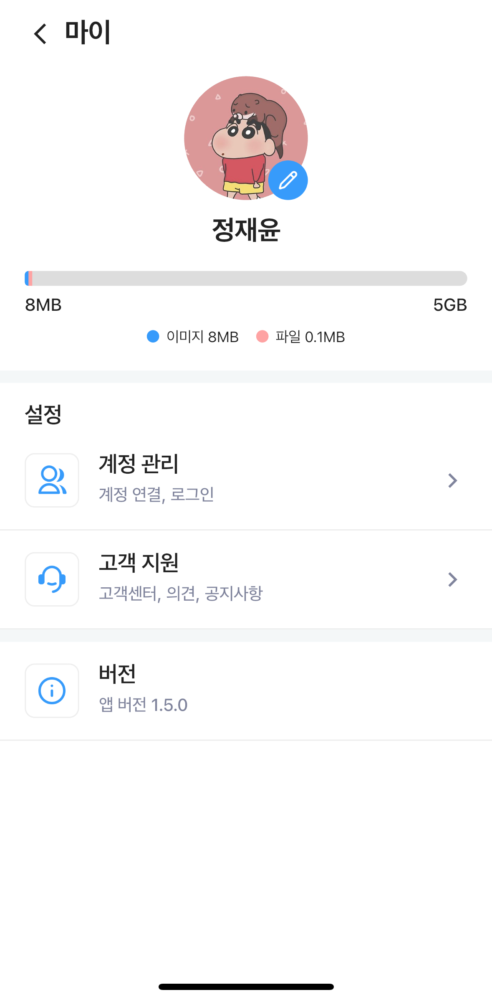
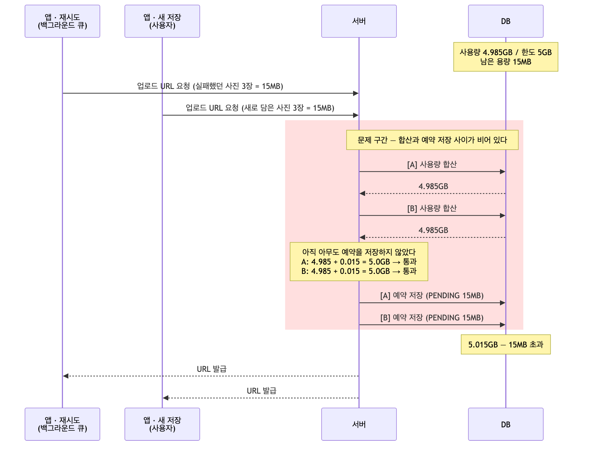
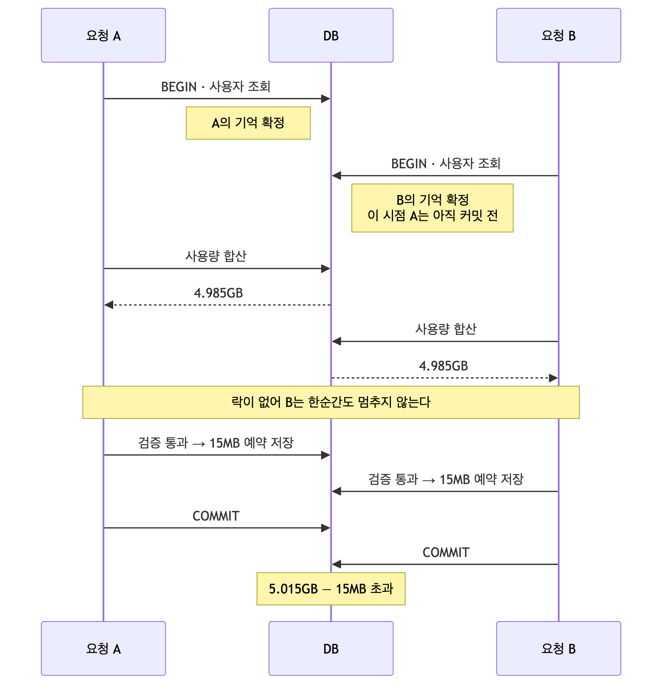
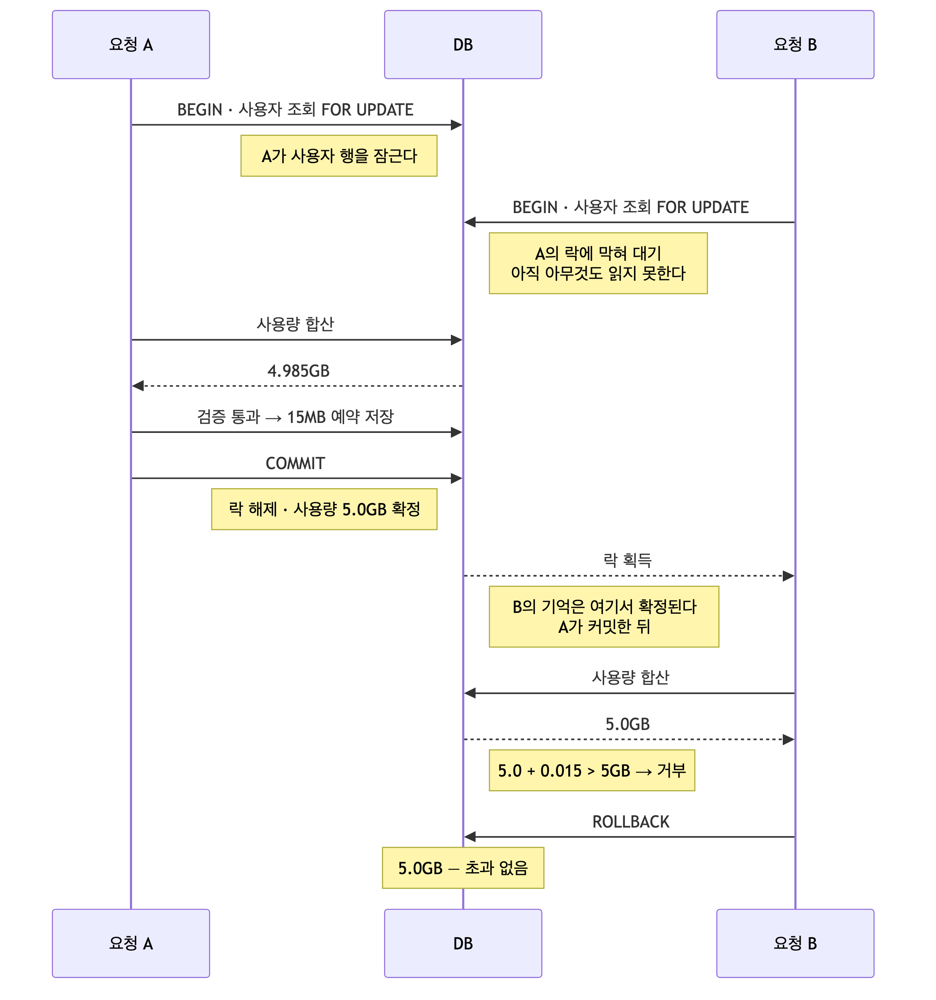

# 동시성 문제 해결기 : 락을 걸었는데 왜 안 막히지?

> **상태** 재현·측정 → 비관적 락 적용 → 재측정 완료 (초과 135MB → 0, 실패·데드락 0)
> **측정 자료** [measurements.md](measurements.md)

# 1. 개요

이번 글에서는 계정당 5GB 저장 용량 제한이 동시 요청에서 지켜지지 않던 문제를 해결한 과정을
공유하고자 합니다.
사용자의 이미지 및 파일 업로드를 받아주기 전에 서버는 **"이 사용자가 지금까지 얼마나 썼는지"를
합산해 한도를 넘는지 확인**하게 됩니다.

이때, 앱은 업로드를 **백그라운드 큐**로 처리합니다. 실패한 항목을 재시도하거나 앱을 다시 켠 뒤
밀린 항목을 올리는 동안 사용자가 새로 저장하면 **두 요청이 서버에 동시에 도착합니다.**
그런데 확인을 통과한 뒤 **그 요청이 차지할 용량이 합계에 더해지기까지 사이가 비어 있습니다.**
두 요청 모두 상대의 몫이 빠진 합계를 읽으므로 전부 "여유 있음"으로 판정됩니다. **그렇게 한도가 뚫렸습니다.**

이 문제를 해결하기 위해 **비관적 락 · 원자적 UPDATE · SERIALIZABLE** 세 가지를 놓고
트레이드 오프를 고민했습니다. 이 글에는 무엇을 기준으로 비교했고 왜 비관적 락을 골랐는지,
그리고 고르고 나서도 한 번 더 막혔던 과정을 담았습니다.

# 2. toIT 서비스 소개



toIT 는 링크·메모·이미지·파일을 보관함에 모아 두는 서비스로, 앱에서 이미지나 파일을 올려
저장하는 기능이 있었습니다. 이때 **계정당 저장 용량은 5GB 로 제한**되어 한도를 넘으면
업로드가 거부됩니다.

# 3. 기존 구조의 문제점



앱에서 네트워크 에러나 장애로 업로드가 실패하면 백그라운드에서 다시 시도합니다.
이때 사용자가 다른 것을 업로드하면 **두 요청이 서버에 동시에 들어옵니다.**

동시에 들어온 요청들은 서로가 저장하기 전에 사용량을 읽습니다. 그러면 **전부 같은 값을 보고
전부 통과**합니다.

문제는 검사를 통과했으니 둘 다 저장됩니다. **걸어둔 5GB 제한이 그대로 넘어갑니다.**
```
남은 용량 15MB, 요청 하나가 15MB일 때

[A] 사용량 합산 → 4.985GB
[B] 사용량 합산 → 4.985GB    ← 아직 아무도 저장하지 않았다
[A] 4.985 + 0.015 = 5.0GB → 통과
[B] 4.985 + 0.015 = 5.0GB → 통과
[A] 저장
[B] 저장
→ 5.015GB. 15MB 초과
```


## 3.1 기존 코드

URL 요청 메서드는 이렇게 되어 있었습니다. **`@Transactional` 도 붙어 있습니다.**

```java
@Transactional
public List<AttachMentsPresignResponse> presignUpload(Long usersId, AttachMentsPresignRequest request) {
    ...
    long totalSize = request.getFiles().stream().mapToLong(f -> f.getFileSize()).sum();
    validateStorageLimit(usersId, totalSize);        // ① 합산 → 검증

    for (var file : request.getFiles()) {
        ...
        attachMentsRepository.save(AttachMents.reserve(...));   // ② 저장
    }
}

private void validateStorageLimit(Long usersId, long newFileSize) {
    List<Object[]> result = attachMentsRepository.sumAttachmentsSizeByUsersId(usersId, ACTIVE);
    double usedBytes = ...;                          // 지금까지 쓴 용량 합계
    if (usedBytes + newFileSize > LIMIT_BYTES) {
        throw new IllegalStateException("스토리지 용량이 초과되었습니다. (최대 5GB)");
    }
}
```

## 3.2 테스트

정확하게 알기 위해 테스트를 진행해보았습니다. **한 사용자를 한도 직전까지 채워두고** 동시에 요청을 보내는 방식입니다. 측정 조건은 다음과 같이 맞추었습니다.
```
남은 용량이 정확히 15MB 가 되도록 채움(filler) 행을 하나 넣는다
한 요청 = 사진 3장 × 5MB = 15MB    ← 앱이 한 번에 묶어 보내는 최대 단위
남은 용량 15MB                    ← 딱 1건 분량
→ 정상이라면 1건만 통과하고 나머지는 전부 거부되어야 한다
```

동시 요청 수를 2부터 20까지 올려가며, **매 라운드마다 DB 를 초기 상태로 되돌리고** 다시 쟀습니다.

결과는 **보낸 만큼 그대로 통과**였습니다. 1건만 통과해야 하는데 2건을 보내면 2건이,
10건을 보내면 10건이 다 저장됐습니다.

| 동시 요청 | 통과 | 차단 | 초과 |
| --- | --- | --- | --- |
| **2** | **2** | 0 | **15MB** |
| 3 | 3 | 0 | 30MB |
| 5 | 5 | 0 | 60MB |
| 8 | 8 | 0 | 105MB |
| **10** | **10** | 0 | **135MB** |
| 15 | 10 | 5 | 135MB |
| 20 | 10 | 10 | 135MB |

# 4. 원인 분석

두 요청이 동시에 들어왔을 때 다음과 같이 흘러갔습니다.



이유는 두 가지였습니다.

1. `@Transactional` 에는 **다른 요청을 기다리게 하는 기능이 없습니다.** 요청마다 트랜잭션이 따로 만들어질 뿐, 그 사이를 조율하지 않습니다. 락도 없었습니다. 사용량 합산은 일반 `SELECT` 라 아무 락을 걸지 않으므로, B 는 합산하는 시점에 한순간도 멈추지 않고 그냥 읽습니다.
2. 설령 A 가 먼저 저장했어도 B 에겐 안 보인다는 것입니다. A 의 저장을 B 의 합산보다 앞으로 당겨도 결과는 같습니다.

```
A: 예약 저장 (아직 커밋 전)
B: 합산 → 여전히 4.985GB
```
- B 가 기억을 확정한 시점에 A 는 커밋 전이었습니다. 미커밋인 남의 변경은 보이지 않습니다.

Mysql은  REPEATABLE READ입니다. 이 범위는 **트랜잭션이 처음 읽는 순간의 상태를 기억하고, 커밋할 때까지 그것만
봅니다.** B 는 사용자 조회에서 기억을 확정했고 그 시점에 A 는 커밋 전이었습니다. 그래서
A 가 저장한 15MB 가 B 에게는 끝까지 보이지 않았습니다.

# 5. 문제 해결 방법

문제를 해결하기 위해 방법이 2가지가 생각났습니다.

1. 합산부터 저장까지를 한 사용자당 한 번에 하나씩만 실행되게 한다
- 같은 사용자의 요청이 동시에 오면 뒤에 온 쪽을 대기시킨다. 앞선 요청이 커밋한 뒤에 합산하므로 그 몫이 반영된 값을 읽는다.
2. 합산과 검증과 저장을 SQL 한 문장으로 합친다
- 지금은 `합계를 읽어 자바로 가져오고 → 자바에서 한도를 넘는지 보고 → 다시 DB 에 저장`하는 세 단계. 
- 그래서 자바에 나가 있는 동안이 비어 있다. 이 셋을 `UPDATE` 한 문장으로 합치면 DB 가 행을 잠그고 읽고 쓰는 동안 끊기지 않으므로 끼어들 지점이 사라지게 된다. 한도를 넘겼는지는 `UPDATE` 가 몇 행을 바꿨는지로 알 수 있다. 
- 조건에 맞아 1행이 바뀌면 통과, 조건에 안 맞아 0행이면 초과로 생각.

이 기준으로 검토했습니다. 1번으로는 비관적 락과 SERIALIZABLE 이 있었고, 2번으로는 원자적
UPDATE 가 있었습니다.


## 5.1 비관적 락

1번을 하려면 **무엇을 기준으로 대기시킬지**를 정해야 합니다. 코드에서는 사용량을 확인하기 전에 사용자를 먼저 조회합니다. 그 조회에 `FOR UPDATE` 를 붙여
다른 요청이 들어와도 전부 기다리게 하는 방법입니다.
- 장점은 컬럼을 새로 만들거나 인프라를 추가하지 않고 조회 한 줄만 바꾸면 된다 합계의 출처가 계속 한 곳이라 값이 틀어질 여지가 없다 
- 단점은 같은 사용자의 요청이 직렬화되므로 그만큼 응답이 느려진다

느려지는 쪽은 **같은 사용자가 동시에 올릴 때**뿐이고, 그건 원래 한 건만 통과해야 하는 상황입니다. 감수할 만하다고 봤습니다.

## 5.2 SERIALIZABLE

같은 1번을 **코드가 아니라 설정으로** 하는 방법입니다. 격리수준을 SERIALIZABLE 로 올리면
DB 가 트랜잭션 안의 모든 일반 `SELECT` 를 S락으로 바꿔줍니다. 어디에 락을 걸지 정할 필요도,
코드를 고칠 필요도 없습니다.

하지만 승격되는 락이 **S락**이라는 게 걸렸습니다. S락은 여러 트랜잭션이 동시에 잡을 수
있으니, 합산에서 서로를 막지 못하고 **둘 다 통과**할 것 같았습니다. 그러면 저장할 때 각자
X락을 요구하게 되는데, 그 X락이 상대가 쥔 S락에 막힙니다.

**실제로 적용해서 재봤습니다.**

| 동시 요청 | 통과 | 차단 | 실패 | 초과 | p95 | 락 대기 | 데드락 |
| --- | --- | --- | --- | --- | --- | --- | --- |
| **2** | 1 | 1 | 0 | **0** | 53.7ms | 1 | **0** |
| 3 | 1 | 0 | 2 | 0 | 116.8ms | 3 | **2** |
| 5 | 1 | 0 | 4 | 0 | 121.9ms | 5 | **4** |
| 8 | 1 | 0 | 7 | 0 | 167.4ms | 8 | **7** |
| **10** | 1 | 0 | 9 | **0** | 209.8ms | 10 | **9** |
| 15 | 1 | 5 | 9 | 0 | 259.5ms | 10 | **9** |
| **20** | 1 | 10 | 9 | **0** | 290.9ms | 10 | **9** |

그런데 **락 대기 = N, 데드락 = N − 1, 통과 = 1** 이 정확히 나왔습니다.

동시 2에서는 데드락이 나지 않았습니다. B가 합산을 시작할 때 A는 이미 X락을 쥔 뒤여서 B는 단순 대기로 끝났습니다(락 대기 1). 다만 이건 도착 간격이 벌어진 결과일 뿐이라,
둘이 더 가깝게 들어오면 동시 2에서도 데드락이 납니다. 요청 수가 아니라 타이밍이 정하는 것이고, 그만큼 결과가 불안정하다는 뜻이기도 합니다.

그리고 격리수준은 **트랜잭션에 거는 설정**이라 "이 조회만"을 지정할 수 없습니다.
막고 싶은 건 사용량 합산 하나인데 다른 테이블 조회까지 잠겨서 불필요하게 더 느려질 수 있었습니다.

## 5.3 원자적 UPDATE

2번을 하려면 합계를 매번 더해서 구하지 말고, 사용자마다 지금 쓴 용량을 컬럼으로 들고 있는 형태를 생각했습니다. 그래야 더하는 일과 한도를 넘는지 보는 일을 `UPDATE` 한 문장으로 묶을 수 있습니다.

- 장점은 락을 잡는 구간이 문장 하나뿐이라 제일 빠르고, 매번 하던 합산도 사라진다
- 단점은 사용량이 컬럼과 실제 파일 목록 두 곳에 존재하게 된다

지금은 매번 합산하니 파일이 지워지면 값도 알아서 줄지만, 컬럼은 스스로 줄지 않습니다. 첨부
삭제·폴더 삭제·정리 배치·저장 확정 실패마다 일일이 차감해야 하고, **한 곳이라도 빠뜨리면 에러
없이 오차가 누적**됩니다.

**지금은 틀릴 수 없는 구조인데 굳이 틀릴 수 있는 상태를 새로 만들 이유가 없다**고 판단했습니다.

# 6. 비관적 락 적용

쿼리는 다음과 같이 바꾸었습니다.

```java
@Lock(LockModeType.PESSIMISTIC_WRITE)
@Query("SELECT u FROM Users u WHERE u.usersId = :usersId")
Optional<Users> findByIdForUpdate(@Param("usersId") Long usersId);
```

기존 `findById`는 그대로 두고 새 메서드를 나란히 뒀습니다. 프로필 조회처럼 락이 필요 없는
곳은 계속 기존 것을 씁니다.



사용자 조회를 메서드의 **첫 DB 접근**으로 옮겼습니다. 앞에 있던 폴더 조회는 그 뒤로 보냈습니다.

```java
// 사용자 행을 잠가 같은 사용자의 동시 요청을 직렬화한다.
// 이 조회보다 앞에 일반 조회를 넣지 말 것 — 스냅샷이 먼저 확정되어 락이 무력해진다.
Users users = usersService.findByIdForUpdate(usersId);        // ① 락

for (Long folderId : request.getFoldersIdList()) {            // ② 폴더 조회
    foldersService.findByFoldersIdAndUsers_UsersId(usersId, folderId);
}

validateStorageLimit(usersId, totalSize);                     // ③ 합산 → 검증
```


# 7. 개선 후 테스트

같은 시나리오를 다시 돌렸습니다.

| 동시 요청 | 통과 | 차단 | 실패 | 초과 | p95 | 최장 응답 | 락 대기 | 데드락 |
| --- | --- | --- | --- | --- | --- | --- | --- | --- |
| **2** | **1** | 1 | 0 | **0** | 56.2ms | 56.5ms | 1 | **0** |
| 3 | 1 | 2 | 0 | 0 | 50.9ms | 51.3ms | 2 | **0** |
| 5 | 1 | 4 | 0 | 0 | 56.8ms | 57.3ms | 4 | **0** |
| 8 | 1 | 7 | 0 | 0 | 83.3ms | 84.8ms | 7 | **0** |
| **10** | **1** | 9 | 0 | **0** | 138.3ms | 140.5ms | 9 | **0** |
| 15 | 1 | 14 | 0 | 0 | 230.5ms | 237.6ms | 14 | **0** |
| **20** | **1** | 19 | 0 | **0** | 161.7ms | 164.0ms | 19 | **0** |

**전 구간에서 초과가 0이 되었습니다.** 차단된 요청은 오류가 아니라 400 "스토리지 용량이
초과되었습니다" 이고, 실패와 데드락은 한 건도 없었습니다.

> 최종적으로 동시 요청 2~20 전 구간에서 통과 건수가 요청 수만큼에서 1건으로, 한도 초과량은 최대 135MB 에서 0 으로 바뀌었습니다.
> 즉, 동시 업로드 요청에서 계정당 5GB 용량 제한이 뚫리던 경쟁 조건을 비관적 락으로 해결하였습니다.

## 7.1 락 대기 측정

락을 걸었으니 뒤에 온 요청은 앞선 요청이 커밋할 때까지 기다립니다. 그 대기를 DB 쪽에서
직접 쟀습니다.

```sql
SHOW GLOBAL STATUS LIKE 'Innodb_row_lock_waits';   -- 대기 횟수(누적)
SHOW GLOBAL STATUS LIKE 'Innodb_row_lock_time';    -- 대기 시간 합(누적, ms)
```

누적값이라 라운드 전후로 재서 증가분을 봤습니다.

| 동시 요청 | 2 | 3 | 5 | 8 | 10 | 15 | 20 |
| --- | --- | --- | --- | --- | --- | --- | --- |
| 락 대기 횟수 | 1 | 2 | 4 | 7 | 9 | 14 | 19 |
| 대기 합계 | 32ms | 55ms | 115ms | 279ms | 748ms | 1185ms | 910ms |
| 한 건당 평균 | 32.0ms | 27.5ms | 28.8ms | 39.9ms | 83.1ms | 84.6ms | 47.9ms |

대기 한 건당 평균은 28~85ms 입니다. 요청 하나를 처리하는 시간과 같은 수준이라, 앞사람이
끝나는 즉시 넘겨받았습니다.

한 건이 유난히 오래 기다렸을 수도 있어서, 부하 테스트(k6) 가 기록한 응답 시간도 함께 봤습니다.
가장 오래 걸린 요청이 동시 20 에서 164ms 였습니다. 응답 시간 안에 락 대기가 포함되어 있으니
**어떤 요청도 164ms 보다 오래 기다리지는 않았다**는 뜻입니다. 

같은 부하 테스트에서 p95 는 161.7ms 로, 최장 응답과 **2% 차이**였습니다. **특정 요청만 오래 기다린 게 아니라 대기가 고르게 나뉘었다**는 뜻입니다.

# 8. 결론

마지막으로 세 방법 중 무엇을 쓸지 결정이 필요했습니다. 셋 다 초과를 0 으로 만들 수 있어서
정확성만으로는 고를 수 없었기 때문입니다. 결론적으로는 **비관적 락**을 쓰기로 결정하였습니다.

그 이유는 다음과 같습니다:

- **실패하는 방식이 다릅니다.** SERIALIZABLE 도 초과는 막았지만, 동시 10 에서 9건이 데드락으로
  실패했습니다. 비관적 락은 같은 9건이 400 "용량이 초과되었습니다" 로 거부됩니다. 사용자가
  이유를 알 수 있는 응답이냐 서버 오류냐의 차이이고, 특히 이 문제의 유입 경로가 재시도 큐라
  서버 오류는 다시 재시도를 부릅니다.
- **잠기는 범위가 다릅니다.** 격리수준은 트랜잭션 단위 설정이라 "이 조회만" 을 지정할 수
  없습니다. 막고 싶은 건 사용량 합산 하나인데 폴더 조회까지 함께 잠깁니다.
- **집계의 출처를 늘리고 싶지 않았습니다.** 원자적 UPDATE 는 가장 빠르지만 사용량이 컬럼과
  실제 파일 목록 두 곳에 존재하게 됩니다. 삭제·정리 배치·저장 확정 실패마다 차감해야 하고,
  한 곳이라도 빠뜨리면 에러 없이 오차가 쌓입니다. 지금은 매번 합산하므로 틀릴 수 없는
  구조인데, 굳이 틀릴 수 있는 상태를 새로 만들 이유가 없었습니다.
- **대기 비용이 감당할 수준이었습니다.** 락을 걸어도 대기 한 건당 평균은 28~85ms,
  가장 오래 걸린 요청도 164ms 였습니다. 락 대기 타임아웃 50초의 0.3% 라 여유가 컸습니다.

따라서 비관적 락으로 결정하였습니다.

만약 나중에 같은 사용자의 동시 업로드가 훨씬 잦아져 대기가 눈에 띄게 길어진다면, 그때 가서
원자적 UPDATE 로 옮기고 집계 정합성 관리 비용을 함께 감당하기로 결정하였습니다.
