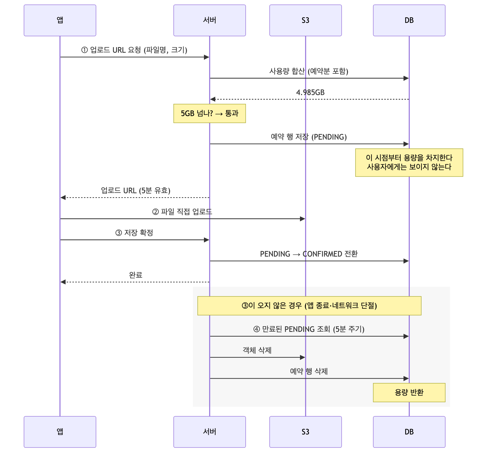
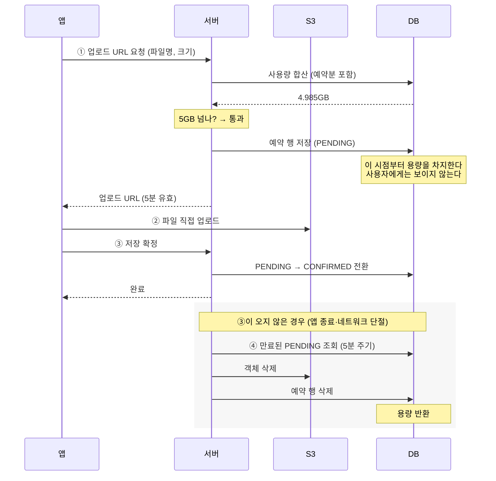
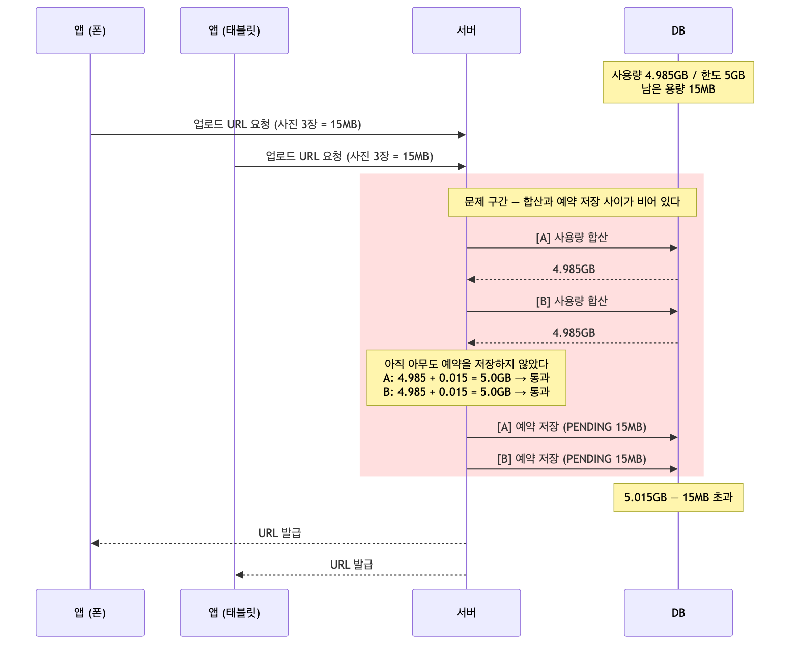
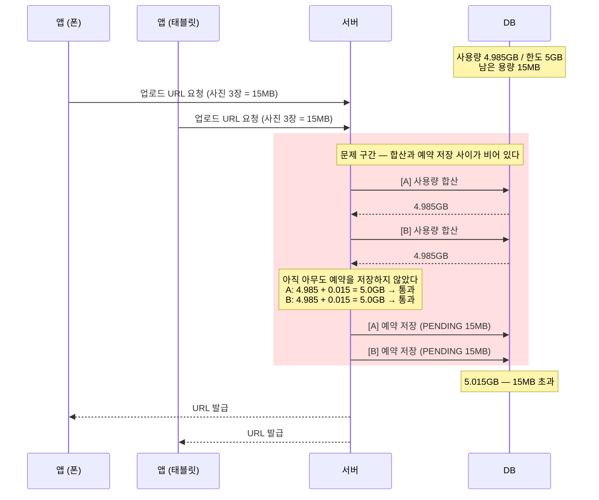

# 동시 요청에 뚫리던 스토리지 한도를 비관적 락으로 보장

> **상태** 재현·측정 → 비관적 락 적용 → 재측정 완료 (초과 0, p95 228 → 209ms)
> **브랜치** `fix/스토리지-용량-제한-예약-구조`
> **측정 자료** [measurements.md](measurements.md)

toIT는 링크, 메모, 이미지, 파일을 보관함에 모아 두는 서비스입니다. 사용자는 앱에서 사진이나 파일을 올려 보관함에 저장하고, 올린 파일은 S3 에 보관합니다.
**계정당 저장 용량은 5GB 로 제한**되며, 한도를 넘으면 업로드가 거부됩니다.

서버는 업로드를 받아주기 전에 "이 사용자가 지금까지 얼마나 썼는지"를 DB 에서 확인합니다. 요청이 하나씩 들어올 때는 앞 요청이 반영된 뒤에 다음 요청이 확인하므로 한도가 잘 지켜졌습니다.
그런데 **여러 요청이 동시에 들어오면 아직 아무것도 반영되지 않은 상태에서 모두가 같은 값을 읽고,** 전부 "여유 있음"으로 판정되어 한도를 넘겨 저장됩니다.

이 문서는 그 경쟁 조건을 재현해 얼마나 뚫리는지 측정하고, 어떻게 보장할지 정리한 기록입니다. 측정 과정에서 두 가지를 확인했습니다. **`@Transactional` 을 붙이고 MySQL 기본 격리수준(REPEATABLE READ)으로
두어도 막히지 않는다는 것**, 그리고 **뚫리는 양의 상한을 커넥션 풀 크기가 정한다는 것**입니다.

1. [기존 구조와 문제점](#1-기존-구조와-문제점)
   - [1-1. 기존 저장 구조](#1-1-기존-저장-구조)
   - [1-2. 문제점 — 동시 요청 경쟁 조건](#1-2-문제점--동시-요청-경쟁-조건)
2. [해결 방향](#2-해결-방향)
   - [2-1. 유력 후보](#2-1-유력-후보)
   - [2-2. 최종 결정](#2-2-최종-결정)
   - [2-3. 측정 계획](#2-3-측정-계획)
3. [구현](#3-구현)
4. [개선 결과](#4-개선-결과)
5. [실제 위험도](#5-실제-위험도)

## 1. 기존 구조와 문제점

### 1-1. 기존 저장 구조

사용자당 스토리지 한도는 **5GB** 입니다. 이미지와 파일은 같은 경로로 저장됩니다. 차이는 한 번에 올릴 수 있는 개수뿐이다(이미지 3장, 파일 1개).
성능을 위해 파일이 서버를 거치지 않고 S3로 바로 올라가므로, 저장이 세 단계로 나뉘게 됩니다.



<details>
<summary>다이어그램 소스 (Mermaid)</summary>



</details>

저장은 크게 세 단계로 나뉩니다.

1. **URL 요청** — 서버에서 용량을 확인하고 업로드 URL 을 받습니다
2. **직접 업로드** — 앱이 S3 로 파일을 바로 보냅니다
3. **저장 확정** — 서버가 DB 에 최종 반영합니다

**저장 확정**이 오지 않은 경우를 위해, 만료된 예약을 정리하는 배치가 따로 돕니다.

여기서 문제가 되는 건 **URL 요청에서 용량을 확인하지만, 그 시점에는 DB 에 아무 흔적도 남기지 않는다는 점**입니다.
실제 반영은 저장 확정에서야 일어나므로, 그대로 두면 그 사이에 들어온 요청들이 전부
"아직 여유 있다"는 낡은 값을 보게 됩니다.

그래서 URL 요청 단계에서 **미리 자리를 잡아둡니다.** 업로드가 확정되기 전이지만 행을 하나 만들어
`PENDING` 상태로 표시해 두는 것입니다. 이 행은 아직 확정된 파일이 아니므로 보관함 목록이나
검색 결과에는 나오지 않지만, **용량 합산에는 포함**됩니다.

저장 확정이 오면 그 행을 `CONFIRMED` 로 바꿉니다. 새 행을 만들지 않고 상태만 바꾸는 이유는,
새로 만들면 예약분과 확정분이 이중으로 잡혀 용량이 두 배가 되기 때문입니다.

`PENDING` 도 용량에 잡히므로 URL 요청을 여러 번 호출하면 그만큼 남은 용량이 줄어듭니다.
따라서 요청을 반복해도 한도를 넘을 수 없습니다.
저장 확정이 끝내 오지 않은 예약 — 앱이 꺼지거나 네트워크가 끊긴 경우 — 은 정리 배치가
S3 객체와 함께 회수해 용량을 되돌립니다.

### 1-2. 문제점 — 동시 요청 경쟁 조건

첫 단계인 **URL 요청**은 안에서 세 가지 일을 순서대로 합니다.

```
사용량 합산  →  5GB 넘는지 검증  →  예약 저장
```

**합산과 예약 저장 사이가 비어 있습니다.**
동시에 들어온 요청들은 서로가 예약을 저장하기 전에 사용량을 읽고, 전부 같은 값을 보고 통과합니다.



<details>
<summary>다이어그램 소스 (Mermaid)</summary>



</details>

테스트 서버(2 vCPU / 2GB, MySQL 8.0, HikariCP 기본 풀 10)에서 재현했습니다. 한 요청은 사진 3장(각 5MB)이라 **15MB** 를 차지하고, 남은 용량도 **15MB** 로 맞춰뒀습니다.
이 상태에서 같은 사용자로 동시 요청 수를 올려가며 보냈습니다.

| 동시 요청 | 통과 | 초과 |
|---|---|---|
| **2** | **2** | **15MB** |
| 5 | 5 | 60MB |
| **10** | **10** | **135MB** |
| 20 | 10 | 135MB |

통과가 1건을 넘은 만큼이 그대로 초과량입니다.
**동시 2건에서 이미 뚫렸습니다.** 기기 두 대에서 사진 3장씩 동시에 올리는 것만으로 발생합니다.

> 전체 측정값과 조건은 [measurements.md](measurements.md) 를 참고하세요.
> NGINX Rate Limiter 가 요청을 잘라내면 애플리케이션 레벨 측정이 안 되므로 앱 포트로 직접 보냈습니다.

원인은 다음과 같았습니다.

1. **요청마다 트랜잭션이 따로 만들어집니다.**
- `@Transactional` 이 보장하는 건 한 요청 안의 작업을 **한 덩어리로 묶어서** A 의 트랜잭션과 B 의 트랜잭션은 별개라 서로가 무엇을 하는지 알지 못합니다.

2. **사용량 합산이 일반 `SELECT` 라 락을 걸지 않습니다.**
- InnoDB 는 읽기가 쓰기를 막지 않도록, 일반 조회에는 락 대신 **MVCC 스냅샷**을 씁니다. A 와 B 는 각자 자기 시점의 스냅샷을 볼 뿐이라 **상대가 아직 커밋하지 않은 예약은 보이지 않습니다.**
락이 없으니 서로를 기다리게 만들 수단도 없습니다.

이렇게 **확인(check)한 값을 믿고 행동(act)하는데 그 둘이 하나로 묶여 있지 않아**
사이에 다른 요청이 끼어드는 문제를 `check-then-act` 경쟁 조건이라는 것을 알 수 있었습니다.

## 2. 해결 방향
문제가 **확인과 예약 사이의 틈**이라면 손댈 곳도 그 틈뿐이라고 봤습니다.
막거나, 없애거나 둘 중 하나입니다.

```
A. 틈을 막는다   — 그 사이에 아무도 들어오지 못하게 한다   (락)
B. 틈을 없앤다   — 확인과 예약을 한 문장으로 합친다        (원자적 UPDATE)
```

이 기준으로 대안을 나눠 봤습니다.

### 2-1. 유력 후보

1. 비관적 락 — 사용자 행을 잠급니다

용량 한도가 사용자 단위이니 경합할 자원도 사용자라고 봤습니다. 마침 용량을 확인하려면 어차피 사용자부터 조회하므로, 그 조회를 FOR UPDATE 로 바꿔 URL 요청이 들어오는 즉시 그 행을 잠그면 같은 사용자의 요청이 한 줄로 세워지겠다고 생각했습니다.
X 락이라 뒤에 온 요청은 앞선 요청이 커밋할 때까지 이 줄에서 기다립니다. 그동안 앞선 요청의 예약이 반영되므로, 뒤에 온 요청은 최신 사용량을 보고 거부됩니다.

단점은 **같은 사용자의 업로드가 한 번에 하나씩만 처리된다**는 것입니다.
락은 커밋할 때 풀리므로 업로드 URL 을 만들고 예약을 저장하는 시간 내내 뒤에 온 요청이 대기하고,
그동안 커넥션을 붙잡고 있습니다. 다른 사용자는 영향받지 않지만, 그 대기 시간은 재봐야 합니다.

```sql
SELECT * FROM users WHERE users_id = ? FOR UPDATE;
```

2. 원자적 UPDATE — 검사와 갱신을 한 문장에 넣습니다
지금은 사용량을 매번 합산하지만, 사용자 테이블에서 이 컬럼을 들고 있는 상태로 생각했습니다.
몇 개의 행을 바꿨는지 숫자로 돌려줍니다. **영향 행이 0 이면 초과, 1 이면 통과**입니다.

단점은 사용량을 직접 관리해야 한다는 것입니다. 지금은 매번 합산하니 파일이 지워지면 값도 알아서 줄지만, 컬럼은 스스로 줄지 않습니다. 첨부 삭제·폴더 삭제·정리 배치 회수·저장 확정 실패마다 일일이 차감해야 하고, 한 곳이라도 빠뜨리면 실제보다 큰 값이 남아 쓰지도 않은 용량 때문에 업로드가 막힙니다. 게다가 에러가 나지 않아 문의가 들어와야 알게 됩니다.

```sql
UPDATE users
   SET used_bytes = used_bytes + :size
 WHERE users_id = :usersId
   AND used_bytes + :size <= 5368709120;
```


3. 격리수준 SERIALIZABLE

트랜잭션 안의 **모든 일반 SELECT** 를 InnoDB 가 `LOCK IN SHARE MODE`(S 락)로 승격시키는 방법입니다.

하지만, 두 가지 대가가 따라옵니다.
- **데드락이 납니다.** S 락끼리는 서로를 통과시키므로 A 와 B 가 둘 다 사용량 합산에 성공합니다.
그다음 각자 예약을 저장하려고 X 락을 요구하는데, X 락은 상대의 S 락과 공존할 수 없습니다.

```
A: 사용량 합산 🔒S        B: 사용량 합산 🔒S      ← S 끼리는 통과
A: 예약 INSERT — X 요청 → B 의 S 락에 막혀 대기
B: 예약 INSERT — X 요청 → A 의 S 락에 막혀 대기   ← 서로를 기다린다
```
- **필요 없는 곳까지 잠깁니다.** 승격 대상은 사용량 합산만이 아니라 그 트랜잭션 안의
**모든 조회**라 `users` 와 `folders` 조회까지 잠깁니다.
읽기는 그대로 되고 쓰기만 잠깐 밀리니 큰 피해는 아니지만, 굳이 넓게 잠글 이유가 없습니다.

### 2-2. 최종 결정

원자적 UPDATE 는 빠르지만 사용량을 직접 관리해야 하고, 틀려도 알아채지 못합니다.
지금은 틀릴 수 없는 구조인데 굳이 그런 위험을 새로 만들 이유가 없다고 봤습니다.
SERIALIZABLE 은 데드락이 나고 필요 없는 곳까지 잠급니다.

비관적 락도 같은 사용자의 업로드가 하나씩 처리되는 단점이 있지만,
한 사람이 여러 기기에서 동시에 올리는 드문 경우에만 해당하고 기존 조회를 한 줄 바꾸면 끝납니다.
그래서 **비관적 락으로 정했습니다.**, 


### 2-3. 측정 계획

각 대안마다 같은 시나리오(남은 용량 15MB, 동시 2~20)를 돌리고 아래를 기록합니다.

- 통과 건수 · 초과량 → **0 이어야 합니다**
- URL 요청 p95 응답시간 → 락으로 인한 지연
- `hikaricp_connections_active` / `pending` → 커넥션 점유
- `jvm_threads_states_threads{state="blocked"}` → 락 대기
- 데드락 발생 여부

**커넥션 풀 점유가 비교의 핵심 비용**입니다. 락 계열은 트랜잭션이 길어져
`hikaricp_connections_active` / `pending` 이 올라갑니다.
Prometheus·Grafana 가 이미 붙어 있어 그대로 관측할 수 있습니다.

---

## 3. 구현

락을 거는 조회를 하나 만들고, URL 요청이 그것부터 부르도록 바꿨습니다.

```java
// UsersRepository
@Lock(LockModeType.PESSIMISTIC_WRITE)
@Query("SELECT u FROM Users u WHERE u.usersId = :usersId")
Optional<Users> findByIdForUpdate(@Param("usersId") Long usersId);
```

```java
// AttachMentsService.presignUpload — 첫 DB 접근을 잠금 조회로 교체
Users users = usersService.findByIdForUpdate(usersId);
```

기존 `findById` 는 그대로 두고 새 메서드를 나란히 뒀습니다.
프로필 조회처럼 락이 필요 없는 곳은 계속 기존 것을 씁니다.

**이 조회가 트랜잭션의 첫 DB 접근이어야 합니다.**
REPEATABLE READ 에서 스냅샷은 첫 일반 조회 시점에 확정되므로, 앞에 조회가 하나라도 있으면
락을 잡아도 그 뒤의 합산이 낡은 값을 읽습니다. 나중에 조회 한 줄이 앞에 끼면 조용히 깨지는
자리라 주석으로 남겨 두었습니다.

서버를 거쳐 올리는 구버전 업로드 경로 두 개는 트랜잭션이 없어 그대로 두었습니다.
트랜잭션을 붙이면 S3 업로드가 락 구간에 들어가므로 별건으로 다룹니다.


## 4. 개선 결과

같은 시나리오(남은 용량 15MB, 요청당 15MB)를 그대로 다시 돌렸습니다.
콜드 스타트 구간에서는 값이 2~3배로 나와, 측정 전에 200요청을 흘려보내고 시작했습니다.

| 동시 요청 | 통과 | 초과 | p95 | 락 대기 | 총 대기 | 평균 대기 |
|---|---|---|---|---|---|---|
| **2** | **1** | **0** | 44.5ms | 1 | 26ms | 26.0ms |
| 3 | 1 | 0 | 54.4ms | 2 | 55ms | 27.5ms |
| 5 | 1 | 0 | 78.2ms | 4 | 152ms | 38.0ms |
| 8 | 1 | 0 | 112.1ms | 7 | 382ms | 54.6ms |
| **10** | **1** | **0** | 153.6ms | 9 | 548ms | 60.9ms |
| 15 | 1 | 0 | 161.1ms | 14 | 974ms | 69.6ms |
| **20** | **1** | **0** | 208.6ms | 19 | 1243ms | 65.4ms |

**전 구간에서 초과가 0 이 되었습니다.** 이전에는 동시 2 에서 15MB, 동시 10 이상에서 135MB 를 넘겼습니다.

락 대기 횟수가 정확히 **동시 요청 수 - 1** 입니다. 첫 요청만 기다리지 않고 나머지는 전부 기다렸으니,
운 좋게 막힌 것이 아니라 **의도대로 한 줄로 세워졌다는 뜻**입니다.

동시 2 는 대기가 1회뿐이라 그 값이 곧 **통과하는 요청의 락 점유 시간(26ms)** 입니다.
모두가 26ms 씩 쥐었다면 동시 20 의 총 대기는 `26 × 190 = 4940ms` 여야 하는데 실측은 1243ms 로
4분의 1 수준입니다. 거부되는 요청은 훨씬 짧게 쥔다는 뜻이었습니다.


> 락 점유 시간을 범위로 적은 것은 동시 요청 수가 커질수록 모델이 어긋나기 때문입니다.
> 부하 도구의 요청 출발 시점이 완벽히 겹치지 않아 뒤쪽 요청은 앞선 요청 전부를 기다리지 않습니다.
> 전체 측정값은 [measurements.md](measurements.md) 를 참고하세요.

